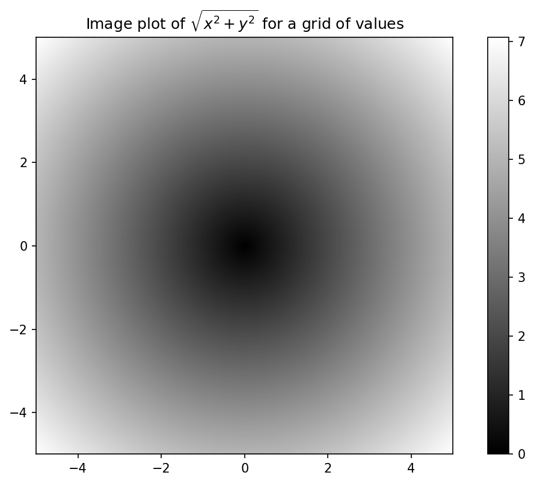
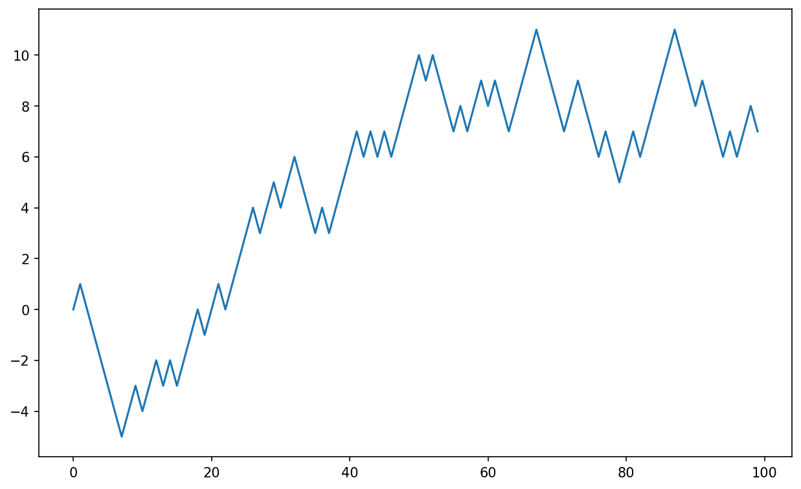

# 第4章 NumPy 基础：数组和向量化计算

__

《Python for Data Analysis 3rd Edition》的开放获取网络版现已作为[印刷版和数字版](https://amzn.to/3DyLaJc)的配套资源发布。若发现任何勘误，[请在此处提交](https://oreilly.com/catalog/0636920519829/errata)。请注意，Quarto生成的网站某些呈现形式会与O'Reilly出版的印刷版和电子书版本有所不同。

如果您觉得在线版本有帮助，请考虑[订购纸质版](https://amzn.to/3DyLaJc)或[无DRM限制的电子书](https://www.ebooks.com/en-us/book/210644288/python-for-data-analysis/wes-mckinney/?affId=WES398681F)以支持作者。网站内容不可复制或转载。代码示例采用MIT许可证，可在GitHub或Gitee上获取。

NumPy（Numerical Python的缩写）是Python数值计算最重要的基础包之一。许多提供科学计算功能的软件包都使用NumPy的数组对象作为数据交换的通用接口标准。我所讲解的NumPy知识大多也适用于pandas。

NumPy包含以下核心功能：

  * ndarray：高效的多维数组，支持快速面向数组的算术运算和灵活的广播（broadcasting）功能
  * 数学函数：支持对整个数组进行快速运算而无需编写循环
  * 磁盘读写工具：支持将数组数据读写到磁盘，并可处理内存映射文件
  * 线性代数、随机数生成和傅里叶变换功能
  * C语言API：用于连接用C、C++或FORTRAN编写的库

由于NumPy提供了全面且文档完善的C语言API，可以轻松地将数据传递给用低级语言编写的外部库，也能让外部库以NumPy数组的形式将数据返回Python。这一特性使Python成为封装遗留C/C++/FORTRAN代码库的首选语言，并为其提供动态易用的接口。

虽然NumPy本身不提供建模或科学计算功能，但理解NumPy数组和面向数组的计算将帮助您更有效地使用具有数组计算语义的工具（如pandas）。由于NumPy涵盖内容广泛，我将在后续深入讲解广播等高级特性（参见[附录A：NumPy高级应用](https://wesmckinney.com/book/advanced-numpy)）。虽然阅读本书后续内容不需要这些高级特性，但它们有助于您更深入地使用Python进行科学计算。

对于大多数数据分析应用，我将重点关注以下功能领域：

  * 基于数组的快速运算：包括数据整理清洗、子集筛选、转换及其他计算
  * 常用数组算法：如排序、去重和集合运算
  * 高效的描述性统计与数据聚合/汇总
  * 数据对齐和关系型数据操作：用于合并异构数据集
  * 将条件逻辑表达为数组运算（而非使用带`if-elif-else`分支的循环）
  * 分组数据操作（聚合、转换和函数应用）

虽然NumPy为通用数值数据处理提供了计算基础，但多数读者会希望使用pandas作为统计与分析（尤其是表格数据）的主要工具。此外，pandas还提供了一些NumPy不具备的领域特定功能（如时间序列处理）。

__

注意 

Python中面向数组的计算可追溯至1995年Jim Hugunin创建的Numeric库。此后10年间，多个科学编程社区开始使用Python进行数组编程，但在21世纪初库生态系统曾一度碎片化。2005年，Travis Oliphant整合了当时的Numeric和Numarray项目，创建了NumPy项目，使社区统一到单一的数组计算框架下。

NumPy之所以对Python数值计算如此重要，是因为其专为大数据数组的高效处理而设计。主要原因包括：

  * NumPy在连续内存块中存储数据，独立于其他Python内置对象。用C语言编写的NumPy算法库可直接操作该内存块，无需类型检查或其他开销。NumPy数组的内存占用也远小于Python内置序列
  * NumPy运算能对整个数组执行复杂计算，无需使用Python的`for`循环（对大序列而言速度缓慢）。NumPy之所以比常规Python代码更快，是因为其基于C的算法避免了解释型Python代码的开销

通过以下示例可直观感受性能差异：创建一个包含100万整数的NumPy数组和等价的Python列表：
    
    
    In [7]: import numpy as np
    
    In [8]: my_arr = np.arange(1_000_000)
    
    In [9]: my_list = list(range(1_000_000))__

现在将每个序列乘以2：
    
    
    In [10]: %timeit my_arr2 = my_arr * 2
    309 us +- 7.48 us per loop (mean +- std. dev. of 7 runs, 1000 loops each)
    
    In [11]: %timeit my_list2 = [x * 2 for x in my_list]
    46.4 ms +- 526 us per loop (mean +- std. dev. of 7 runs, 10 loops each)__

基于NumPy的算法通常比纯Python实现快10到100倍（或更高），且内存使用效率显著提升。

## 4.1 NumPy 的 ndarray：一种多维数组对象

NumPy 的关键特性之一是其 N 维数组对象（ndarray），这是一个快速、灵活的容器，用于处理 Python 中的大型数据集。数组允许您使用类似于标量元素之间等效操作的语法，对整个数据块执行数学运算。

为了让您体验 NumPy 如何使用与 Python 内置对象上的标量值相似的语法实现批量计算，我首先导入 NumPy 并创建一个小数组：

```python
In [12]: import numpy as np

In [13]: data = np.array([[1.5, -0.1, 3], [0, -3, 6.5]])

In [14]: data
Out[14]: 
array([[ 1.5, -0.1,  3. ],
       [ 0. , -3. ,  6.5]])
```

然后我用 `data` 进行数学运算：

```python
In [15]: data * 10
Out[15]: 
array([[ 15.,  -1.,  30.],
       [  0., -30.,  65.]])

In [16]: data + data
Out[16]: 
array([[ 3. , -0.2,  6. ],
       [ 0. , -6. , 13. ]])
```

在第一个示例中，所有元素都乘以了 10。在第二个示例中，数组中每个“单元格”的对应值相互相加。

注意

在本章及全书中，我使用标准的 NumPy 约定，始终使用 `import numpy as np`。您可以在代码中使用 `from numpy import *` 来避免编写 `np.`，但我建议不要养成这种习惯。`numpy` 命名空间很大，包含许多与 Python 内置函数（如 `min` 和 `max`）名称冲突的函数。遵循这些标准约定几乎总是一个好主意。

ndarray 是一个用于同构数据的通用多维容器；也就是说，所有元素必须是同一类型。每个数组都有一个 `shape`（表示每个维度大小的元组）和一个 `dtype`（描述数组*数据类型*的对象）：

```python
In [17]: data.shape
Out[17]: (2, 3)

In [18]: data.dtype
Out[18]: dtype('float64')
```

本章将介绍使用 NumPy 数组的基础知识，这些内容足以让您理解本书的其余部分。虽然对于许多数据分析应用来说，不需要对 NumPy 有深入的理解，但熟练掌握面向数组的编程和思考是成为 Python 科学计算专家的关键一步。

注意

每当您在书中看到“数组”、“NumPy 数组”或“ndarray”时，在大多数情况下它们都指的是 ndarray 对象。

### 创建 ndarray

创建数组最简单的方法是使用 `array` 函数。它接受任何类似序列的对象（包括其他数组），并生成一个包含传递数据的新 NumPy 数组。例如，列表是转换的良好候选：

```python
In [19]: data1 = [6, 7.5, 8, 0, 1]

In [20]: arr1 = np.array(data1)

In [21]: arr1
Out[21]: array([6. , 7.5, 8. , 0. , 1. ])
```

嵌套序列（如等长列表的列表）将被转换为多维数组：

```python
In [22]: data2 = [[1, 2, 3, 4], [5, 6, 7, 8]]

In [23]: arr2 = np.array(data2)

In [24]: arr2
Out[24]: 
array([[1, 2, 3, 4],
       [5, 6, 7, 8]])
```

由于 `data2` 是列表的列表，NumPy 数组 `arr2` 有两个维度，其形状是从数据中推断出来的。我们可以通过检查 `ndim` 和 `shape` 属性来确认这一点：

```python
In [25]: arr2.ndim
Out[25]: 2

In [26]: arr2.shape
Out[26]: (2, 4)
```

除非显式指定（在 ndarray 的数据类型中讨论），`numpy.array` 会尝试为其创建的数组推断一个合适的数据类型。数据类型存储在一个特殊的 `dtype` 元数据对象中；例如，在前两个示例中：

```python
In [27]: arr1.dtype
Out[27]: dtype('float64')

In [28]: arr2.dtype
Out[28]: dtype('int64')
```

除了 `numpy.array`，还有许多其他函数用于创建新数组。例如，`numpy.zeros` 和 `numpy.ones` 分别创建给定长度或形状的 0 或 1 的数组。`numpy.empty` 创建一个数组，而不将其值初始化为任何特定值。要使用这些方法创建更高维度的数组，请传递一个形状元组：

```python
In [29]: np.zeros(10)
Out[29]: array([0., 0., 0., 0., 0., 0., 0., 0., 0., 0.])

In [30]: np.zeros((3, 6))
Out[30]: 
array([[0., 0., 0., 0., 0., 0.],
       [0., 0., 0., 0., 0., 0.],
       [0., 0., 0., 0., 0., 0.]])

In [31]: np.empty((2, 3, 2))
Out[31]: 
array([[[0., 0.],
        [0., 0.],
        [0., 0.]],
       [[0., 0.],
        [0., 0.],
        [0., 0.]]])
```

注意

假设 `numpy.empty` 会返回一个全零数组是不安全的。此函数返回未初始化的内存，因此可能包含非零的“垃圾”值。只有在打算用数据填充新数组时才应使用此函数。

`numpy.arange` 是内置 Python `range` 函数的数组值版本：

```python
In [32]: np.arange(15)
Out[32]: array([ 0,  1,  2,  3,  4,  5,  6,  7,  8,  9, 10, 11, 12, 13, 14])
```

有关标准数组创建函数的简短列表，请参见表 4.1。由于 NumPy 专注于数值计算，如果未指定数据类型，则在许多情况下将是 `float64`（浮点型）。

表 4.1：一些重要的 NumPy 数组创建函数

| 函数             | 描述                                                                 |
|------------------|----------------------------------------------------------------------|
| `array`          | 通过推断数据类型或显式指定数据类型，将输入数据（列表、元组、数组或其他序列类型）转换为 ndarray；默认复制输入数据 |
| `asarray`        | 将输入转换为 ndarray，但如果输入已经是 ndarray，则不复制               |
| `arange`         | 类似于内置的 `range`，但返回 ndarray 而不是列表                        |
| `ones`, `ones_like` | 生成给定形状和数据类型的全 1 数组；`ones_like` 接受另一个数组并生成相同形状和数据类型的 `ones` 数组 |
| `zeros`, `zeros_like` | 类似于 `ones` 和 `ones_like`，但生成全 0 数组                         |
| `empty`, `empty_like` | 通过分配新内存创建新数组，但不像 `ones` 和 `zeros` 那样填充任何值        |
| `full`, `full_like` | 生成给定形状和数据类型的数组，所有值设置为指定的“填充值”；`full_like` 接受另一个数组并生成相同形状和数据类型的填充数组 |
| `eye`, `identity` | 创建方阵 N × N 单位矩阵（对角线为 1，其余为 0）                         |

### ndarray 的数据类型

*数据类型*或 `dtype` 是一个特殊的对象，包含 ndarray 需要将内存块解释为特定类型数据的信息（或*元数据*，关于数据的数据）：

```python
In [33]: arr1 = np.array([1, 2, 3], dtype=np.float64)

In [34]: arr2 = np.array([1, 2, 3], dtype=np.int32)

In [35]: arr1.dtype
Out[35]: dtype('float64')

In [36]: arr2.dtype
Out[36]: dtype('int32')
```

数据类型是 NumPy 与来自其他系统的数据交互灵活性的来源。在大多数情况下，它们直接映射到底层磁盘或内存表示，这使得可以读写磁盘上的二进制数据流，并连接到用低级语言（如 C 或 FORTRAN）编写的代码。数值数据类型的命名方式相同：类型名称（如 `float` 或 `int`）后跟一个数字，表示每个元素的位数。标准的双精度浮点值（Python 的 `float` 对象底层使用的）占用 8 字节或 64 位。因此，该类型在 NumPy 中称为 `float64`。有关 NumPy 支持的数据类型的完整列表，请参见表 4.2。

注意

不必担心记住 NumPy 数据类型，尤其是如果您是新用户。通常只需要关心您正在处理的数据的*一般类型*，无论是浮点、复数、整数、布尔值、字符串还是通用 Python 对象。当您需要更多控制数据在内存和磁盘上的存储方式时，尤其是大型数据集，了解您可以控制存储类型是有好处的。

表 4.2：NumPy 数据类型

| 类型                | 类型代码   | 描述                                       |
|---------------------|------------|--------------------------------------------|
| `int8`, `uint8`     | `i1`, `u1` | 有符号和无符号 8 位（1 字节）整数类型         |
| `int16`, `uint16`   | `i2`, `u2` | 有符号和无符号 16 位整数类型                 |
| `int32`, `uint32`   | `i4`, `u4` | 有符号和无符号 32 位整数类型                 |
| `int64`, `uint64`   | `i8`, `u8` | 有符号和无符号 64 位整数类型                 |
| `float16`           | `f2`       | 半精度浮点                                 |
| `float32`           | `f4` 或 `f` | 标准单精度浮点；与 C float 兼容             |
| `float64`           | `f8` 或 `d` | 标准双精度浮点；与 C double 和 Python `float` 对象兼容 |
| `float128`          | `f16` 或 `g` | 扩展精度浮点                               |
| `complex64`, `complex128`, `complex256` | `c8`, `c16`, `c32` | 分别由两个 32、64 或 128 位浮点数表示的复数 |
| `bool`              | ?          | 布尔类型，存储 `True` 和 `False` 值          |
| `object`            | O          | Python 对象类型；值可以是任何 Python 对象    |
| `string_`           | S          | 固定长度 ASCII 字符串类型（每个字符 1 字节）；例如，要创建长度为 10 的字符串数据类型，使用 `'S10'` |
| `unicode_`          | U          | 固定长度 Unicode 类型（字节数平台相关）；与 `string_` 相同的规范语义（例如，`'U10'`） |

注意

既有*有符号*也有*无符号*整数类型，许多读者可能不熟悉这个术语。*有符号*整数可以表示正整数和负整数，而*无符号*整数只能表示非负整数。例如，`int8`（有符号 8 位整数）可以表示从 -128 到 127（含）的整数，而 `uint8`（无符号 8 位整数）可以表示 0 到 255。

您可以使用 ndarray 的 `astype` 方法显式转换或*强制转换*数组的数据类型：

```python
In [37]: arr = np.array([1, 2, 3, 4, 5])

In [38]: arr.dtype
Out[38]: dtype('int64')

In [39]: float_arr = arr.astype(np.float64)

In [40]: float_arr
Out[40]: array([1., 2., 3., 4., 5.])

In [41]: float_arr.dtype
Out[41]: dtype('float64')
```

在这个例子中，整数被转换为浮点数。如果我将一些浮点数转换为整数数据类型，小数部分将被截断：

```python
In [42]: arr = np.array([3.7, -1.2, -2.6, 0.5, 12.9, 10.1])

In [43]: arr
Out[43]: array([ 3.7, -1.2, -2.6,  0.5, 12.9, 10.1])

In [44]: arr.astype(np.int32)
Out[44]: array([ 3, -1, -2,  0, 12, 10], dtype=int32)
```

如果您有一个表示数字的字符串数组，可以使用 `astype` 将它们转换为数字形式：

```python
In [45]: numeric_strings = np.array(["1.25", "-9.6", "42"], dtype=np.string_)

In [46]: numeric_strings.astype(float)
Out[46]: array([ 1.25, -9.6 , 42.  ])
```

注意

使用 `numpy.string_` 类型时要小心，因为 NumPy 中的字符串数据是固定大小的，可能会在没有警告的情况下截断输入。pandas 在非数值数据上具有更直观的开箱即用行为。

如果由于某种原因转换失败（例如无法转换为 `float64` 的字符串），将引发 `ValueError`。之前我有点懒，写了 `float` 而不是 `np.float64`；NumPy 将 Python 类型别名为其自己的等效数据类型。

您也可以使用另一个数组的 `dtype` 属性：

```python
In [47]: int_array = np.arange(10)

In [48]: calibers = np.array([.22, .270, .357, .380, .44, .50], dtype=np.float64)

In [49]: int_array.astype(calibers.dtype)
Out[49]: array([0., 1., 2., 3., 4., 5., 6., 7., 8., 9.])
```

您还可以使用简写的类型代码字符串来引用 `dtype`：

```python
In [50]: zeros_uint32 = np.zeros(8, dtype="u4")

In [51]: zeros_uint32
Out[51]: array([0, 0, 0, 0, 0, 0, 0, 0], dtype=uint32)
```

注意

调用 `astype` *总是*创建一个新数组（数据的副本），即使新数据类型与旧数据类型相同。

### 使用 NumPy 数组进行算术运算

数组很重要，因为它们使您能够在不编写任何 `for` 循环的情况下对数据执行批量操作。NumPy 用户称之为*向量化*。等大小数组之间的任何算术运算都会逐元素应用操作：

```python
In [52]: arr = np.array([[1., 2., 3.], [4., 5., 6.]])

In [53]: arr
Out[53]: 
array([[1., 2., 3.],
       [4., 5., 6.]])

In [54]: arr * arr
Out[54]: 
array([[ 1.,  4.,  9.],
       [16., 25., 36.]])

In [55]: arr - arr
Out[55]: 
array([[0., 0., 0.],
       [0., 0., 0.]])
```

与标量的算术运算将标量参数传播到数组中的每个元素：

```python
In [56]: 1 / arr
Out[56]: 
array([[1.    , 0.5   , 0.3333],
       [0.25  , 0.2   , 0.1667]])

In [57]: arr ** 2
Out[57]: 
array([[ 1.,  4.,  9.],
       [16., 25., 36.]])
```

相同大小数组之间的比较产生布尔数组：

```python
In [58]: arr2 = np.array([[0., 4., 1.], [7., 2., 12.]])

In [59]: arr2
Out[59]: 
array([[ 0.,  4.,  1.],
       [ 7.,  2., 12.]])

In [60]: arr2 > arr
Out[60]: 
array([[False,  True, False],
       [ True, False,  True]])
```

评估不同大小数组之间的操作称为*广播*，将在[附录 A：高级 NumPy](https://wesmckinney.com/book/advanced-numpy) 中详细讨论。对于本书的大部分内容，不需要对广播有深入的理解。

### 基本索引和切片

NumPy 数组索引是一个深入的主题，因为有许多方法可以选择数据的子集或单个元素。一维数组很简单；表面上它们类似于 Python 列表：

```python
In [61]: arr = np.arange(10)

In [62]: arr
Out[62]: array([0, 1, 2, 3, 4, 5, 6, 7, 8, 9])

In [63]: arr[5]
Out[63]: 5

In [64]: arr[5:8]
Out[64]: array([5, 6, 7])

In [65]: arr[5:8] = 12

In [66]: arr
Out[66]: array([ 0,  1,  2,  3,  4, 12, 12, 12,  8,  9])
```

如您所见，如果将标量值分配给切片，如 `arr[5:8] = 12`，则该值会传播（或*广播*）到整个选择。

注意

与 Python 内置列表的第一个重要区别是数组切片是原始数组的视图。这意味着数据不会被复制，并且对视图的任何修改都会反映在源数组中。

为了举例说明，我首先创建 `arr` 的一个切片：

```python
In [67]: arr_slice = arr[5:8]

In [68]: arr_slice
Out[68]: array([12, 12, 12])
```

现在，当我在 `arr_slice` 中更改值时，这些更改会反映在原始数组 `arr` 中：

```python
In [69]: arr_slice[1] = 12345

In [70]: arr
Out[70]: 
array([    0,     1,     2,     3,     4,    12, 12345,    12,     8,
           9])
```

“裸”切片 `[:]` 将分配给数组中的所有值：

```python
In [71]: arr_slice[:] = 64

In [72]: arr
Out[72]: array([ 0,  1,  2,  3,  4, 64, 64, 64,  8,  9])
```

如果您是 NumPy 的新手，可能会对此感到惊讶，尤其是如果您使用过其他更积极复制数据的数组编程语言。由于 NumPy 被设计为能够处理非常大的数组，您可以想象如果 NumPy 坚持总是复制数据，会出现性能和内存问题。

注意

如果您想要 ndarray 切片的副本而不是视图，您需要显式复制数组——例如，`arr[5:8].copy()`。正如您将看到的，pandas 也是这样工作的。

对于高维数组，您有更多的选择。在二维数组中，每个索引处的元素不再是标量，而是一维数组：

```python
In [73]: arr2d = np.array([[1, 2, 3], [4, 5, 6], [7, 8, 9]])

In [74]: arr2d[2]
Out[74]: array([7, 8, 9])
```

因此，可以递归地访问单个元素。但这有点太繁琐了，所以您可以传递一个逗号分隔的索引列表来选择单个元素。因此这些是等价的：

```python
In [75]: arr2d[0][2]
Out[75]: 3

In [76]: arr2d[0, 2]
Out[76]: 3
```

有关二维数组索引的图示，请参见图 4.1。我发现将轴 0 视为数组的“行”，轴 1 视为“列”是有帮助的。


图 4.1：在 NumPy 数组中索引元素

在多维数组中，如果省略后面的索引，返回的对象将是一个较低维度的 ndarray，由沿较高维度的所有数据组成。所以在 2 × 2 × 3 数组 `arr3d` 中：

```python
In [77]: arr3d = np.array([[[1, 2, 3], [4, 5, 6]], [[7, 8, 9], [10, 11, 12]]])

In [78]: arr3d
Out[78]: 
array([[[ 1,  2,  3],
        [ 4,  5,  6]],
       [[ 7,  8,  9],
        [10, 11, 12]]])
```

`arr3d[0]` 是一个 2 × 3 数组：

```python
In [79]: arr3d[0]
Out[79]: 
array([[1, 2, 3],
       [4, 5, 6]])
```

标量值和数组都可以分配给 `arr3d[0]`：

```python
In [80]: old_values = arr3d[0].copy()

In [81]: arr3d[0] = 42

In [82]: arr3d
Out[82]: 
array([[[42, 42, 42],
        [42, 42, 42]],
       [[ 7,  8,  9],
        [10, 11, 12]]])

In [83]: arr3d[0] = old_values

In [84]: arr3d
Out[84]: 
array([[[ 1,  2,  3],
        [ 4,  5,  6]],
       [[ 7,  8,  9],
        [10, 11, 12]]])
```

类似地，`arr3d[1, 0]` 给出所有以 `(1, 0)` 开头的索引的值，形成一个一维数组：

```python
In [85]: arr3d[1, 0]
Out[85]: array([7, 8, 9])
```

这个表达式等同于我们分两步索引：

```python
In [86]: x = arr3d[1]

In [87]: x
Out[87]: 
array([[ 7,  8,  9],
       [10, 11, 12]])

In [88]: x[0]
Out[88]: array([7, 8, 9])
```

请注意，在所有这些选择了数组子部分的情况下，返回的数组都是视图。

注意

NumPy 数组的这种多维索引语法不适用于常规 Python 对象，例如列表的列表。

#### 使用切片进行索引

像 Python 列表这样的一维对象一样，ndarray 可以使用熟悉的语法进行切片：

```python
In [89]: arr
Out[89]: array([ 0,  1,  2,  3,  4, 64, 64, 64,  8,  9])

In [90]: arr[1:6]
Out[90]: array([ 1,  2,  3,  4, 64])
```

考虑之前的二维数组 `arr2d`。对这个数组进行切片有点不同：

```python
In [91]: arr2d
Out[91]: 
array([[1, 2, 3],
       [4, 5, 6],
       [7, 8, 9]])

In [92]: arr2d[:2]
Out[92]: 
array([[1, 2, 3],
       [4, 5, 6]])
```

如您所见，它沿轴 0（第一个轴）进行了切片。因此，切片沿一个轴选择一系列元素。将表达式 `arr2d[:2]` 读作“选择 `arr2d` 的前两行”是有帮助的。

您可以传递多个切片，就像可以传递多个索引一样：

```python
In [93]: arr2d[:2, 1:]
Out[93]: 
array([[2, 3],
       [5, 6]])
```

这样切片时，您总是获得相同维数的数组视图。通过混合整数索引和切片，您会得到较低维度的切片。

例如，我可以选择第二行，但仅前两列，像这样：

```python
In [94]: lower_dim_slice = arr2d[1, :2]
```

这里，虽然 `arr2d` 是二维的，但 `lower_dim_slice` 是一维的，其形状是一个包含一个轴大小的元组：

```python
In [95]: lower_dim_slice.shape
Out[95]: (2,)
```

类似地，我可以选择第三列，但仅前两行，像这样：

```python
In [96]: arr2d[:2, 2]
Out[96]: array([3, 6])
```

有关图示，请参见图 4.2。请注意，单独的冒号表示取整个轴，因此您可以通过以下方式仅切片更高维的轴：

```python
In [97]: arr2d[:, :1]
Out[97]: 
array([[1],
       [4],
       [7]])
```

当然，分配给切片表达式会分配给整个选择：

```python
In [98]: arr2d[:2, 1:] = 0

In [99]: arr2d
Out[99]: 
array([[1, 0, 0],
       [4, 0, 0],
       [7, 8, 9]])
```


图 4.2：二维数组切片

### 布尔索引

让我们考虑一个例子，其中我们在一个数组中有一些数据，还有一个包含重复名称的数组：

```python
In [100]: names = np.array(["Bob", "Joe", "Will", "Bob", "Will", "Joe", "Joe"])

In [101]: data = np.array([[4, 7], [0, 2], [-5, 6], [0, 0], [1, 2],
       .....:                  [-12, -4], [3, 4]])

In [102]: names
Out[102]: array(['Bob', 'Joe', 'Will', 'Bob', 'Will', 'Joe', 'Joe'], dtype='<U4')

In [103]: data
Out[103]: 
array([[  4,   7],
       [  0,   2],
       [ -5,   6],
       [  0,   0],
       [  1,   2],
       [-12,  -4],
       [  3,   4]])
```

假设每个名称对应 `data` 数组中的一行，我们想选择所有对应名称为 `"Bob"` 的行。像算术运算一样，与数组的比较（如 `==`）也是向量化的。因此，将 `names` 与字符串 `"Bob"` 比较会产生一个布尔数组：

```python
In [104]: names == "Bob"
Out[104]: array([ True, False, False,  True, False, False, False])
```

这个布尔数组可以在索引数组时传递：

```python
In [105]: data[names == "Bob"]
Out[105]: 
array([[4, 7],
       [0, 0]])
```

布尔数组必须与其索引的数组轴长度相同。您甚至可以混合和匹配布尔数组与切片或整数（或整数序列；稍后更多介绍）。

在这些示例中，我从 `names == "Bob"` 的行中选择，并且也索引列：

```python
In [106]: data[names == "Bob", 1:]
Out[106]: 
array([[7],
       [0]])

In [107]: data[names == "Bob", 1]
Out[107]: array([7, 0])
```

要选择除 `"Bob"` 之外的所有内容，您可以使用 `!=` 或使用 `~` 取反条件：

```python
In [108]: names != "Bob"
Out[108]: array([False,  True,  True, False,  True,  True,  True])

In [109]: ~(names == "Bob")
Out[109]: array([False,  True,  True, False,  True,  True,  True])

In [110]: data[~(names == "Bob")]
Out[110]: 
array([[  0,   2],
       [ -5,   6],
       [  1,   2],
       [-12,  -4],
       [  3,   4]])
```

当您想要反转由变量引用的布尔数组时，`~` 运算符可能很有用：

```python
In [111]: cond = names == "Bob"

In [112]: data[~cond]
Out[112]: 
array([[  0,   2],
       [ -5,   6],
       [  1,   2],
       [-12,  -4],
       [  3,   4]])
```

要选择三个名称中的两个，要组合多个布尔条件，请使用布尔算术运算符，如 `&`（和）和 `|`（或）：

```python
In [113]: mask = (names == "Bob") | (names == "Will")

In [114]: mask
Out[114]: array([ True, False,  True,  True,  True, False, False])

In [115]: data[mask]
Out[115]: 
array([[ 4,  7],
       [-5,  6],
       [ 0,  0],
       [ 1,  2]])
```

通过布尔索引从数组中选择数据并将结果分配给新变量*总是*创建数据的副本，即使返回的数组未更改。

注意

Python 关键字 `and` 和 `or` 不适用于布尔数组。请改用 `&`（和）和 `|`（或）。

使用布尔数组设置值是通过将右侧的值或值替换到布尔数组值为 `True` 的位置来实现的。要将 `data` 中所有负值设置为 0，我们只需要：

```python
In [116]: data[data < 0] = 0

In [117]: data
Out[117]: 
array([[4, 7],
       [0, 2],
       [0, 6],
       [0, 0],
       [1, 2],
       [0, 0],
       [3, 4]])
```

您也可以使用一维布尔数组设置整行或整列：

```python
In [118]: data[names != "Joe"] = 7

In [119]: data
Out[119]: 
array([[7, 7],
       [0, 2],
       [7, 7],
       [7, 7],
       [7, 7],
       [0, 0],
       [3, 4]])
```

正如我们稍后将看到的，这些类型的操作在二维数据上使用 pandas 很方便。

### 花式索引

*花式索引*是 NumPy 采用的术语，用于描述使用整数数组进行索引。假设我们有一个 8 × 4 数组：

```python
In [120]: arr = np.zeros((8, 4))

In [121]: for i in range(8):
       .....:     arr[i] = i

In [122]: arr
Out[122]: 
array([[0., 0., 0., 0.],
       [1., 1., 1., 1.],
       [2., 2., 2., 2.],
       [3., 3., 3., 3.],
       [4., 4., 4., 4.],
       [5., 5., 5., 5.],
       [6., 6., 6., 6.],
       [7., 7., 7., 7.]])
```

要以特定顺序选择行的子集，您可以简单地传递一个指定所需顺序的列表或 ndarray 整数：

```python
In [123]: arr[[4, 3, 0, 6]]
Out[123]: 
array([[4., 4., 4., 4.],
       [3., 3., 3., 3.],
       [0., 0., 0., 0.],
       [6., 6., 6., 6.]])
```

希望这段代码做了您期望的事情！使用负索引从末尾选择行：

```python
In [124]: arr[[-3, -5, -7]]
Out[124]: 
array([[5., 5., 5., 5.],
       [3., 3., 3., 3.],
       [1., 1., 1., 1.]])
```

传递多个索引数组会有些不同；它选择与每个索引元组对应的一维元素数组：

```python
In [125]: arr = np.arange(32).reshape((8, 4))

In [126]: arr
Out[126]: 
array([[ 0,  1,  2,  3],
       [ 4,  5,  6,  7],
       [ 8,  9, 10, 11],
       [12, 13, 14, 15],
       [16, 17, 18, 19],
       [20, 21, 22, 23],
       [24, 25, 26, 27],
       [28, 29, 30, 31]])

In [127]: arr[[1, 5, 7, 2], [0, 3, 1, 2]]
Out[127]: array([ 4, 23, 29, 10])
```

要了解有关 `reshape` 方法的更多信息，请查看[附录 A：高级 NumPy](https://wesmckinney.com/book/advanced-numpy)。

这里选择了元素 `(1, 0), (5, 3), (7, 1)` 和 `(2, 2)`。使用与轴数量相同的整数数组进行花式索引的结果总是一维的。

在这种情况下，花式索引的行为与某些用户（包括我自己）可能预期的有点不同，即选择矩阵的行和列子集形成的矩形区域。这是一种实现方法：

```python
In [128]: arr[[1, 5, 7, 2]][:, [0, 3, 1, 2]]
Out[128]: 
array([[ 4,  7,  5,  6],
       [20, 23, 21, 22],
       [28, 31, 29, 30],
       [ 8, 11,  9, 10]])
```

请记住，花式索引与切片不同，在将结果分配给新变量时总是将数据复制到新数组中。如果您使用花式索引赋值，索引值将被修改：

```python
In [129]: arr[[1, 5, 7, 2], [0, 3, 1, 2]]
Out[129]: array([ 4, 23, 29, 10])

In [130]: arr[[1, 5, 7, 2], [0, 3, 1, 2]] = 0

In [131]: arr
Out[131]: 
array([[ 0,  1,  2,  3],
       [ 0,  5,  6,  7],
       [ 8,  9,  0, 11],
       [12, 13, 14, 15],
       [16, 17, 18, 19],
       [20, 21, 22,  0],
       [24, 25, 26, 27],
       [28,  0, 30, 31]])
```

### 转置数组和交换轴

转置是一种特殊形式的重塑，同样返回底层数据的视图而不复制任何内容。数组有 `transpose` 方法和特殊的 `T` 属性：

```python
In [132]: arr = np.arange(15).reshape((3, 5))

In [133]: arr
Out[133]: 
array([[ 0,  1,  2,  3,  4],
       [ 5,  6,  7,  8,  9],
       [10, 11, 12, 13, 14]])

In [134]: arr.T
Out[134]: 
array([[ 0,  5, 10],
       [ 1,  6, 11],
       [ 2,  7, 12],
       [ 3,  8, 13],
       [ 4,  9, 14]])
```

在进行矩阵计算时，您可能经常这样做——例如，在使用 `numpy.dot` 计算内部矩阵乘积时：

```python
In [135]: arr = np.array([[0, 1, 0], [1, 2, -2], [6, 3, 2], [-1, 0, -1], [1, 0, 1
]])

In [136]: arr
Out[136]: 
array([[ 0,  1,  0],
       [ 1,  2, -2],
       [ 6,  3,  2],
       [-1,  0, -1],
       [ 1,  0,  1]])

In [137]: np.dot(arr.T, arr)
Out[137]: 
array([[39, 20, 12],
           [20, 14,  2],
           [12,  2, 10]])
```

中缀运算符 `@` 是进行矩阵乘法的另一种方式：

```python
In [138]: arr.T @ arr
Out[138]: 
array([[39, 20, 12],
       [20, 14,  2],
       [12,  2, 10]])
```

简单的 `.T` 转置是交换轴的特殊情况。ndarray 有 `swapaxes` 方法，它接受一对轴号并切换指示的轴以重新排列数据：

```python
In [139]: arr
Out[139]: 
array([[ 0,  1,  0],
       [ 1,  2, -2],
       [ 6,  3,  2],
       [-1,  0, -1],
       [ 1,  0,  1]])

In [140]: arr.swapaxes(0, 1)
Out[140]: 
array([[ 0,  1,  6, -1,  1],
       [ 1,  2,  3,  0,  0],
       [ 0, -2,  2, -1,  1]])
```

`swapaxes` 同样返回数据的视图而不进行复制。

## 4.2 伪随机数生成（Pseudorandom Number Generation）

`numpy.random` 模块是对 Python 内置 `random` 模块的补充，它提供了能高效生成多种概率分布下整个数组样本值的函数。例如，您可以使用 `numpy.random.standard_normal` 从标准正态分布中获取一个 4×4 的样本数组：

```python
In [141]: samples = np.random.standard_normal(size=(4, 4))

In [142]: samples
Out[142]: 
array([[-0.2047,  0.4789, -0.5194, -0.5557],
       [ 1.9658,  1.3934,  0.0929,  0.2817],
       [ 0.769 ,  1.2464,  1.0072, -1.2962],
       [ 0.275 ,  0.2289,  1.3529,  0.8864]])
```

相比之下，Python 内置的 `random` 模块一次只能生成一个样本值。从以下基准测试可以看出，在生成非常大量的样本时，`numpy.random` 的速度快了一个数量级以上：

```python
In [143]: from random import normalvariate

In [144]: N = 1_000_000

In [145]: %timeit samples = [normalvariate(0, 1) for _ in range(N)]
490 ms +- 2.23 ms per loop (mean +- std. dev. of 7 runs, 1 loop each)

In [146]: %timeit np.random.standard_normal(N)
32.6 ms +- 271 us per loop (mean +- std. dev. of 7 runs, 10 loops each)
```

这些随机数并非真正的随机数（而是伪随机数 _pseudorandom_），它们是由一个可配置的随机数生成器（random number generator）通过确定性计算生成的。虽然像 `numpy.random.standard_normal` 这样的函数使用 `numpy.random` 模块的默认随机数生成器，但您的代码也可以配置为使用显式生成器：

```python
In [147]: rng = np.random.default_rng(seed=12345)

In [148]: data = rng.standard_normal((2, 3))
```

`seed` 参数决定了生成器的初始状态，而每次使用 `rng` 对象生成数据时，其状态都会改变。生成器对象 `rng` 也与可能使用 `numpy.random` 模块的其他代码相隔离：

```python
In [149]: type(rng)
Out[149]: numpy.random._generator.Generator
```

随机生成器对象（如 `rng`）可用的方法部分列表请参见表 4.3。在本章后续内容中，我将使用上面创建的 `rng` 对象来生成随机数据。

**表 4.3: NumPy 随机数生成器方法**

方法 | 描述  
---|---  
`permutation` | 返回序列的随机排列，或返回一个打乱顺序的范围  
`shuffle` | 就地随机排列序列  
`uniform` | 从均匀分布中抽取样本  
`integers` | 从给定的低到高范围中抽取随机整数  
`standard_normal` | 从均值为 0、标准差为 1 的正态分布中抽取样本  
`binomial` | 从二项分布中抽取样本  
`normal` | 从正态（高斯）分布中抽取样本  
`beta` | 从贝塔分布中抽取样本  
`chisquare` | 从卡方分布中抽取样本  
`gamma` | 从伽马分布中抽取样本  
`uniform` | 从均匀 [0, 1) 分布中抽取样本

## 4.3 通用函数：快速的逐元素数组函数

通用函数（universal function，简称 _ufunc_）是一种对 ndarray 中的数据执行逐元素运算的函数。你可以将它们视为简单函数的快速向量化包装器，这些函数接收一个或多个标量值，并产生一个或多个标量结果。

许多通用函数是简单的逐元素转换，例如 `numpy.sqrt` 或 `numpy.exp`：
    
    
    In [150]: arr = np.arange(10)
    
    In [151]: arr
    Out[151]: array([0, 1, 2, 3, 4, 5, 6, 7, 8, 9])
    
    In [152]: np.sqrt(arr)
    Out[152]: 
    array([0.    , 1.    , 1.4142, 1.7321, 2.    , 2.2361, 2.4495, 2.6458,
           2.8284, 3.    ])
    
    In [153]: np.exp(arr)
    Out[153]: 
    array([   1.    ,    2.7183,    7.3891,   20.0855,   54.5982,  148.4132,
            403.4288, 1096.6332, 2980.958 , 8103.0839])

这些被称为 _一元_（unary）通用函数。其他函数如 `numpy.add` 或 `numpy.maximum` 则接收两个数组（因此称为 _二元_（binary）通用函数）并返回单个数组作为结果：
    
    
    In [154]: x = rng.standard_normal(8)
    
    In [155]: y = rng.standard_normal(8)
    
    In [156]: x
    Out[156]: 
    array([-1.3678,  0.6489,  0.3611, -1.9529,  2.3474,  0.9685, -0.7594,
            0.9022])
    
    In [157]: y
    Out[157]: 
    array([-0.467 , -0.0607,  0.7888, -1.2567,  0.5759,  1.399 ,  1.3223,
           -0.2997])
    
    In [158]: np.maximum(x, y)
    Out[158]: 
    array([-0.467 ,  0.6489,  0.7888, -1.2567,  2.3474,  1.399 ,  1.3223,
            0.9022])

在这个例子中，`numpy.maximum` 计算了 `x` 和 `y` 中元素的逐元素最大值。

虽然不常见，但通用函数可以返回多个数组。`numpy.modf` 就是一个例子：它是 Python 内置函数 `math.modf` 的向量化版本，返回浮点数组的小数部分和整数部分：
    
    
    In [159]: arr = rng.standard_normal(7) * 5
    
    In [160]: arr
    Out[160]: array([ 4.5146, -8.1079, -0.7909,  2.2474, -6.718 , -0.4084,  8.6237])
    
    In [161]: remainder, whole_part = np.modf(arr)
    
    In [162]: remainder
    Out[162]: array([ 0.5146, -0.1079, -0.7909,  0.2474, -0.718 , -0.4084,  0.6237])
    
    In [163]: whole_part
    Out[163]: array([ 4., -8., -0.,  2., -6., -0.,  8.])

通用函数接受一个可选的 `out` 参数，允许它们将结果赋值到现有数组，而不是创建新数组：
    
    
    In [164]: arr
    Out[164]: array([ 4.5146, -8.1079, -0.7909,  2.2474, -6.718 , -0.4084,  8.6237])
    
    In [165]: out = np.zeros_like(arr)
    
    In [166]: np.add(arr, 1)
    Out[166]: array([ 5.5146, -7.1079,  0.2091,  3.2474, -5.718 ,  0.5916,  9.6237])
    
    In [167]: np.add(arr, 1, out=out)
    Out[167]: array([ 5.5146, -7.1079,  0.2091,  3.2474, -5.718 ,  0.5916,  9.6237])
    
    In [168]: out
    Out[168]: array([ 5.5146, -7.1079,  0.2091,  3.2474, -5.718 ,  0.5916,  9.6237])

表 4.4 和表 4.5 列出了一些 NumPy 的通用函数。新的通用函数会不断添加到 NumPy 中，因此查阅在线的 NumPy 文档是获取完整列表并保持更新的最佳方式。

表 4.4：一些一元通用函数

函数 | 描述  
---|---  
`abs, fabs` | 逐元素计算整数、浮点数或复数的绝对值  
`sqrt` | 计算每个元素的平方根（等价于 `arr ** 0.5`）  
`square` | 计算每个元素的平方（等价于 `arr ** 2`）  
`exp` | 计算每个元素的指数 ex  
`log, log10, log2, log1p` | 分别计算自然对数（底数为 _e_）、底数为 10 的对数、底数为 2 的对数以及 log(1 + x)  
`sign` | 计算每个元素的符号：1（正数）、0（零）或 –1（负数）  
`ceil` | 计算每个元素的上限（即大于等于该数的最小整数）  
`floor` | 计算每个元素的下限（即小于等于每个元素的最大整数）  
`rint` | 将元素四舍五入到最接近的整数，同时保留 `dtype`  
`modf` | 将数组的小数部分和整数部分作为单独的数组返回  
`isnan` | 返回布尔数组，指示每个值是否为 `NaN`（非数字）  
`isfinite, isinf` | 分别返回布尔数组，指示每个元素是否为有限值（非 `inf`、非 `NaN`）或无限值  
`cos, cosh, sin, sinh, tan, tanh` | 常规双曲三角函数  
`arccos, arccosh, arcsin, arcsinh, arctan, arctanh` | 反三角函数  
`logical_not` | 逐元素计算 `not` `x` 的真值（等价于 `~arr`）  

表 4.5：一些二元通用函数

函数 | 描述  
---|---  
`add` | 将数组中的对应元素相加  
`subtract` | 从第一个数组的元素中减去第二个数组的元素  
`multiply` | 将数组元素相乘  
`divide, floor_divide` | 除法或向下取整除法（截断余数）  
`power` | 将第一个数组中的元素提升到第二个数组中指示的幂次  
`maximum, fmax` | 逐元素最大值；`fmax` 忽略 `NaN`  
`minimum, fmin` | 逐元素最小值；`fmin` 忽略 `NaN`  
`mod` | 逐元素取模（除法的余数）  
`copysign` | 将第二个参数中的值的符号复制到第一个参数中的值  
`greater, greater_equal, less, less_equal, equal, not_equal` | 执行逐元素比较，产生布尔数组（等价于中缀运算符 `>, >=, <, <=, ==, !=`）  
`logical_and` | 计算逐元素的 AND（`&`）逻辑运算真值  
`logical_or` | 计算逐元素的 OR（`|`）逻辑运算真值  
`logical_xor` | 计算逐元素的 XOR（`^`）逻辑运算真值

## 4.4 面向数组的数组编程（Array-Oriented Programming with Arrays）

使用 NumPy 数组能够将多种数据处理任务表达为简洁的数组表达式，否则可能需要编写循环才能完成。这种用数组表达式替代显式循环的做法，被一些人称为 _向量化（vectorization）_。通常，向量化的数组操作会比纯 Python 的等价实现快很多，尤其在数值计算中效果最为显著。后续在[附录 A：高级 NumPy 用法](https://wesmckinney.com/book/advanced-numpy)中，我将解释 _广播（broadcasting）_，这是一种强大的向量化计算方法。

举一个简单的例子，假设我们想要在规则网格上计算函数 `sqrt(x^2 + y^2)` 的值。`numpy.meshgrid` 函数接受两个一维数组，并生成两个二维矩阵，分别对应两个数组中所有 `(x, y)` 的组合：
    
    
    In [169]: points = np.arange(-5, 5, 0.01) # 1000 个等间距点
    
    In [170]: xs, ys = np.meshgrid(points, points)
    
    In [171]: ys
    Out[171]: 
    array([[-5.  , -5.  , -5.  , ..., -5.  , -5.  , -5.  ],
           [-4.99, -4.99, -4.99, ..., -4.99, -4.99, -4.99],
           [-4.98, -4.98, -4.98, ..., -4.98, -4.98, -4.98],
           ...,
           [ 4.97,  4.97,  4.97, ...,  4.97,  4.97,  4.97],
           [ 4.98,  4.98,  4.98, ...,  4.98,  4.98,  4.98],
           [ 4.99,  4.99,  4.99, ...,  4.99,  4.99,  4.99]])__

现在，计算该函数只需写出与处理两个点时相同的表达式即可：
    
    
    In [172]: z = np.sqrt(xs ** 2 + ys ** 2)
    
    In [173]: z
    Out[173]: 
    array([[7.0711, 7.064 , 7.0569, ..., 7.0499, 7.0569, 7.064 ],
           [7.064 , 7.0569, 7.0499, ..., 7.0428, 7.0499, 7.0569],
           [7.0569, 7.0499, 7.0428, ..., 7.0357, 7.0428, 7.0499],
           ...,
           [7.0499, 7.0428, 7.0357, ..., 7.0286, 7.0357, 7.0428],
           [7.0569, 7.0499, 7.0428, ..., 7.0357, 7.0428, 7.0499],
           [7.064 , 7.0569, 7.0499, ..., 7.0428, 7.0499, 7.0569]])__

作为[第 9 章：绘图与可视化](https://wesmckinney.com/book/plotting-and-visualization)的预览，我使用 matplotlib 创建了这个二维数组的可视化：
    
    
    In [174]: import matplotlib.pyplot as plt
    
    In [175]: plt.imshow(z, cmap=plt.cm.gray, extent=[-5, 5, -5, 5])
    Out[175]: <matplotlib.image.AxesImage at 0x17f04b040>
    
    In [176]: plt.colorbar()
    Out[176]: <matplotlib.colorbar.Colorbar at 0x1810661a0>
    
    In [177]: plt.title("Image plot of $\sqrt{x^2 + y^2}$ for a grid of values")
    Out[177]: Text(0.5, 1.0, 'Image plot of $\\sqrt{x^2 + y^2}$ for a grid of values'
    )__

在“网格上计算函数的绘图”中，我使用了 matplotlib 的 `imshow` 函数，根据函数值的二维数组创建了一个图像绘图。



图 4.3：网格上计算函数的绘图

如果你正在使用 IPython，可以通过执行 `plt.close("all")` 来关闭所有打开的绘图窗口：
    
    
    In [179]: plt.close("all")__

__

注意 

术语 _向量化（vectorization）_ 也用于描述其他一些计算机科学概念，但在本书中，我用它来描述一次性对整个数据数组进行操作，而不是使用 Python `for` 循环逐个值处理。

### 将条件逻辑表达为数组操作

`numpy.where` 函数是三元表达式 `x if condition else y` 的向量化版本。假设我们有一个布尔数组和两个值数组：
    
    
    In [180]: xarr = np.array([1.1, 1.2, 1.3, 1.4, 1.5])
    
    In [181]: yarr = np.array([2.1, 2.2, 2.3, 2.4, 2.5])
    
    In [182]: cond = np.array([True, False, True, True, False])__

假设我们想要在 `cond` 中对应值为 `True` 时从 `xarr` 中取值，否则从 `yarr` 中取值。实现此功能的列表推导式可能如下所示：
    
    
    In [183]: result = [(x if c else y)
       .....:           for x, y, c in zip(xarr, yarr, cond)]
    
    In [184]: result
    Out[184]: [1.1, 2.2, 1.3, 1.4, 2.5]__

这种做法存在多个问题。首先，对于大型数组而言速度不会很快（因为所有工作都是在解释型 Python 代码中完成的）。其次，它不适用于多维数组。使用 `numpy.where`，只需一次函数调用即可完成：
    
    
    In [185]: result = np.where(cond, xarr, yarr)
    
    In [186]: result
    Out[186]: array([1.1, 2.2, 1.3, 1.4, 2.5])__

`numpy.where` 的第二个和第三个参数不必是数组；它们可以是一个或两个都是标量。在数据分析中，`where` 的一个典型用法是根据另一个数组生成新值数组。假设你有一个随机生成的数据矩阵，并且想要将所有正值替换为 2，所有负值替换为 –2。这可以通过 `numpy.where` 实现：
    
    
    In [187]: arr = rng.standard_normal((4, 4))
    
    In [188]: arr
    Out[188]: 
    array([[ 2.6182,  0.7774,  0.8286, -0.959 ],
           [-1.2094, -1.4123,  0.5415,  0.7519],
           [-0.6588, -1.2287,  0.2576,  0.3129],
           [-0.1308,  1.27  , -0.093 , -0.0662]])
    
    In [189]: arr > 0
    Out[189]: 
    array([[ True,  True,  True, False],
           [False, False,  True,  True],
           [False, False,  True,  True],
           [False,  True, False, False]])
    
    In [190]: np.where(arr > 0, 2, -2)
    Out[190]: 
    array([[ 2,  2,  2, -2],
           [-2, -2,  2,  2],
           [-2, -2,  2,  2],
           [-2,  2, -2, -2]])__

在使用 `numpy.where` 时，可以组合使用标量和数组。例如，我可以将 `arr` 中的所有正值替换为常数 2，如下所示：
    
    
    In [191]: np.where(arr > 0, 2, arr) # 仅将正值设置为 2
    Out[191]: 
    array([[ 2.    ,  2.    ,  2.    , -0.959 ],
           [-1.2094, -1.4123,  2.    ,  2.    ],
           [-0.6588, -1.2287,  2.    ,  2.    ],
           [-0.1308,  2.    , -0.093 , -0.0662]])__

### 数学和统计方法

一系列计算整个数组或沿轴数据的统计数据的数学函数，可作为数组类的方法使用。你可以使用聚合（有时称为 _归约（reductions）_）函数，如 `sum`、`mean` 和 `std`（标准差），通过调用数组实例方法或使用顶层的 NumPy 函数来实现。当你使用 NumPy 函数（如 `numpy.sum`）时，必须将要聚合的数组作为第一个参数传递。

这里我生成一些正态分布的随机数据，并计算一些汇总统计量：
    
    
    In [192]: arr = rng.standard_normal((5, 4))
    
    In [193]: arr
    Out[193]: 
    array([[-1.1082,  0.136 ,  1.3471,  0.0611],
           [ 0.0709,  0.4337,  0.2775,  0.5303],
           [ 0.5367,  0.6184, -0.795 ,  0.3   ],
           [-1.6027,  0.2668, -1.2616, -0.0713],
           [ 0.474 , -0.4149,  0.0977, -1.6404]])
    
    In [194]: arr.mean()
    Out[194]: -0.08719744457434529
    
    In [195]: np.mean(arr)
    Out[195]: -0.08719744457434529
    
    In [196]: arr.sum()
    Out[196]: -1.743948891486906 __

像 `mean` 和 `sum` 这样的函数接受一个可选的 `axis` 参数，用于计算给定轴上的统计量，结果是一个维度减少一的数组：
    
    
    In [197]: arr.mean(axis=1)
    Out[197]: array([ 0.109 ,  0.3281,  0.165 , -0.6672, -0.3709])
    
    In [198]: arr.sum(axis=0)
    Out[198]: array([-1.6292,  1.0399, -0.3344, -0.8203])__

这里，`arr.mean(axis=1)` 表示“跨列计算平均值”，而 `arr.sum(axis=0)` 表示“沿行求和”。

其他方法如 `cumsum` 和 `cumprod` 不会进行聚合，而是生成一个包含中间结果的数组：
    
    
    In [199]: arr = np.array([0, 1, 2, 3, 4, 5, 6, 7])
    
    In [200]: arr.cumsum()
    Out[200]: array([ 0,  1,  3,  6, 10, 15, 21, 28])__

在多维数组中，像 `cumsum` 这样的累积函数会返回一个相同大小的数组，但会根据每个较低维度的切片，沿指定轴计算部分累积值：
    
    
    In [201]: arr = np.array([[0, 1, 2], [3, 4, 5], [6, 7, 8]])
    
    In [202]: arr
    Out[202]: 
    array([[0, 1, 2],
           [3, 4, 5],
           [6, 7, 8]])__

表达式 `arr.cumsum(axis=0)` 沿行计算累积和，而 `arr.cumsum(axis=1)` 沿列计算累积和：
    
    
    In [203]: arr.cumsum(axis=0)
    Out[203]: 
    array([[ 0,  1,  2],
           [ 3,  5,  7],
           [ 9, 12, 15]])
    
    In [204]: arr.cumsum(axis=1)
    Out[204]: 
    array([[ 0,  1,  3],
           [ 3,  7, 12],
           [ 6, 13, 21]])__

完整列表请参见表 4.6。在后续章节中，我们将看到这些方法的许多实际示例。

表 4.6：基本数组统计方法

方法 | 描述  
---|---  
`sum` | 数组或沿轴所有元素的总和；空数组的总和为 0  
`mean` | 算术平均值；空数组无效（返回 `NaN`）  
`std, var` | 分别为标准差和方差  
`min, max` | 最小值和最大值  
`argmin, argmax` | 分别为最小和最大元素的索引  
`cumsum` | 从 0 开始的元素累积和  
`cumprod` | 从 1 开始的元素累积积  
  
### 布尔数组的方法

在上述方法中，布尔值会被强制转换为 1（`True`）和 0（`False`）。因此，`sum` 常被用作计算布尔数组中 `True` 值数量的方法：
    
    
    In [205]: arr = rng.standard_normal(100)
    
    In [206]: (arr > 0).sum() # 正值的数量
    Out[206]: 48
    
    In [207]: (arr <= 0).sum() # 非正值的数量
    Out[207]: 52 __

此处表达式 `(arr > 0).sum()` 中的括号是必要的，以便能够在 `arr > 0` 的临时结果上调用 `sum()`。

另外两个方法 `any` 和 `all`，对于布尔数组尤其有用。`any` 测试数组中是否有一个或多个值为 `True`，而 `all` 检查是否所有值都为 `True`：
    
    
    In [208]: bools = np.array([False, False, True, False])
    
    In [209]: bools.any()
    Out[209]: True
    
    In [210]: bools.all()
    Out[210]: False __

这些方法也适用于非布尔数组，非零元素会被视为 `True`。

### 排序

与 Python 内置的列表类型类似，NumPy 数组可以通过 `sort` 方法原地排序：
    
    
    In [211]: arr = rng.standard_normal(6)
    
    In [212]: arr
    Out[212]: array([ 0.0773, -0.6839, -0.7208,  1.1206, -0.0548, -0.0824])
    
    In [213]: arr.sort()
    
    In [214]: arr
    Out[214]: array([-0.7208, -0.6839, -0.0824, -0.0548,  0.0773,  1.1206])__

你可以通过向 `sort` 传递轴编号，在多维数组中沿指定轴对每个一维数据段进行原地排序。在此示例数据中：
    
    
    In [215]: arr = rng.standard_normal((5, 3))
    
    In [216]: arr
    Out[216]: 
    array([[ 0.936 ,  1.2385,  1.2728],
           [ 0.4059, -0.0503,  0.2893],
           [ 0.1793,  1.3975,  0.292 ],
           [ 0.6384, -0.0279,  1.3711],
           [-2.0528,  0.3805,  0.7554]])__

`arr.sort(axis=0)` 对每列中的值进行排序，而 `arr.sort(axis=1)` 对每行中的值进行排序：
    
    
    In [217]: arr.sort(axis=0)
    
    In [218]: arr
    Out[218]: 
    array([[-2.0528, -0.0503,  0.2893],
           [ 0.1793, -0.0279,  0.292 ],
           [ 0.4059,  0.3805,  0.7554],
           [ 0.6384,  1.2385,  1.2728],
           [ 0.936 ,  1.3975,  1.3711]])
    
    In [219]: arr.sort(axis=1)
    
    In [220]: arr
    Out[220]: 
    array([[-2.0528, -0.0503,  0.2893],
           [-0.0279,  0.1793,  0.292 ],
           [ 0.3805,  0.4059,  0.7554],
           [ 0.6384,  1.2385,  1.2728],
           [ 0.936 ,  1.3711,  1.3975]])__

顶层方法 `numpy.sort` 返回数组的排序副本（类似于 Python 内置函数 `sorted`），而不是原地修改数组。例如：
    
    
    In [221]: arr2 = np.array([5, -10, 7, 1, 0, -3])
    
    In [222]: sorted_arr2 = np.sort(arr2)
    
    In [223]: sorted_arr2
    Out[223]: array([-10,  -3,   0,   1,   5,   7])__

有关使用 NumPy 排序方法的更多细节，以及间接排序等高级技巧，请参阅[附录 A：高级 NumPy 用法](https://wesmckinney.com/book/advanced-numpy)。其他几种与排序相关的数据操作（例如，按一列或多列对数据表进行排序）也可以在 pandas 中找到。

### 唯一值及其他集合逻辑

NumPy 提供了一些针对一维 ndarray 的基本集合操作。常用的一个是 `numpy.unique`，它返回数组中的排序唯一值：
    
    
    In [224]: names = np.array(["Bob", "Will", "Joe", "Bob", "Will", "Joe", "Joe"])
    
    In [225]: np.unique(names)
    Out[225]: array(['Bob', 'Joe', 'Will'], dtype='<U4')
    
    In [226]: ints = np.array([3, 3, 3, 2, 2, 1, 1, 4, 4])
    
    In [227]: np.unique(ints)
    Out[227]: array([1, 2, 3, 4])__

与纯 Python 替代方法对比：
    
    
    In [228]: sorted(set(names))
    Out[228]: ['Bob', 'Joe', 'Will']__

在许多情况下，NumPy 版本更快，并且返回的是 NumPy 数组而不是 Python 列表。

另一个函数 `numpy.in1d`，测试一个数组中的值是否在另一个数组中，返回一个布尔数组：
    
    
    In [229]: values = np.array([6, 0, 0, 3, 2, 5, 6])
    
    In [230]: np.in1d(values, [2, 3, 6])
    Out[230]: array([ True, False, False,  True,  True, False,  True])__

NumPy 中的数组集合操作完整列表请参见表 4.7。

表 4.7：数组集合操作

方法 | 描述  
---|---  
`unique(x)` | 计算 `x` 中排序后的唯一元素  
`intersect1d(x, y)` | 计算 `x` 和 `y` 中排序后的公共元素  
`union1d(x, y)` | 计算元素的排序并集  
`in1d(x, y)` | 计算一个布尔数组，表示 `x` 的每个元素是否包含在 `y` 中  
`setdiff1d(x, y)` | 集合差集，即存在于 `x` 中但不在 `y` 中的元素  
`setxor1d(x, y)` | 集合对称差集；存在于任一数组中但不同时存在于两个数组中的元素

## 4.5 数组的文件输入与输出

NumPy 能够以文本或二进制格式将数据保存到磁盘或从磁盘加载数据。本节仅讨论 NumPy 的内置二进制格式，因为大多数用户会更倾向于使用 pandas 等工具来加载文本或表格数据（更多内容参见[第 6 章：数据加载、存储与文件格式](https://wesmckinney.com/book/accessing-data)）。

`numpy.save` 和 `numpy.load` 是在磁盘上高效保存和加载数组数据的两个主力函数。数组默认以未压缩的原始二进制格式保存，文件扩展名为 _.npy_：
    
    
    In [231]: arr = np.arange(10)
    
    In [232]: np.save("some_array", arr)__

如果文件路径尚未以 _.npy_ 结尾，系统会自动追加该扩展名。随后可通过 `numpy.load` 加载磁盘上的数组：
    
    
    In [233]: np.load("some_array.npy")
    Out[233]: array([0, 1, 2, 3, 4, 5, 6, 7, 8, 9])__

您可以使用 `numpy.savez` 并将数组作为关键字参数传递，从而将多个数组保存到未压缩的归档文件中：
    
    
    In [234]: np.savez("array_archive.npz", a=arr, b=arr)__

加载 _.npz_ 文件时，会返回一个类似字典的对象，该对象会延迟加载各个数组：
    
    
    In [235]: arch = np.load("array_archive.npz")
    
    In [236]: arch["b"]
    Out[236]: array([0, 1, 2, 3, 4, 5, 6, 7, 8, 9])__

如果数据压缩效果良好，您可以改用 `numpy.savez_compressed`：
    
    
    In [237]: np.savez_compressed("arrays_compressed.npz", a=arr, b=arr)__

## 4.6 线性代数

线性代数运算（如矩阵乘法、分解、行列式及其他方阵数学运算）是许多数组库的重要组成部分。使用 `*` 对两个二维数组进行乘法运算是按元素乘积（element-wise product），而矩阵乘法则需要使用 `dot` 函数或中缀运算符 `@`。`dot` 既是数组方法，也是 `numpy` 命名空间中用于执行矩阵乘法的函数：

```python
In [241]: x = np.array([[1., 2., 3.], [4., 5., 6.]])

In [242]: y = np.array([[6., 23.], [-1, 7], [8, 9]])

In [243]: x
Out[243]: 
array([[1., 2., 3.],
       [4., 5., 6.]])

In [244]: y
Out[244]: 
array([[ 6., 23.],
       [-1.,  7.],
       [ 8.,  9.]])

In [245]: x.dot(y)
Out[245]: 
array([[ 28.,  64.],
       [ 67., 181.]])
```

`x.dot(y)` 等价于 `np.dot(x, y)`：

```python
In [246]: np.dot(x, y)
Out[246]: 
array([[ 28.,  64.],
       [ 67., 181.]])
```

二维数组与大小合适的一维数组之间的矩阵乘积会生成一维数组：

```python
In [247]: x @ np.ones(3)
Out[247]: array([ 6., 15.])
```

`numpy.linalg` 包含一套标准的矩阵分解运算以及求逆和行列式等功能：

```python
In [248]: from numpy.linalg import inv, qr

In [249]: X = rng.standard_normal((5, 5))

In [250]: mat = X.T @ X

In [251]: inv(mat)
Out[251]: 
array([[  3.4993,   2.8444,   3.5956, -16.5538,   4.4733],
       [  2.8444,   2.5667,   2.9002, -13.5774,   3.7678],
       [  3.5956,   2.9002,   4.4823, -18.3453,   4.7066],
       [-16.5538, -13.5774, -18.3453,  84.0102, -22.0484],
       [  4.4733,   3.7678,   4.7066, -22.0484,   6.0525]])

In [252]: mat @ inv(mat)
Out[252]: 
array([[ 1.,  0.,  0.,  0.,  0.],
       [ 0.,  1.,  0.,  0.,  0.],
       [ 0.,  0.,  1., -0.,  0.],
       [ 0.,  0.,  0.,  1.,  0.],
       [-0.,  0.,  0.,  0.,  1.]])
```

表达式 `X.T.dot(X)` 计算 `X` 与其转置矩阵 `X.T` 的点积。

常用线性代数函数见表 4.8。

表 4.8：常用 `numpy.linalg` 函数
函数 | 说明  
---|---  
`diag` | 以一位数组形式返回方阵的对角（或非对角）元素，或将一维数组转换为对角矩阵（非对角元素用零填充）  
`dot` | 矩阵乘法  
`trace` | 计算对角线元素的和  
`det` | 计算矩阵行列式  
`eig` | 计算方阵的特征值和特征向量  
`inv` | 计算方阵的逆矩阵  
`pinv` | 计算矩阵的 Moore-Penrose 伪逆  
`qr` | 计算 QR 分解  
`svd` | 计算奇异值分解（SVD）  
`solve` | 求解线性方程组 Ax = b，其中 A 为方阵  
`lstsq` | 计算 Ax = b 的最小二乘解

## 4.7 示例：随机漫步 (Random Walks)

模拟[_随机漫步_](https://en.wikipedia.org/wiki/Random_walk)是展示数组运算应用的一个说明性示例。我们首先考虑一个简单的随机漫步：从 0 开始，每一步以相等概率出现 1 或 –1。

以下是一个使用内置 `random` 模块、用纯 Python 实现单次随机漫步（1000 步）的方法：

```python
import random
position = 0
walk = [position]
nsteps = 1000
for _ in range(nsteps):
    step = 1 if random.randint(0, 1) else -1
    position += step
    walk.append(position)
```

图 4.4 展示了其中一次随机漫步前 100 个值的示例图：

```python
In [255]: plt.plot(walk[:100])
```



图 4.4: 一个简单的随机漫步

你可能会观察到 `walk` 是随机步长的累积和，可以用数组表达式来计算。因此，我使用 `numpy.random` 模块一次性抽取 1000 次掷硬币的结果，将其设置为 1 和 –1，并计算累积和：

```python
In [256]: nsteps = 1000

In [257]: rng = np.random.default_rng(seed=12345)  # 新的随机数生成器

In [258]: draws = rng.integers(0, 2, size=nsteps)

In [259]: steps = np.where(draws == 0, 1, -1)

In [260]: walk = steps.cumsum()
```

由此，我们可以开始提取一些统计量，例如漫步轨迹上的最小值和最大值：

```python
In [261]: walk.min()
Out[261]: -8

In [262]: walk.max()
Out[262]: 50
```

一个更复杂的统计量是 _首次穿越时间 (first crossing time)_，即随机漫步到达特定值时的步数。这里我们可能想知道随机漫步需要多少步才能到达距离原点 0 至少 10 步的位置（任意方向）。`np.abs(walk) >= 10` 会给我们一个布尔数组，指示漫步在何处达到或超过了 10，但我们想要的是 _首次_ 达到 10 或 –10 的索引。事实证明，我们可以使用 `argmax` 来计算这个值，它会返回布尔数组中最大值（`True` 是最大值）的第一个索引：

```python
In [263]: (np.abs(walk) >= 10).argmax()
Out[263]: 155
```

请注意，在此使用 `argmax` 并不总是最高效的，因为它总是会对数组进行完整扫描。在这种特殊情况下，一旦观察到 `True`，我们就知道它是最大值。

### 同时模拟多次随机漫步

如果你的目标是模拟多次随机漫步，例如五千次，你可以对前面的代码稍作修改来生成所有随机漫步。如果向 `numpy.random` 函数传递一个二元组，它们将生成一个二维的抽取数组，然后我们可以对每一行计算累积和，从而一次性计算出所有五千次随机漫步：

```python
In [264]: nwalks = 5000

In [265]: nsteps = 1000

In [266]: draws = rng.integers(0, 2, size=(nwalks, nsteps)) # 0 或 1

In [267]: steps = np.where(draws > 0, 1, -1)

In [268]: walks = steps.cumsum(axis=1)

In [269]: walks
Out[269]: 
array([[  1,   2,   3, ...,  22,  23,  22],
       [  1,   0,  -1, ..., -50, -49, -48],
       [  1,   2,   3, ...,  50,  49,  48],
       ...,
       [ -1,  -2,  -1, ..., -10,  -9, -10],
       [ -1,  -2,  -3, ...,   8,   9,   8],
       [ -1,   0,   1, ...,  -4,  -3,  -2]])
```

现在，我们可以计算所有漫步中获取的最大值和最小值：

```python
In [270]: walks.max()
Out[270]: 114

In [271]: walks.min()
Out[271]: -120
```

在这些漫步中，我们来计算达到 30 或 –30 的最小穿越时间。这稍微有点棘手，因为并非所有 5000 次漫步都达到了 30。我们可以使用 `any` 方法来检查这一点：

```python
In [272]: hits30 = (np.abs(walks) >= 30).any(axis=1)

In [273]: hits30
Out[273]: array([False,  True,  True, ...,  True, False,  True])

In [274]: hits30.sum() # 达到 30 或 -30 的次数
Out[274]: 3395
```

我们可以使用这个布尔数组来筛选出实际穿越绝对值 30 水平的 `walks` 行，并沿轴 1 调用 `argmax` 来获取穿越时间：

```python
In [275]: crossing_times = (np.abs(walks[hits30]) >= 30).argmax(axis=1)

In [276]: crossing_times
Out[276]: array([201, 491, 283, ..., 219, 259, 541])
```

最后，我们计算平均最小穿越时间：

```python
In [277]: crossing_times.mean()
Out[277]: 500.5699558173785
```

你可以自由尝试使用除等概率掷硬币之外的其他步长分布。你只需要使用不同的随机数生成器方法，例如 `standard_normal` 来生成具有某些均值和标准差的正态分布步长：

```python
In [278]: draws = 0.25 * rng.standard_normal((nwalks, nsteps))
```

> **注意**
> 请记住，这种向量化方法需要创建一个包含 `nwalks * nsteps` 个元素的数组，对于大型模拟可能会占用大量内存。如果内存受限，则需要采用不同的方法。

## 4.8 本章小结

尽管本书后续章节将重点介绍使用 pandas 构建数据清洗（data wrangling）技能，我们仍将继续采用类似的数组化（array-based）风格进行数据处理。在[附录 A：高级 NumPy 应用](https://wesmckinney.com/book/advanced-numpy)中，我们将深入探讨 NumPy 的特性，帮助您进一步开发数组计算技能。