# 9绘图与可视化

__

《利用 Python 进行数据分析 第三版》的开放获取网络版本现已上线，作为[纸质版与电子版](https://amzn.to/3DyLaJc)的配套资源。如果您发现任何错误，[请在此处提交勘误](https://oreilly.com/catalog/0636920519829/errata)。请注意，由 Quarto 生成的此站点某些呈现形式会与 O’Reilly 出版的印刷版及电子书版本有所不同。

如果您觉得此在线版本很有帮助，请考虑[订购纸质版](https://amzn.to/3DyLaJc)或[无DRM限制的电子书](https://www.ebooks.com/en-us/book/210644288/python-for-data-analysis/wes-mckinney/?affId=WES398681F)以支持作者。本网站内容不可复制或转载。代码示例遵循 MIT 许可协议，可在 GitHub 或 Gitee 上获取。

制作信息丰富的可视化图表（有时称为 _plots_）是数据分析中最重要的任务之一。它可能是探索性过程的一部分——例如，帮助识别异常值或必要的数据转换，或者作为生成模型思路的一种方式。对其他人而言，构建用于网络的交互式可视化可能是最终目标。Python 拥有许多用于制作静态或动态可视化图表的附加库，但我将主要关注 [matplotlib](https://matplotlib.org) 以及基于它构建的库。

matplotlib 是一个桌面绘图包，设计目标是创建适用于出版的高质量图表和图形。该项目由 John Hunter 于 2002 年启动，旨在为 Python 提供类似 MATLAB 的绘图界面。matplotlib 和 IPython 社区紧密合作，简化了在 IPython shell（以及现在的 Jupyter notebook）中的交互式绘图。matplotlib 支持所有操作系统上的各种 GUI 后端，并能够将可视化导出为所有常见的矢量和光栅图形格式（PDF、SVG、JPG、PNG、BMP、GIF 等）。除少数图表外，本书中几乎所有图形都是使用 matplotlib 生成的。

随着时间的推移，matplotlib 衍生出了许多数据可视化附加工具包，这些工具包使用 matplotlib 作为其底层绘图引擎。其中之一是 [seaborn](http://seaborn.pydata.org)，我们将在本章后续部分探讨。

遵循本章代码示例最简单的方法是在 Jupyter notebook 中输出图表。要进行设置，请在 Jupyter notebook 中执行以下语句：
    
    
    %matplotlib inline

__

注意 

自本书 2012 年第一版出版以来，许多新的数据可视化库被创建出来，其中一些（如 Bokeh 和 Altair）利用现代 Web 技术来创建与 Jupyter notebook 良好集成的交互式可视化。本书没有使用多种可视化工具，而是决定坚持使用 matplotlib 来教授基础知识，特别是因为 pandas 与 matplotlib 具有良好的集成性。您可以运用本章的原理来学习如何使用其他可视化库。

## 9.1 matplotlib API 入门精要

使用 matplotlib 时，我们采用以下导入约定：

```python
In [13]: import matplotlib.pyplot as plt
```

在 Jupyter 中运行 `%matplotlib notebook`（或在 IPython 中直接运行 `%matplotlib`）后，我们可以尝试创建一个简单的绘图。如果一切设置正确，将会出现如简单线图所示的折线图：

```python
In [14]: data = np.arange(10)

In [15]: data
Out[15]: array([0, 1, 2, 3, 4, 5, 6, 7, 8, 9])

In [16]: plt.plot(data)
```

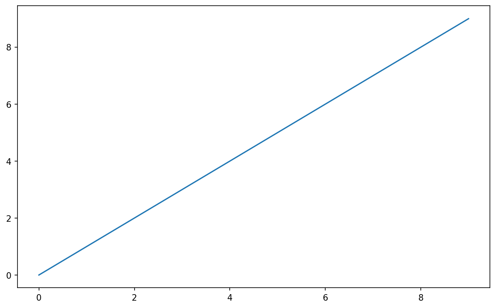

图 9.1：简单线图

虽然像 seaborn 这样的库和 pandas 的内置绘图函数会处理许多制作图表时的繁琐细节，但如果你希望超越函数选项提供的自定义功能，就需要学习一些关于 matplotlib API 的知识。

__

注意 

本书篇幅有限，无法全面介绍 matplotlib 的全部功能。但足以让你掌握基础知识并上手运行。matplotlib 图库和文档是学习高级功能的最佳资源。

### 图形与子图

matplotlib 中的绘图位于 `Figure` 对象内。你可以使用 `plt.figure` 创建一个新图形：

```python
In [17]: fig = plt.figure()
```

在 IPython 中，如果你先运行 `%matplotlib` 来设置 matplotlib 集成，将会出现一个空的绘图窗口，但在 Jupyter 中，直到我们使用更多命令之前，什么都不会显示。

`plt.figure` 有许多选项；特别是 `figsize`，它可以确保图形在保存到磁盘时具有特定的大小和宽高比。

你不能用空白图形制作图表。必须使用 `add_subplot` 创建一个或多个 `子图(subplots)`：

```python
In [18]: ax1 = fig.add_subplot(2, 2, 1)
```

这意味着图形应该是 2 × 2（因此最多四个图），并且我们选择四个子图中的第一个（编号从 1 开始）。如果你创建接下来的两个子图，最终将得到一个如具有三个子图的空 matplotlib 图形所示的可视化效果：

```python
In [19]: ax2 = fig.add_subplot(2, 2, 2)

In [20]: ax3 = fig.add_subplot(2, 2, 3)
```

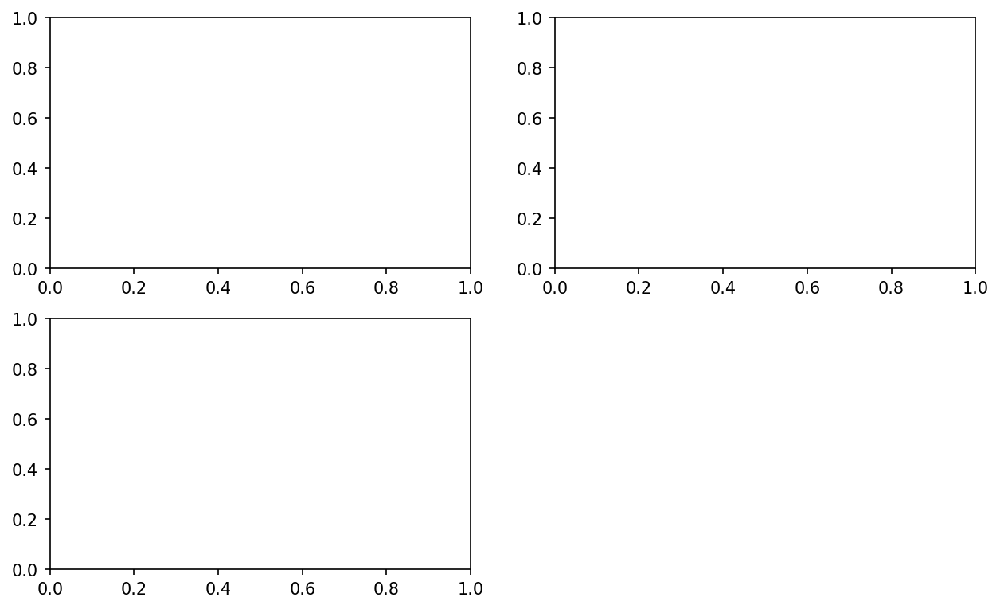

图 9.2：具有三个子图的空 matplotlib 图形

__

提示 

使用 Jupyter notebook 的一个细微差别是，绘图在每个单元格评估后会被重置，因此你必须将所有绘图命令放在一个 notebook 单元格中。

这里我们在同一个单元格中运行所有这些命令：

```python
fig = plt.figure()
ax1 = fig.add_subplot(2, 2, 1)
ax2 = fig.add_subplot(2, 2, 2)
ax3 = fig.add_subplot(2, 2, 3)
```

这些绘图轴对象有各种创建不同类型图表的方法，并且优先使用轴方法而不是像 `plt.plot` 这样的顶级绘图函数。例如，我们可以使用 `plot` 方法制作一个线图（参见单一绘图后的数据可视化）：

```python
In [21]: ax3.plot(np.random.standard_normal(50).cumsum(), color="black",
   ....:          linestyle="dashed")
```

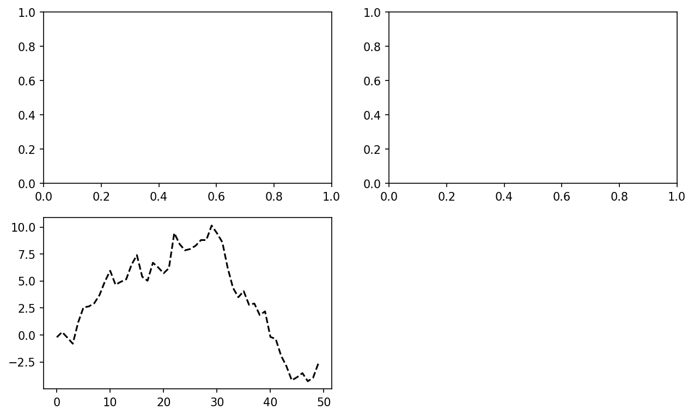

图 9.3：单一绘图后的数据可视化

当你运行此代码时，可能会注意到类似 `<matplotlib.lines.Line2D at ...>` 的输出。matplotlib 会返回引用刚添加的绘图子组件的对象。大多数情况下，你可以安全地忽略此输出，或者可以在行尾添加分号以抑制输出。

额外的选项指示 matplotlib 绘制黑色虚线。此处 `fig.add_subplot` 返回的对象是 `AxesSubplot` 对象，你可以通过调用每个对象的实例方法直接在其它空子图上绘图（参见额外绘图后的数据可视化）：

```python
In [22]: ax1.hist(np.random.standard_normal(100), bins=20, color="black", alpha=0.3);
In [23]: ax2.scatter(np.arange(30), np.arange(30) + 3 * np.random.standard_normal(30));
```

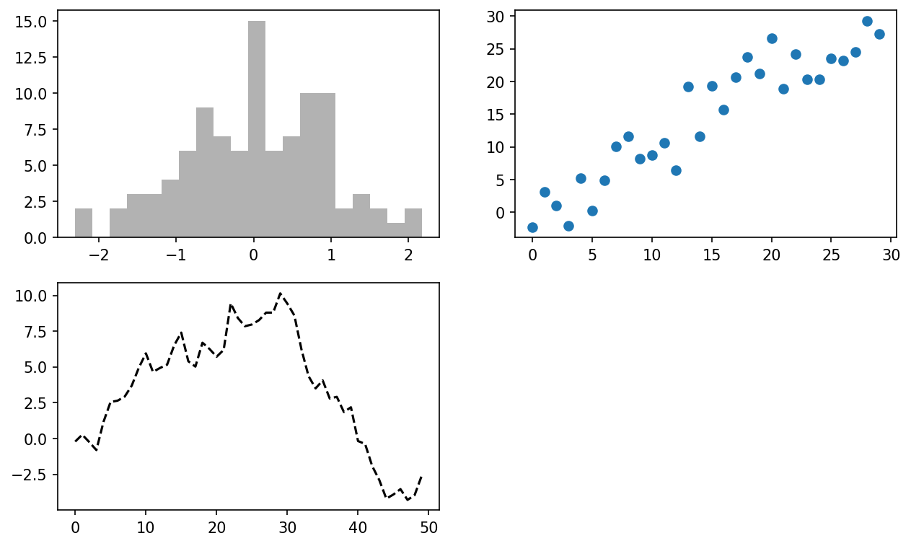

图 9.4：额外绘图后的数据可视化

样式选项 `alpha=0.3` 设置叠加绘图的透明度。

你可以在 [matplotlib 文档](https://matplotlib.org) 中找到全面的图表类型目录。

为了更方便地创建子图网格，matplotlib 包含一个 `plt.subplots` 方法，该方法创建一个新图形并返回一个包含已创建子图对象的 NumPy 数组：

```python
In [25]: fig, axes = plt.subplots(2, 3)

In [26]: axes
Out[26]: 
array([[<Axes: >, <Axes: >, <Axes: >],
       [<Axes: >, <Axes: >, <Axes: >]], dtype=object)
```

然后可以像二维数组一样索引 `axes` 数组；例如，`axes[0, 1]` 指的是顶部行中间的子图。你还可以分别使用 `sharex` 和 `sharey` 指示子图应具有相同的 x 轴或 y 轴。当你在同一尺度上比较数据时，这非常有用；否则，matplotlib 会独立自动缩放绘图范围。有关此方法的更多信息，请参见表 9.1。

表 9.1：`matplotlib.pyplot.subplots` 选项

参数 | 描述  
---|---  
`nrows` | 子图的行数  
`ncols` | 子图的列数  
`sharex` | 所有子图应使用相同的 x 轴刻度（调整 `xlim` 将影响所有子图）  
`sharey` | 所有子图应使用相同的 y 轴刻度（调整 `ylim` 将影响所有子图）  
`subplot_kw` | 传递给用于创建每个子图的 `add_subplot` 调用的关键字字典  
`**fig_kw` | 创建图形时传递给 `subplots` 的附加关键字，例如 `plt.subplots(2, 2, figsize=(8, 6))`  

#### 调整子图周围的间距

默认情况下，matplotlib 会在子图外部和子图之间保留一定量的内边距。此间距全部相对于绘图的高度和宽度指定，因此如果你以编程方式或使用 GUI 窗口手动调整绘图大小，绘图将动态调整自身。你可以使用 `Figure` 对象上的 `subplots_adjust` 方法更改间距：

```python
subplots_adjust(left=None, bottom=None, right=None, top=None,
                wspace=None, hspace=None)
```

`wspace` 和 `hspace` 分别控制用作子图间距的图形宽度和图形高度的百分比。以下是你在 Jupyter 中可以执行的一个小例子，我将间距缩小到零（参见无子图间距的数据可视化）：

```python
fig, axes = plt.subplots(2, 2, sharex=True, sharey=True)
for i in range(2):
    for j in range(2):
        axes[i, j].hist(np.random.standard_normal(500), bins=50,
                        color="black", alpha=0.5)
fig.subplots_adjust(wspace=0, hspace=0)
```

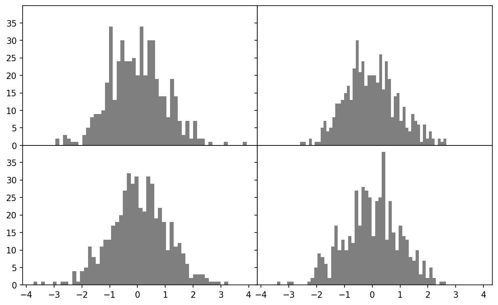

图 9.5：无子图间距的数据可视化

你可能会注意到轴标签重叠。matplotlib 不会检查标签是否重叠，因此在这种情况下，你需要通过指定明确的刻度位置和刻度标签来自行修复标签（我们将在后面的刻度、标签和图例一节中介绍如何操作）。

### 颜色、标记和线型

matplotlib 的线 `plot` 函数接受 x 和 y 坐标数组以及可选的颜色样式选项。例如，要用绿色虚线绘制 `x` 对 `y` 的图，你可以执行：

```python
ax.plot(x, y, linestyle="--", color="green")
```

提供了许多常用颜色的颜色名称，但你可以通过指定其十六进制代码（例如 `"#CECECE"`）使用光谱中的任何颜色。你可以通过查看 `plt.plot` 的文档字符串（在 IPython 或 Jupyter 中使用 `plt.plot?`）来查看一些支持的线型。更全面的参考可在在线文档中找到。

线图还可以有_标记(markers)_来突出显示实际数据点。由于 matplotlib 的 `plot` 函数创建的是连续线图，在点之间进行插值，因此有时可能不清楚点的位置。标记可以作为附加样式选项提供（参见带标记的线图）：

```python
In [31]: ax = fig.add_subplot()

In [32]: ax.plot(np.random.standard_normal(30).cumsum(), color="black",
   ....:         linestyle="dashed", marker="o");
```

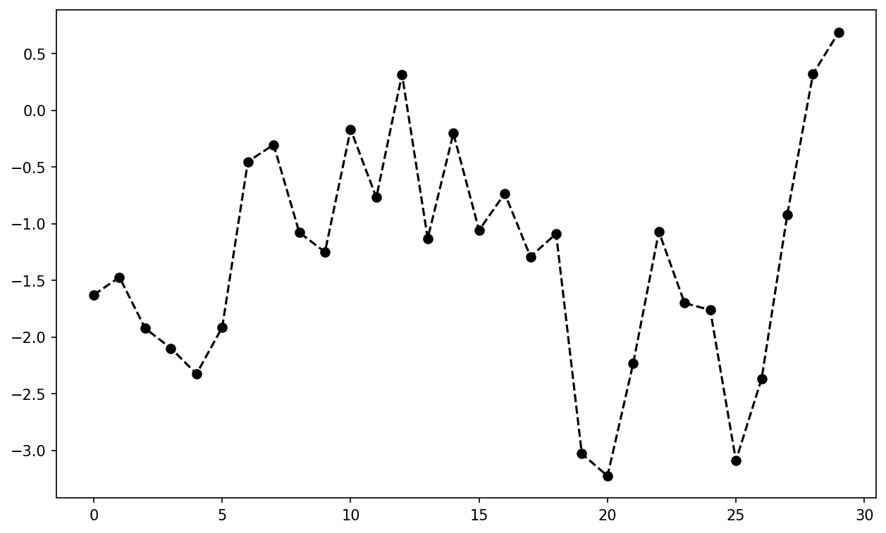

图 9.6：带标记的线图

对于线图，你会注意到后续点默认是线性插值的。这可以通过 `drawstyle` 选项更改（参见具有不同绘制样式选项的线图）：

```python
In [34]: fig = plt.figure()

In [35]: ax = fig.add_subplot()

In [36]: data = np.random.standard_normal(30).cumsum()

In [37]: ax.plot(data, color="black", linestyle="dashed", label="Default");
In [38]: ax.plot(data, color="black", linestyle="dashed",
   ....:         drawstyle="steps-post", label="steps-post");
In [39]: ax.legend()
```

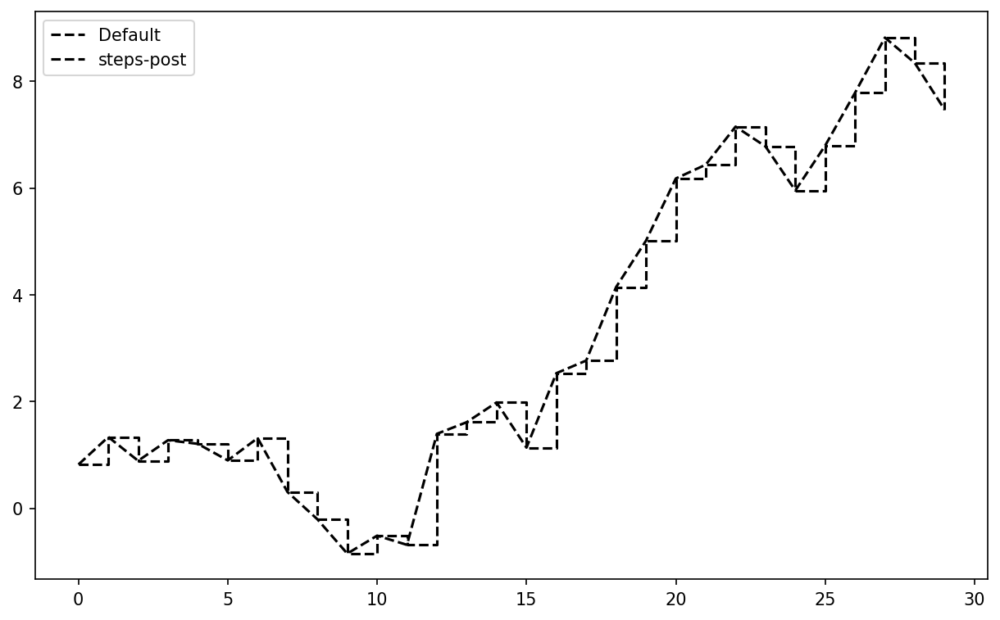

图 9.7：具有不同绘制样式选项的线图

在这里，由于我们向 `plot` 传递了 `label` 参数，我们能够创建一个图例，使用 `ax.legend` 来标识每条线。我将在刻度、标签和图例中进一步讨论图例。

__

注意 

你必须调用 `ax.legend` 来创建图例，无论你在绘图时是否传递了 `label` 选项。

### 刻度、标签和图例

大多数类型的绘图装饰都可以通过 matplotlib 轴对象的方法访问。这包括像 `xlim`、`xticks` 和 `xticklabels` 这样的方法。它们分别控制绘图范围、刻度位置和刻度标签。它们可以通过两种方式使用：

  * 无参数调用时返回当前参数值（例如，`ax.xlim()` 返回当前 x 轴绘图范围）

  * 带参数调用时设置参数值（例如，`ax.xlim([0, 10])` 将 x 轴范围设置为 0 到 10）

所有此类方法都作用于活动或最近创建的 `AxesSubplot`。每个都对应于子图对象本身的两个方法；就 `xlim` 而言，这些是 `ax.get_xlim` 和 `ax.set_xlim`。

#### 设置标题、轴标签、刻度和刻度标签

为了说明自定义轴，我将创建一个简单的图形和一个随机游走的图（参见用于说明 xticks 的简单图（带有默认标签））：

```python
In [40]: fig, ax = plt.subplots()

In [41]: ax.plot(np.random.standard_normal(1000).cumsum());
```

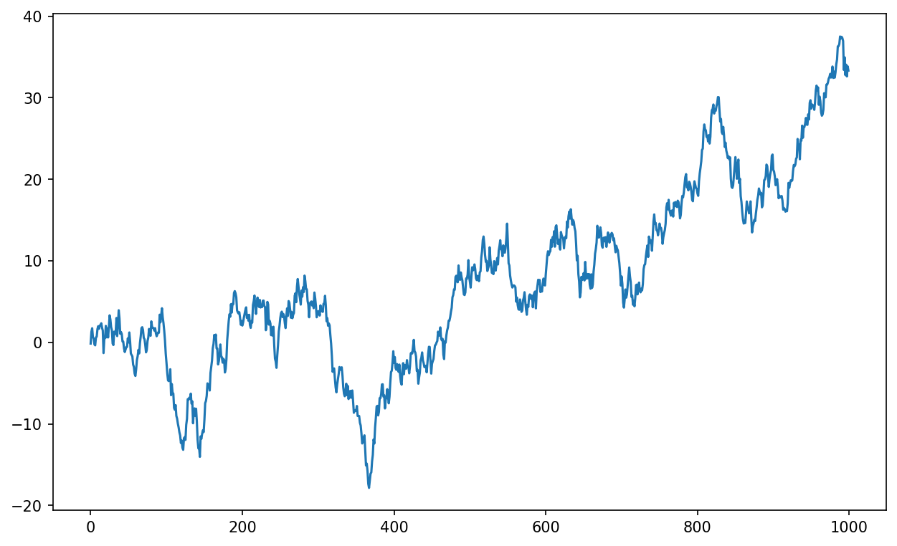

图 9.8：用于说明 xticks 的简单图（带有默认标签）

要更改 x 轴刻度，最简单的方法是使用 `set_xticks` 和 `set_xticklabels`。前者指示 matplotlib 在数据范围内放置刻度的位置；默认情况下，这些位置也将是标签。但我们可以使用 `set_xticklabels` 将任何其他值设置为标签：

```python
In [42]: ticks = ax.set_xticks([0, 250, 500, 750, 1000])

In [43]: labels = ax.set_xticklabels(["one", "two", "three", "four", "five"],
   ....:                             rotation=30, fontsize=8)
```

`rotation` 选项将 x 刻度标签设置为 30 度旋转。最后，`set_xlabel` 为 x 轴命名，`set_title` 是子图标题（参见用于说明自定义 xticks 的简单图的结果图）：

```python
In [44]: ax.set_xlabel("Stages")
Out[44]: Text(0.5, 6.666666666666652, 'Stages')

In [45]: ax.set_title("My first matplotlib plot")
```

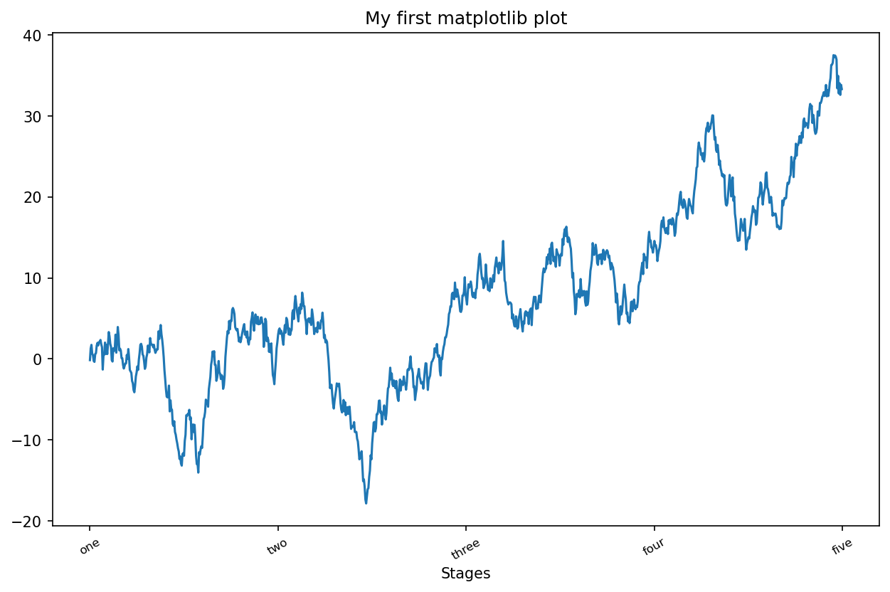

图 9.9：用于说明自定义 xticks 的简单图

修改 y 轴包括相同的过程，在此示例中将 `x` 替换为 `y`。轴类有一个 `set` 方法，允许批量设置绘图属性。从先前的示例中，我们也可以写成：

```python
ax.set(title="My first matplotlib plot", xlabel="Stages")
```

#### 添加图例

图例是识别绘图元素的另一个关键元素。有几种添加方法。最简单的方法是在添加每个绘图部分时传递 `label` 参数：

```python
In [46]: fig, ax = plt.subplots()

In [47]: ax.plot(np.random.randn(1000).cumsum(), color="black", label="one");
In [48]: ax.plot(np.random.randn(1000).cumsum(), color="black", linestyle="dashed",
   ....:         label="two");
In [49]: ax.plot(np.random.randn(1000).cumsum(), color="black", linestyle="dotted",
   ....:         label="three");
```

完成此操作后，你可以调用 `ax.legend()` 自动创建图例。结果图见带有三条线和图例的简单图：

```python
In [50]: ax.legend()
```

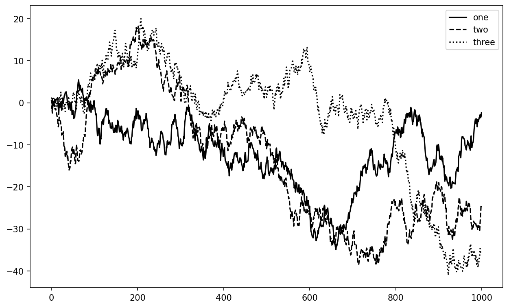

图 9.10：带有三条线和图例的简单图

`legend` 方法有几个用于位置 `loc` 参数的其他选择。有关更多信息，请参见文档字符串（使用 `ax.legend?`）。

`loc` 图例选项告诉 matplotlib 放置图例的位置。默认是 `"best"`，它尝试选择一个最不碍事的位置。要从图例中排除一个或多个元素，请传递无标签或 `label="_nolegend_"`。

### 注解和在子图上绘图

除了标准绘图类型之外，你可能还希望绘制自己的绘图注解，这些注解可能包括文本、箭头或其他形状。你可以使用 `text`、`arrow` 和 `annotate` 函数添加注解和文本。`text` 在绘图的给定坐标 `(x, y)` 处绘制文本，并带有可选的自定义样式：

```python
ax.text(x, y, "Hello world!",
        family="monospace", fontsize=10)
```

注解可以绘制适当排列的文本和箭头。例如，让我们绘制自 2007 年以来的标准普尔 500 指数收盘价（从 Yahoo! Finance 获取），并用 2008-2009 年金融危机的一些重要日期进行注解。你可以在 Jupyter notebook 的单个单元格中运行此代码示例。结果参见 2008-2009 年金融危机中的重要日期：

```python
from datetime import datetime

fig, ax = plt.subplots()

data = pd.read_csv("examples/spx.csv", index_col=0, parse_dates=True)
spx = data["SPX"]

spx.plot(ax=ax, color="black")

crisis_data = [
    (datetime(2007, 10, 11), "Peak of bull market"),
    (datetime(2008, 3, 12), "Bear Stearns Fails"),
    (datetime(2008, 9, 15), "Lehman Bankruptcy")
]

for date, label in crisis_data:
    ax.annotate(label, xy=(date, spx.asof(date) + 75),
                xytext=(date, spx.asof(date) + 225),
                arrowprops=dict(facecolor="black", headwidth=4, width=2,
                                headlength=4),
                horizontalalignment="left", verticalalignment="top")

# Zoom in on 2007-2010
ax.set_xlim(["1/1/2007", "1/1/2011"])
ax.set_ylim([600, 1800])

ax.set_title("Important dates in the 2008–2009 financial crisis")
```

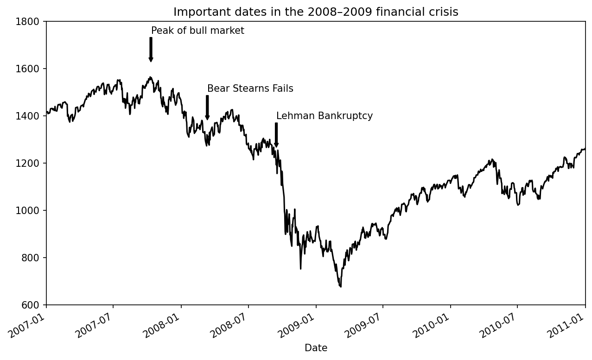

图 9.11：2008-2009 年金融危机中的重要日期

在此图中有几个要点需要强调。`ax.annotate` 方法可以在指定的 x 和 y 坐标处绘制标签。我们使用 `set_xlim` 和 `set_ylim` 方法手动设置绘图的开始和结束边界，而不是使用 matplotlib 的默认设置。最后，`ax.set_title` 为绘图添加主标题。

请参阅在线 matplotlib 图库以获取更多注解示例供学习。

绘制形状需要更加小心。matplotlib 有代表许多常见形状的对象，称为_补丁(patches)_。其中一些，如 `Rectangle` 和 `Circle`，可以在 `matplotlib.pyplot` 中找到，但完整集合位于 `matplotlib.patches` 中。

要向绘图添加形状，你需要创建补丁对象，并通过将补丁传递给 `ax.add_patch` 将其添加到子图 `ax` 中（参见由三个不同补丁组成的数据可视化）：

```python
fig, ax = plt.subplots()

rect = plt.Rectangle((0.2, 0.75), 0.4, 0.15, color="black", alpha=0.3)
circ = plt.Circle((0.7, 0.2), 0.15, color="blue", alpha=0.3)
pgon = plt.Polygon([[0.15, 0.15], [0.35, 0.4], [0.2, 0.6]],
                   color="green", alpha=0.5)

ax.add_patch(rect)
ax.add_patch(circ)
ax.add_patch(pgon)
```

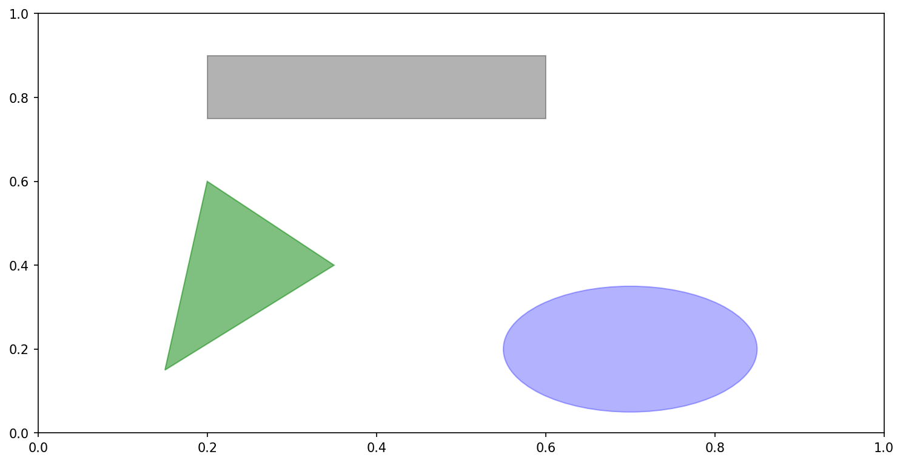

图 9.12：由三个不同补丁组成的数据可视化

如果你查看许多熟悉绘图类型的实现，你会发现它们是由补丁组装而成的。

### 将绘图保存到文件

你可以使用图形对象的 `savefig` 实例方法将活动图形保存到文件。例如，要保存图形的 SVG 版本，你只需输入：

```python
fig.savefig("figpath.svg")
```

文件类型从文件扩展名推断。因此，如果你使用 `.pdf`，你将得到一个 PDF。我经常用于发布图形的一个重要选项是 `dpi`，它控制每英寸点数分辨率。要获取相同的 400 DPI 的 PNG 图，你可以执行：

```python
fig.savefig("figpath.png", dpi=400)
```

有关 `savefig` 的一些其他选项，请参见表 9.2。有关完整列表，请参阅 IPython 或 Jupyter 中的文档字符串。

表 9.2：一些 `fig.savefig` 选项

参数 | 描述  
---|---  
`fname` | 包含文件路径的字符串或 Python 文件类对象。图形格式从文件扩展名推断（例如，PDF 为 `.pdf`，PNG 为 `.png`）。  
`dpi` | 以每英寸点数为单位的图形分辨率；在 IPython 中默认为 100，在 Jupyter 中默认为 72，但可以配置。  
`facecolor, edgecolor` | 子图外部的图形背景颜色；默认为 `"w"`（白色）。  
`format` | 要使用的显式文件格式（`"png"`、`"pdf"`、`"svg"`、`"ps"`、`"eps"`、...）。  

### matplotlib 配置

matplotlib 附带的颜色方案和默认设置主要面向准备出版图形。幸运的是，几乎所有的默认行为都可以通过全局参数进行自定义，这些参数控制图形大小、子图间距、颜色、字体大小、网格样式等。一种从 Python 以编程方式修改配置的方法是使用 `rc` 方法；例如，要将全局默认图形大小设置为 10 × 10，你可以输入：

```python
plt.rc("figure", figsize=(10, 10))
```

所有当前配置设置都可在 `plt.rcParams` 字典中找到，并且可以通过调用 `plt.rcdefaults()` 函数将它们恢复为默认值。

`rc` 的第一个参数是你希望自定义的组件，例如 `"figure"`、`"axes"`、`"xtick"`、`"ytick"`、`"grid"`、`"legend"` 或许多其他组件。之后可以跟随一系列指示新参数的关键字参数。在程序中记录选项的一种方便方式是作为字典：

```python
plt.rc("font", family="monospace", weight="bold", size=8)
```

为了进行更广泛的自定义并查看所有选项的列表，matplotlib 在 _matplotlib/mpl-data_ 目录中附带了一个配置文件 _matplotlibrc_。如果你自定义此文件并将其放在主目录中名为 _.matplotlibrc_ 的文件中，则每次使用 matplotlib 时都会加载它。

正如我们将在下一节中看到的，seaborn 包有几个内置的绘图主题或_样式(styles)_，它们在内部使用 matplotlib 的配置系统。

## 9.2 使用 pandas 和 seaborn 绘图

matplotlib 可以说是一种相对底层的工具。您需要从基础组件组装图形：数据展示（即绘图类型：折线图、条形图、箱线图、散点图、等高线图等）、图例、标题、刻度标签和其他注释。

在 pandas 中，我们可能有多列数据，以及行和列标签。pandas 本身内置了一些方法，可以简化从 DataFrame 和 Series 对象创建可视化图表的过程。另一个库是 [`seaborn`](https://seaborn.pydata.org)，它是一个基于 matplotlib 构建的高级统计图形库。seaborn 简化了许多常见可视化类型的创建。

### 折线图

Series 和 DataFrame 都有一个用于制作某些基本图表类型的 `plot` 属性。默认情况下，`plot()` 会创建折线图（参见简单 Series 绘图）：
    
    
    In [61]: s = pd.Series(np.random.standard_normal(10).cumsum(), index=np.arange(0,
     100, 10))
    
    In [62]: s.plot()__

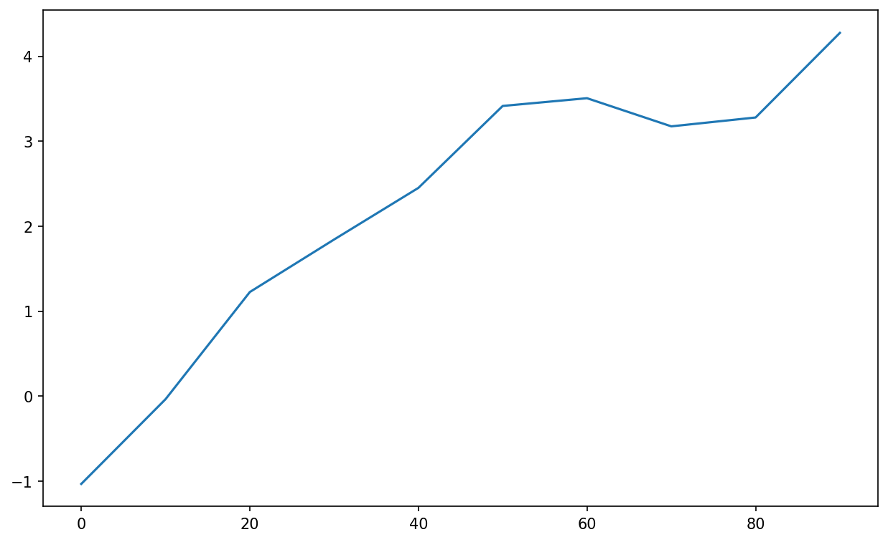

图 9.13：简单 Series 绘图

Series 对象的索引会被传递给 matplotlib 用于在 x 轴上绘图，但您可以通过传递 `use_index=False` 来禁用此功能。x 轴的刻度和范围可以通过 `xticks` 和 `xlim` 选项调整，y 轴则分别使用 `yticks` 和 `ylim`。有关 `plot` 选项的部分列表，请参见表 9.3。我将在本节中讨论其中更多选项，其余部分留给您自行探索。

表 9.3：`Series.plot` 方法参数 参数 | 描述  
---|---  
`label` | 图例标签  
`ax` | 要绘图的 matplotlib 子图对象；如果未传递任何内容，则使用当前活动的 matplotlib 子图  
`style` | 样式字符串，如 `"ko--"`，将传递给 matplotlib  
`alpha` | 图形填充不透明度（从 0 到 1）  
`kind` | 可以是 `"area"`、`"bar"`、`"barh"`、`"density"`、`"hist"`、`"kde"`、`"line"` 或 `"pie"`；默认为 `"line"`  
`figsize` | 要创建的图形对象的大小  
`logx` | 在 x 轴上使用对数刻度时传递 `True`；传递 `"sym"` 以使用允许负值的对称对数刻度  
`logy` | 在 y 轴上使用对数刻度时传递 `True`；传递 `"sym"` 以使用允许负值的对称对数刻度  
`title` | 用于图表的标题  
`use_index` | 使用对象索引作为刻度标签  
`rot` | 刻度标签的旋转角度（0 到 360）  
`xticks` | 用于 x 轴刻度的值  
`yticks` | 用于 y 轴刻度的值  
`xlim` | x 轴范围（例如 `[0, 10]`）  
`ylim` | y 轴范围  
`grid` | 显示轴网格（默认关闭）  
  
大多数 pandas 的绘图方法接受一个可选的 `ax` 参数，该参数可以是一个 matplotlib 子图对象。这使您能够更灵活地在网格布局中放置子图。

DataFrame 的 `plot` 方法将其每一列作为不同的线绘制在同一子图上，并自动创建图例（参见简单 DataFrame 绘图）：
    
    
    In [63]: df = pd.DataFrame(np.random.standard_normal((10, 4)).cumsum(0),
       ....:                   columns=["A", "B", "C", "D"],
       ....:                   index=np.arange(0, 100, 10))
    
    In [64]: plt.style.use('grayscale')
    
    In [65]: df.plot()__

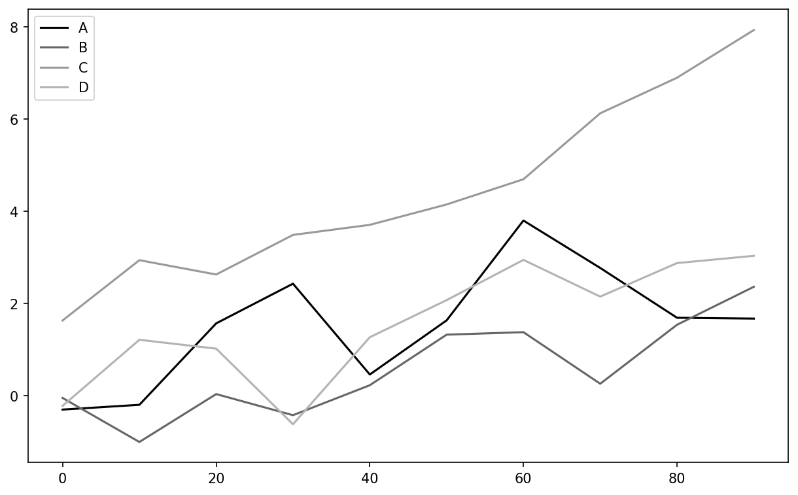

图 9.14：简单 DataFrame 绘图

__

注意 

这里我使用了 `plt.style.use('grayscale')` 来切换到更适合黑白出版的颜色方案，因为一些读者可能无法看到全彩图表。

`plot` 属性包含一系列用于不同图表类型的方法。例如，`df.plot()` 等价于 `df.plot.line()`。接下来我们将探讨其中一些方法。

__

注意 

传递给 `plot` 的额外关键字参数会传递给相应的 matplotlib 绘图函数，因此您可以通过进一步学习 matplotlib API 来自定义这些图表。

DataFrame 有许多选项，允许对列的处理方式有一定的灵活性，例如，是将它们全部绘制在同一子图上，还是创建单独的子图。有关这些选项的更多信息，请参见表 9.4。

表 9.4：DataFrame 特定的绘图参数 参数 | 描述  
---|---  
`subplots` | 在单独的子图中绘制每个 DataFrame 列  
`layouts` | 提供子图布局的 2 元组（行数, 列数）  
`sharex` | 如果 `subplots=True`，共享相同的 x 轴，链接刻度和范围  
`sharey` | 如果 `subplots=True`，共享相同的 y 轴  
`legend` | 添加子图图例（默认为 `True`）  
`sort_columns` | 按字母顺序绘制列；默认使用现有列顺序  
  
__

注意 

有关时间序列绘图，请参见[第 11 章：时间序列](https://wesmckinney.com/book/time-series)。

### 条形图

`plot.bar()` 和 `plot.barh()` 分别创建垂直和水平条形图。在这种情况下，Series 或 DataFrame 的索引将被用作 x（`bar`）或 y（`barh`）刻度（参见水平和垂直条形图）：
    
    
    In [66]: fig, axes = plt.subplots(2, 1)
    
    In [67]: data = pd.Series(np.random.uniform(size=16), index=list("abcdefghijklmno
    p"))
    
    In [68]: data.plot.bar(ax=axes[0], color="black", alpha=0.7)
    Out[68]: <Axes: >
    
    In [69]: data.plot.barh(ax=axes[1], color="black", alpha=0.7)__

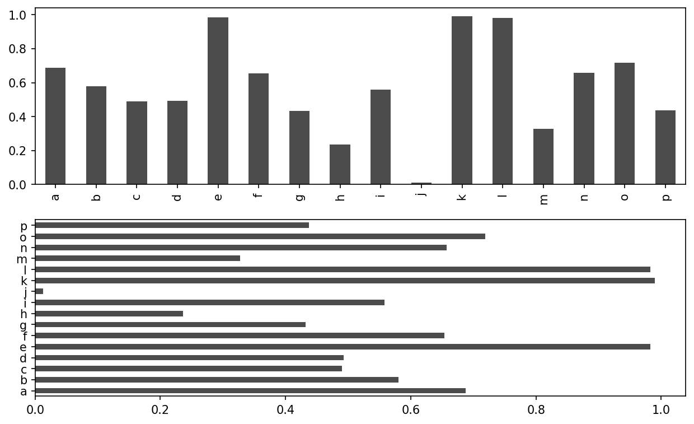

图 9.15：水平和垂直条形图

对于 DataFrame，条形图会将每一行的值按组别并排放置。参见 DataFrame 条形图：
    
    
    In [71]: df = pd.DataFrame(np.random.uniform(size=(6, 4)),
       ....:                   index=["one", "two", "three", "four", "five", "six"],
       ....:                   columns=pd.Index(["A", "B", "C", "D"], name="Genus"))
    
    In [72]: df
    Out[72]: 
    Genus         A         B         C         D
    one    0.370670  0.602792  0.229159  0.486744
    two    0.420082  0.571653  0.049024  0.880592
    three  0.814568  0.277160  0.880316  0.431326
    four   0.374020  0.899420  0.460304  0.100843
    five   0.433270  0.125107  0.494675  0.961825
    six    0.601648  0.478576  0.205690  0.560547
    
    In [73]: df.plot.bar()__

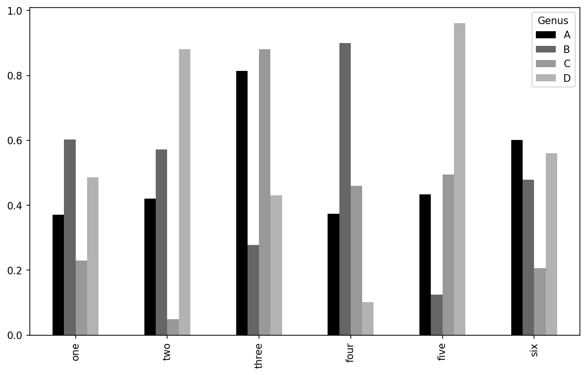

图 9.16：DataFrame 条形图

请注意，DataFrame 列上的名称“Genus”被用作图例标题。

通过传递 `stacked=True`，我们可以从 DataFrame 创建堆叠条形图，从而将每一行的值水平堆叠在一起（参见 DataFrame 堆叠条形图）：
    
    
    In [75]: df.plot.barh(stacked=True, alpha=0.5)__

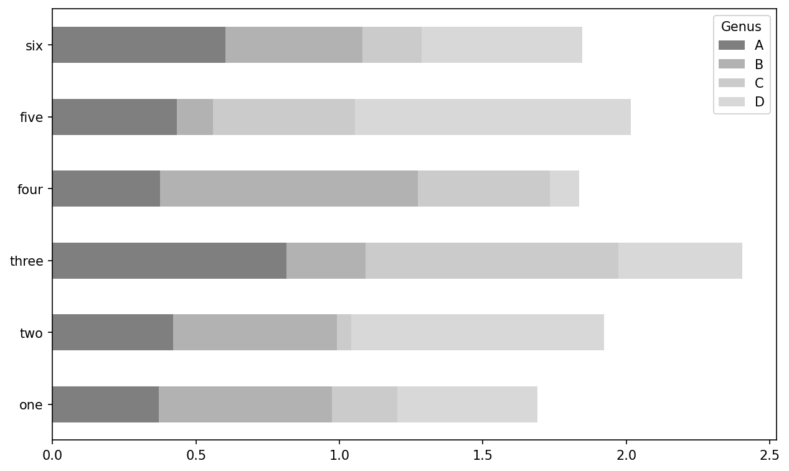

图 9.17：DataFrame 堆叠条形图

__

注意 

条形图的一个有用技巧是使用 `value_counts` 可视化 Series 的值频率：`s.value_counts().plot.bar()`。

让我们看一个关于餐厅小费的示例数据集。假设我们想制作一个堆叠条形图，显示每天不同聚会规模的数据点百分比。我使用 `read_csv` 加载数据，并按天和聚会规模进行交叉制表。`pandas.crosstab` 函数是一种便捷的方法，可以从两个 DataFrame 列计算简单的频率表：
    
    
    In [77]: tips = pd.read_csv("examples/tips.csv")
    
    In [78]: tips.head()
    Out[78]: 
       total_bill   tip smoker  day    time  size
    0       16.99  1.01     No  Sun  Dinner     2
    1       10.34  1.66     No  Sun  Dinner     3
    2       21.01  3.50     No  Sun  Dinner     3
    3       23.68  3.31     No  Sun  Dinner     2
    4       24.59  3.61     No  Sun  Dinner     4
    
    In [79]: party_counts = pd.crosstab(tips["day"], tips["size"])
    
    In [80]: party_counts = party_counts.reindex(index=["Thur", "Fri", "Sat", "Sun"])
    
    In [81]: party_counts
    Out[81]: 
    size  1   2   3   4  5  6
    day                      
    Thur  1  48   4   5  1  3
    Fri   1  16   1   1  0  0
    Sat   2  53  18  13  1  0
    Sun   0  39  15  18  3  1 __

由于一人和六人聚会的数据不多，我在这里移除它们：
    
    
    In [82]: party_counts = party_counts.loc[:, 2:5]__

然后，进行归一化使每行总和为 1，并绘制图表（参见每天内各聚会规模的占比）：
    
    
    # 归一化使总和为 1
    In [83]: party_pcts = party_counts.div(party_counts.sum(axis="columns"),
       ....:                               axis="index")
    
    In [84]: party_pcts
    Out[84]: 
    size         2         3         4         5
    day                                         
    Thur  0.827586  0.068966  0.086207  0.017241
    Fri   0.888889  0.055556  0.055556  0.000000
    Sat   0.623529  0.211765  0.152941  0.011765
    Sun   0.520000  0.200000  0.240000  0.040000
    
    In [85]: party_pcts.plot.bar(stacked=True)__

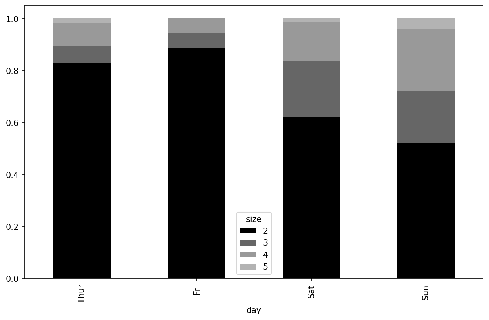

图 9.18：每天内各聚会规模的占比

因此，您可以看到在这个数据集中，周末的聚会规模似乎有所增加。

对于需要聚合或汇总才能绘制图表的数据，使用 `seaborn` 包可以使事情变得简单得多（使用 `conda install seaborn` 安装）。现在让我们看看使用 seaborn 绘制的每天的小费百分比（参见带误差线的每天小费百分比）：
    
    
    In [87]: import seaborn as sns
    
    In [88]: tips["tip_pct"] = tips["tip"] / (tips["total_bill"] - tips["tip"])
    
    In [89]: tips.head()
    Out[89]: 
       total_bill   tip smoker  day    time  size   tip_pct
    0       16.99  1.01     No  Sun  Dinner     2  0.063204
    1       10.34  1.66     No  Sun  Dinner     3  0.191244
    2       21.01  3.50     No  Sun  Dinner     3  0.199886
    3       23.68  3.31     No  Sun  Dinner     2  0.162494
    4       24.59  3.61     No  Sun  Dinner     4  0.172069
    
    In [90]: sns.barplot(x="tip_pct", y="day", data=tips, orient="h")__

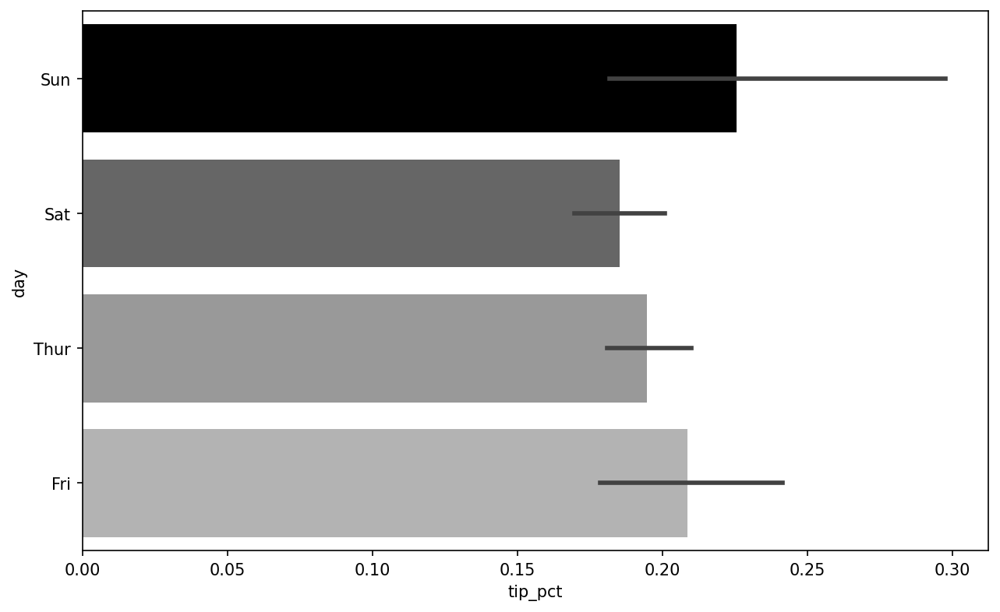

图 9.19：带误差线的每天小费百分比

seaborn 中的绘图函数接受一个 `data` 参数，该参数可以是一个 pandas DataFrame。其他参数引用列名。由于 `day` 中的每个值有多个观测值，条形表示 `tip_pct` 的平均值。条形上绘制的黑线代表 95% 置信区间（这可以通过可选参数进行配置）。

`seaborn.barplot` 有一个 `hue` 选项，使我们能够按额外的分类值进行拆分（参见按天和时间划分的小费百分比）：
    
    
    In [92]: sns.barplot(x="tip_pct", y="day", hue="time", data=tips, orient="h")__

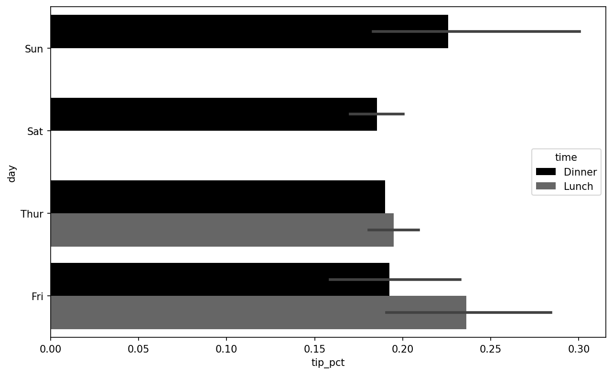

图 9.20：按天和时间划分的小费百分比

请注意，seaborn 自动改变了图表的美学效果：默认调色板、图表背景和网格线颜色。您可以使用 `seaborn.set_style` 在不同的图表外观之间切换：
    
    
    In [94]: sns.set_style("whitegrid")__

在为黑白印刷媒体制作图表时，您可能会发现设置灰度调色板很有用，如下所示：
    
    
    sns.set_palette("Greys_r")__

### 直方图和密度图

_直方图_（histogram）是一种条形图，用于离散化显示值的频率。数据点被分割成离散的、等间距的区间（bin），并绘制每个区间中的数据点数量。使用之前的小费数据，我们可以使用 Series 上的 `plot.hist` 方法制作总账单小费百分比的直方图（参见小费百分比直方图）：
    
    
    In [96]: tips["tip_pct"].plot.hist(bins=50)__

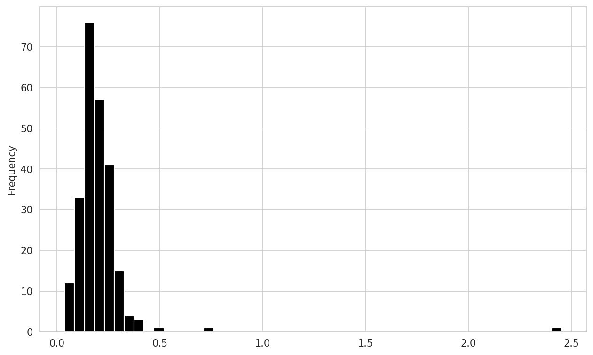

图 9.21：小费百分比直方图

一种相关的图表类型是_密度图_（density plot），它是通过计算可能生成观测数据的连续概率分布的估计值而形成的。通常的过程是将此分布近似为“核”（kernels）的混合——即更简单的分布，如正态分布。因此，密度图也被称为核密度估计（KDE）图。使用 `plot.density` 可以利用传统的混合正态估计制作密度图（参见小费百分比密度图）：
    
    
    In [98]: tips["tip_pct"].plot.density()__

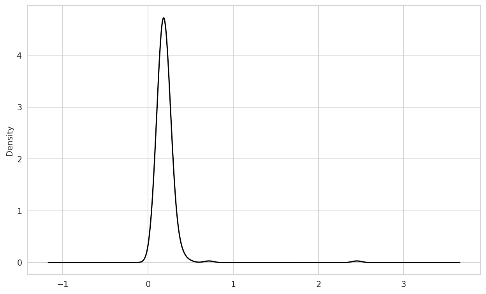

图 9.22：小费百分比密度图

这种图表需要 SciPy，因此如果您尚未安装，可以暂停并立即安装：
    
    
    conda install scipy

seaborn 通过其 `histplot` 方法使直方图和密度图的制作更加简单，该方法可以同时绘制直方图和连续密度估计。例如，考虑一个由两个不同标准正态分布抽取组成的双峰分布（参见正态混合的归一化直方图）：
    
    
    In [100]: comp1 = np.random.standard_normal(200)
    
    In [101]: comp2 = 10 + 2 * np.random.standard_normal(200)
    
    In [102]: values = pd.Series(np.concatenate([comp1, comp2]))
    
    In [103]: sns.histplot(values, bins=100, color="black")__

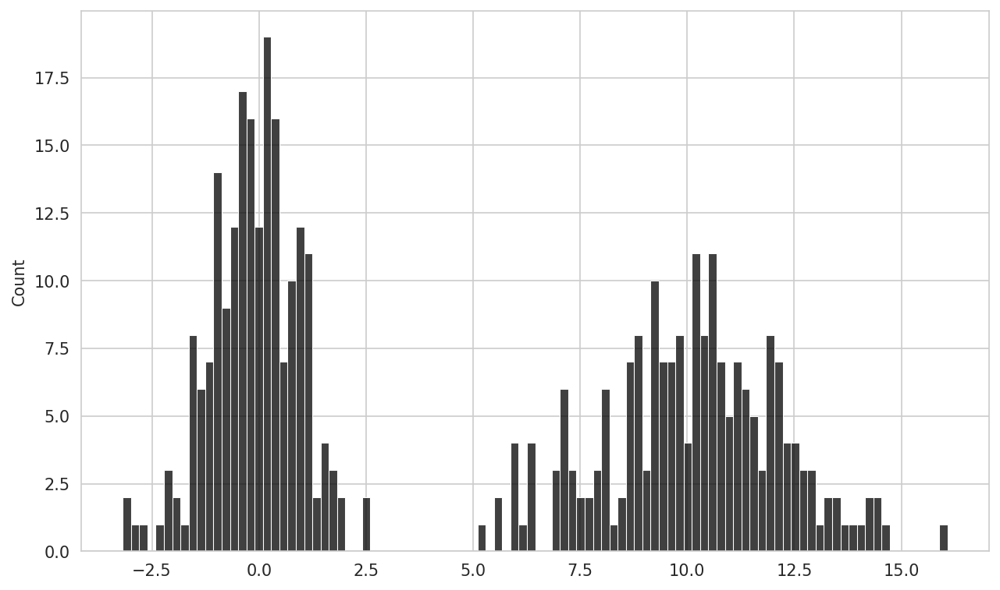

图 9.23：正态混合的归一化直方图

### 散点图或点图

点图或散点图可以是检查两个一维数据系列之间关系的有用方法。例如，这里我们从 statsmodels 项目中加载 `macrodata` 数据集，选择几个变量，然后计算对数差分：
    
    
    In [104]: macro = pd.read_csv("examples/macrodata.csv")
    
    In [105]: data = macro[["cpi", "m1", "tbilrate", "unemp"]]
    
    In [106]: trans_data = np.log(data).diff().dropna()
    
    In [107]: trans_data.tail()
    Out[107]: 
              cpi        m1  tbilrate     unemp
    198 -0.007904  0.045361 -0.396881  0.105361
    199 -0.021979  0.066753 -2.277267  0.139762
    200  0.002340  0.010286  0.606136  0.160343
    201  0.008419  0.037461 -0.200671  0.127339
    202  0.008894  0.012202 -0.405465  0.042560 __

然后，我们可以使用 seaborn 的 `regplot` 方法，该方法制作散点图并拟合线性回归线（参见 seaborn 回归/散点图）：
    
    
    In [109]: ax = sns.regplot(x="m1", y="unemp", data=trans_data)
    
    In [110]: ax.set_title("Changes in log(m1) versus log(unemp)")__

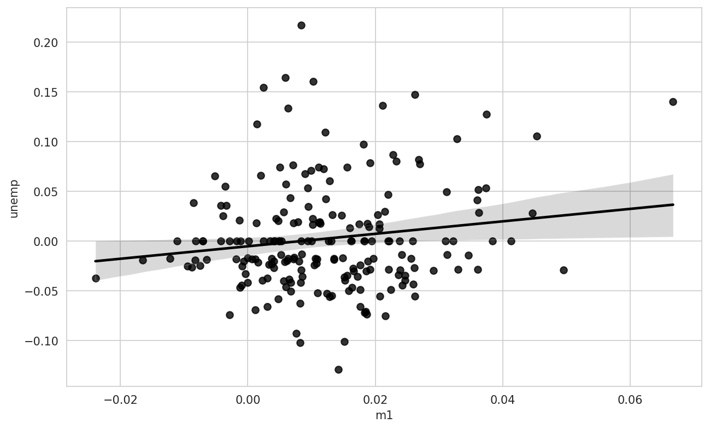

图 9.24：seaborn 回归/散点图

在探索性数据分析中，能够查看一组变量之间的所有散点图是很有帮助的；这被称为_配对_图（pairs plot）或_散点图矩阵_（scatter plot matrix）。从头开始制作这样的图表需要一些工作，因此 seaborn 有一个方便的 `pairplot` 函数，支持在对角线上放置每个变量的直方图或密度估计（参见 statsmodels 宏观数据的配对图矩阵）：
    
    
    In [111]: sns.pairplot(trans_data, diag_kind="kde", plot_kws={"alpha": 0.2})__

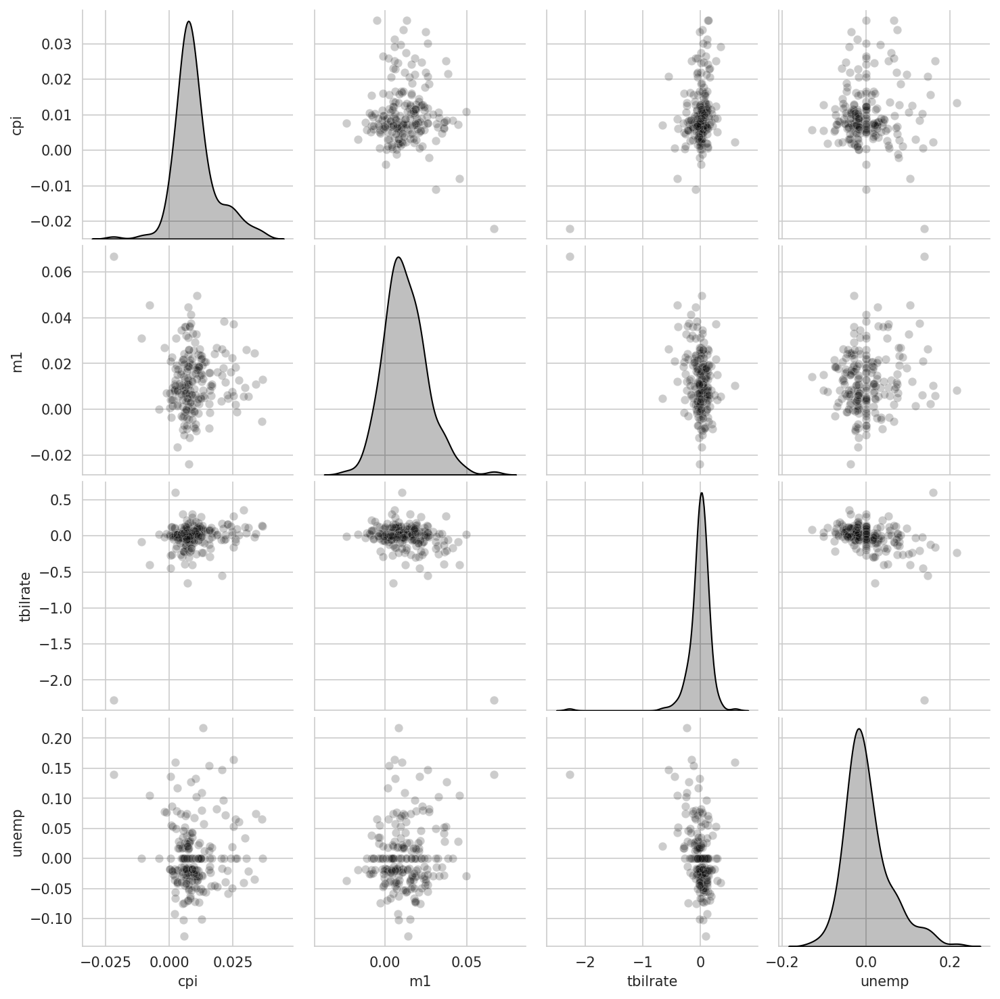

图 9.25：statsmodels 宏观数据的配对图矩阵

您可能会注意到 `plot_kws` 参数。这使我们能够将配置选项传递给非对角线元素上的单个绘图调用。有关更细粒度的配置选项，请查看 `seaborn.pairplot` 的文档字符串。

### 分面网格和分类数据

对于具有额外分组维度的数据集呢？可视化具有许多分类变量的数据的一种方法是使用_分面网格_（facet grid），这是一个二维的图表布局，其中数据基于某个变量的不同值在每个轴上的图表中进行分割。seaborn 有一个有用的内置函数 `catplot`，可以简化制作按分类变量分割的多种分面图表（参见按天/时间/吸烟者划分的小费百分比）：
    
    
    In [112]: sns.catplot(x="day", y="tip_pct", hue="time", col="smoker",
       .....:             kind="bar", data=tips[tips.tip_pct < 1])__

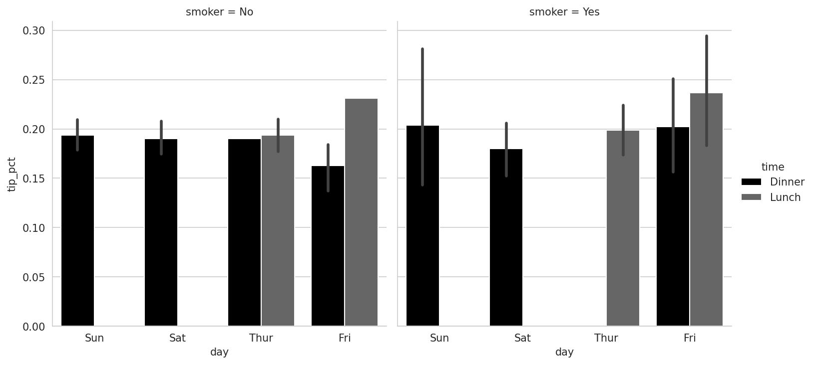

图 9.26：按天/时间/吸烟者划分的小费百分比

除了通过分面内不同条形颜色按 `"time"` 分组外，我们还可以通过为每个 `time` 值添加一行来扩展分面网格（参见按时间/吸烟者分天的划分小费百分比）：
    
    
    In [113]: sns.catplot(x="day", y="tip_pct", row="time",
       .....:             col="smoker",
       .....:             kind="bar", data=tips[tips.tip_pct < 1])__

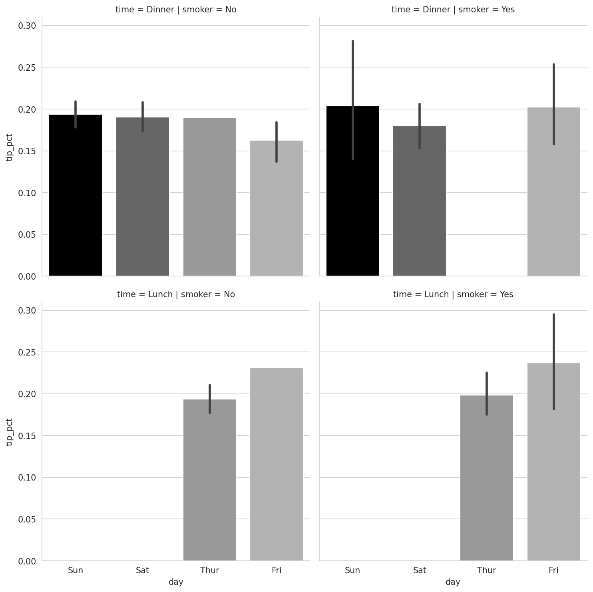

图 9.27：按时间/吸烟者分天的划分小费百分比

`catplot` 支持其他可能有用的图表类型，具体取决于您要显示的内容。例如，_箱线图_（box plots）（显示中位数、四分位数和异常值）可以是一种有效的可视化类型（参见按天划分的小费百分比箱线图）：
    
    
    In [114]: sns.catplot(x="tip_pct", y="day", kind="box",
       .....:             data=tips[tips.tip_pct < 0.5])__

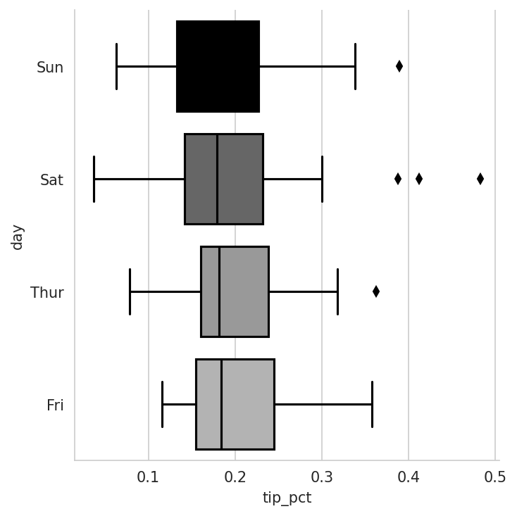

图 9.28：按天划分的小费百分比箱线图

您可以使用更通用的 `seaborn.FacetGrid` 类创建自己的分面网格图表。更多信息请参阅 [seaborn 文档](https://seaborn.pydata.org/)。

## 9.3 其他 Python 可视化工具

正如开源领域的常态，Python 中创建图形的方式有多种选择（多到无法一一列举）。自 2010 年以来，许多开发工作都集中在创建用于在 Web 上发布的交互式图形上。借助 [Altair](https://altair-viz.github.io)、[Bokeh](http://bokeh.pydata.org) 和 [Plotly](https://plotly.com/python) 等工具，现在可以在 Python 中指定用于 Web 浏览器的动态交互式图形。

对于创建用于打印或 Web 的静态图形，我建议根据需求使用 matplotlib 以及基于 matplotlib 构建的库，如 pandas 和 seaborn。对于其他数据可视化需求，学习使用其他可用工具之一可能会有所帮助。我鼓励您探索这个生态系统，因为它未来将继续发展和创新。

关于数据可视化，一本优秀的书籍是 Claus O. Wilke 所著的《数据可视化基础》（Fundamentals of Data Visualization，O'Reilly 出版），该书有印刷版，也可以在 Claus 的网站 <https://clauswilke.com/dataviz> 上找到。

## 9.4 本章小结

本章的目标是让您通过 pandas、matplotlib 和 seaborn 初步掌握基本的数据可视化技术。如果可视化呈现数据分析结果在您的工作中非常重要，我建议您寻找更多资源来深入学习有效的数据可视化方法。这是一个活跃的研究领域，您可以通过线上和线下的许多优质学习资源进行实践。

接下来，我们将把注意力转向 pandas 的数据聚合与分组操作。