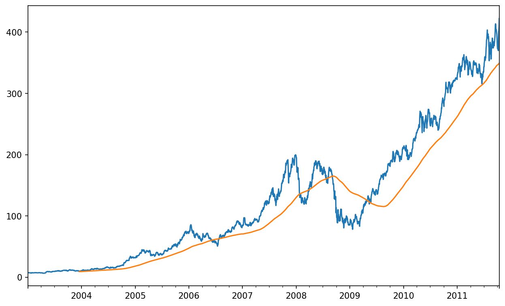
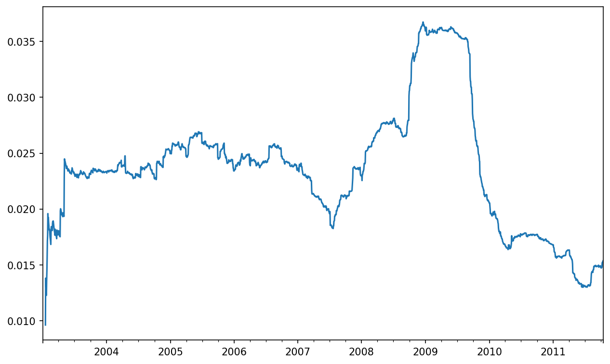
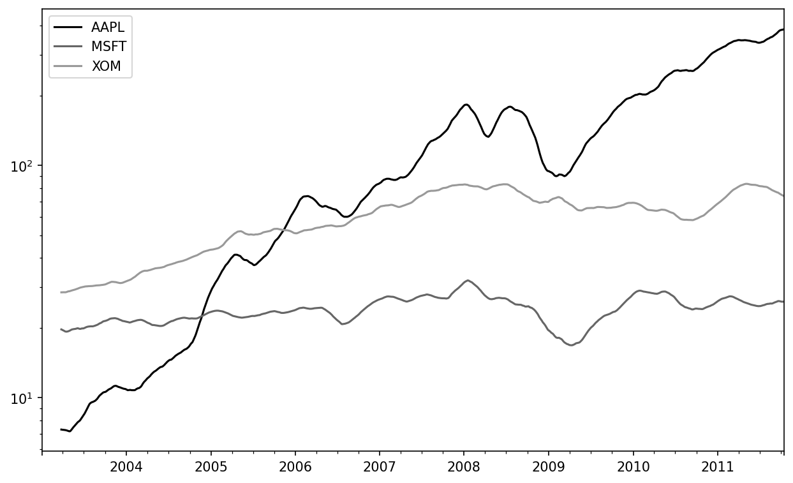
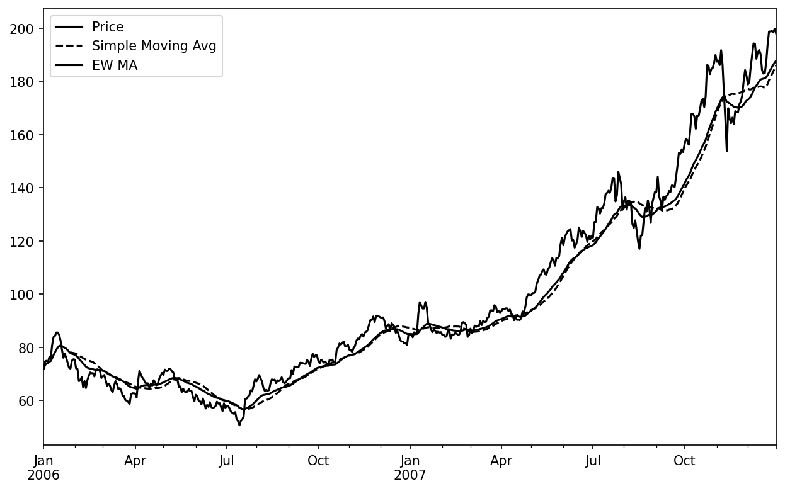
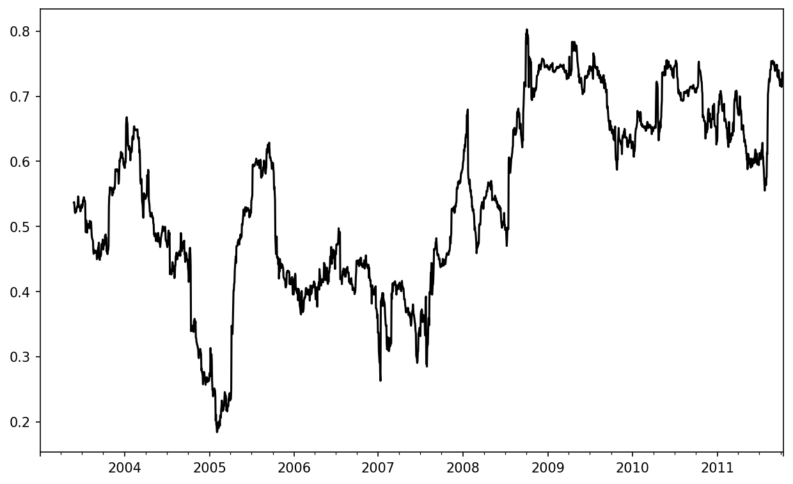
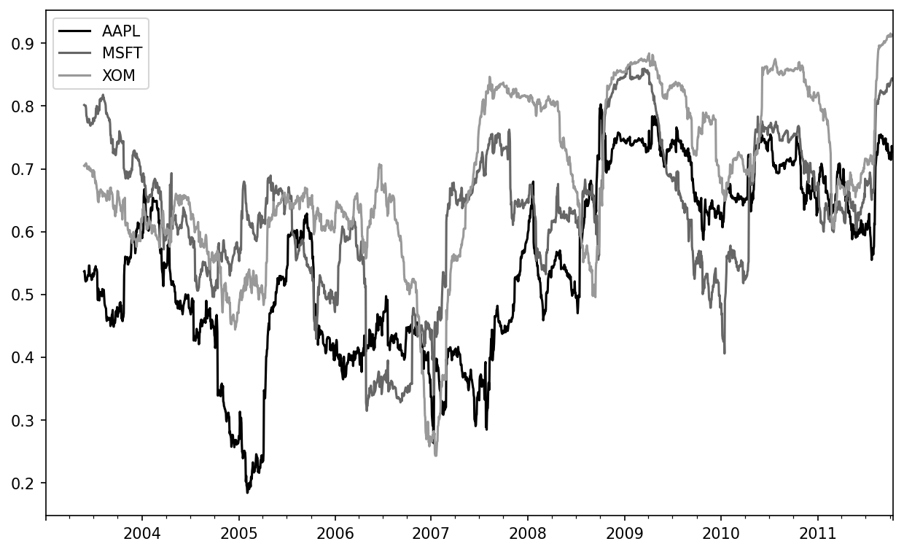
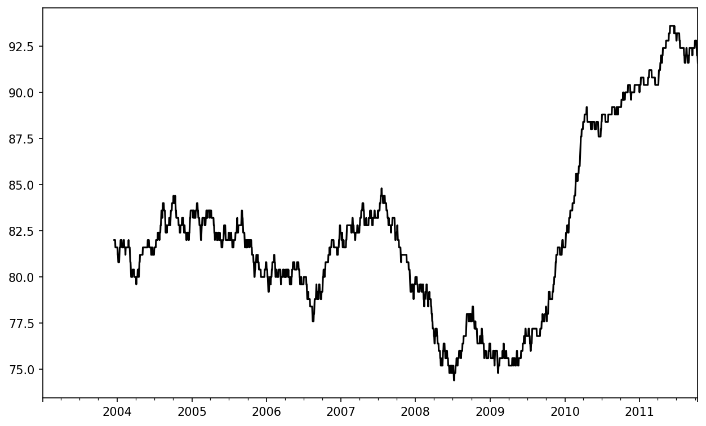

# 11 时间序列

__

《利用 Python 进行数据分析 第三版》的开放存取网络版现已上线，作为[印刷版与数字版](https://amzn.to/3DyLaJc)的配套资源。若发现任何勘误，[请在此处提交](https://oreilly.com/catalog/0636920519829/errata)。请注意，由 Quarto 生成的本站点某些呈现形式会与 O’Reilly 出版的印刷版及电子书版本有所不同。

如果您觉得在线版书籍很有帮助，请考虑[订购纸质版本](https://amzn.to/3DyLaJc)或[无 DRM 限制的电子书](https://www.ebooks.com/en-us/book/210644288/python-for-data-analysis/wes-mckinney/?affId=WES398681F)以支持作者。本站内容禁止复制或转载。代码示例遵循 MIT 许可协议，可在 GitHub 或 Gitee 上获取。

时间序列数据是许多领域（如金融、经济学、生态学、神经科学和物理学）中结构化数据的重要形式。任何在多个时间点重复记录的数据都会形成时间序列。许多时间序列是*固定频率*（fixed frequency）的，也就是说数据点按照某种规则以固定间隔出现，例如每 15 秒、每 5 分钟或每月一次。时间序列也可以是*非规则*（irregular）的，没有固定的时间单位或单位之间的偏移。如何标记和引用时间序列数据取决于具体应用，可能会遇到以下情况之一：

时间戳（Timestamps）
    

特定的时间瞬间。

固定时期（Fixed periods）
    

例如整个 2017 年 1 月，或整个 2020 年。

时间间隔（Intervals of time）
    

由开始和结束时间戳表示。时期（periods）可视为时间间隔的特殊情况。

实验时间或经过时间（Experiment or elapsed time）
    

每个时间戳是相对于特定开始时间（例如饼干放入烤箱后每秒记录的直径）的时间度量值，从 0 开始计数。

本章主要关注前三种类型的时间序列，但许多技术也可应用于实验时间序列——其索引可能是表示实验开始后经过时间的整数或浮点数。最简单的时间序列类型是通过时间戳建立索引的。

__

提示 

pandas 还支持基于时间差（timedeltas）的索引，这是表示实验时间或经过时间的有效方式。本书虽不探讨时间差索引，但您可在 [pandas 文档](https://pandas.pydata.org)中了解更多信息。

pandas 提供了许多内置的时间序列工具和算法。您可以高效处理大型时间序列，对不规则和固定频率的时间序列进行切片、分割、聚合和重采样。其中一些工具对金融和经济应用非常有用，但同样可用于分析服务器日志数据。

与其余章节一样，我们首先导入 NumPy 和 pandas：
    
    
    In [12]: import numpy as np
    
    In [13]: import pandas as pd __

## 11.1 日期和时间数据类型及工具

Python 标准库包含了用于处理日期和时间数据的数据类型，以及日历相关功能。`datetime`、`time` 和 `calendar` 模块是主要的入门模块。`datetime.datetime` 类型（或简称为 `datetime`）被广泛使用：

```python
In [14]: from datetime import datetime

In [15]: now = datetime.now()

In [16]: now
Out[16]: datetime.datetime(2023, 4, 12, 13, 9, 16, 484533)

In [17]: now.year, now.month, now.day
Out[17]: (2023, 4, 12)
```

`datetime` 可同时存储日期和时间，精度可达微秒。`datetime.timedelta`（或简称为 `timedelta`）表示两个 `datetime` 对象之间的时间差：

```python
In [18]: delta = datetime(2011, 1, 7) - datetime(2008, 6, 24, 8, 15)

In [19]: delta
Out[19]: datetime.timedelta(days=926, seconds=56700)

In [20]: delta.days
Out[20]: 926

In [21]: delta.seconds
Out[21]: 56700
```

你可以将一个 `timedelta` 或其倍数加（或减）到一个 `datetime` 对象上，以产生一个新的偏移后对象：

```python
In [22]: from datetime import timedelta

In [23]: start = datetime(2011, 1, 7)

In [24]: start + timedelta(12)
Out[24]: datetime.datetime(2011, 1, 19, 0, 0)

In [25]: start - 2 * timedelta(12)
Out[25]: datetime.datetime(2010, 12, 14, 0, 0)
```

表 11.1 总结了 `datetime` 模块中的数据类型。尽管本章主要关注 pandas 中的数据类型和更高级别的时间序列操作，但你在 Python 的其他许多地方也可能会遇到基于 `datetime` 的类型。

表 11.1：`datetime` 模块中的类型
类型 | 描述  
---|---  
`date` | 使用公历存储日历日期（年、月、日）  
`time` | 存储一天中的时间（时、分、秒和微秒）  
`datetime` | 同时存储日期和时间  
`timedelta` | 两个 `datetime` 值之间的差异（以天、秒和微秒表示）  
`tzinfo` | 用于存储时区信息的基类型  

### 字符串与日期时间的转换

你可以使用 `str` 或 `strftime` 方法将 `datetime` 对象和 pandas 的 `Timestamp` 对象（我将在后面介绍）格式化为字符串，并传递格式规范：

```python
In [26]: stamp = datetime(2011, 1, 3)

In [27]: str(stamp)
Out[27]: '2011-01-03 00:00:00'

In [28]: stamp.strftime("%Y-%m-%d")
Out[28]: '2011-01-03'
```

完整的格式代码列表请参见表 11.2。

表 11.2：`datetime` 格式规范（兼容 ISO C89）
类型 | 描述  
---|---  
`%Y` | 四位数的年份  
`%y` | 两位数的年份  
`%m` | 两位数的月份 [01, 12]  
`%d` | 两位数的日期 [01, 31]  
`%H` | 小时（24 小时制）[00, 23]  
`%I` | 小时（12 小时制）[01, 12]  
`%M` | 两位数的分钟 [00, 59]  
`%S` | 秒 [00, 61]（秒 60 和 61 用于闰秒）  
`%f` | 微秒（整数，补零，从 000000 到 999999）  
`%j` | 一年中的第几天（补零的整数，从 001 到 336）  
`%w` | 星期几（整数，0 表示周日，6 表示周六）  
`%u` | 星期几（整数，从 1 开始，1 表示周一）  
`%U` | 一年中的周数 [00, 53]；周日被视为每周的第一天，一年中第一个周日之前的天数属于“第 0 周”  
`%W` | 一年中的周数 [00, 53]；周一被视为每周的第一天，一年中第一个周一之前的天数属于“第 0 周”  
`%z` | UTC 时区偏移，格式为 `+HHMM` 或 `-HHMM`；如果未设置时区则为空  
`%Z` | 时区名称（字符串），如果无时区则为空字符串  
`%F` | `%Y-%m-%d` 的简写形式（例如 `2012-4-18`）  
`%D` | `%m/%d/%y` 的简写形式（例如 `04/18/12`）  

你可以使用许多相同的格式代码，通过 `datetime.strptime` 将字符串转换为日期（但有些代码如 `%F` 无法使用）：

```python
In [29]: value = "2011-01-03"

In [30]: datetime.strptime(value, "%Y-%m-%d")
Out[30]: datetime.datetime(2011, 1, 3, 0, 0)

In [31]: datestrs = ["7/6/2011", "8/6/2011"]

In [32]: [datetime.strptime(x, "%m/%d/%Y") for x in datestrs]
Out[32]: 
[datetime.datetime(2011, 7, 6, 0, 0),
 datetime.datetime(2011, 8, 6, 0, 0)]
```

`datetime.strptime` 是一种解析已知格式日期的方法。

pandas 通常更倾向于处理日期数组，无论是用作轴索引还是 DataFrame 中的列。`pandas.to_datetime` 方法可以解析多种不同的日期表示形式。像 ISO 8601 这样的标准日期格式可以快速解析：

```python
In [33]: datestrs = ["2011-07-06 12:00:00", "2011-08-06 00:00:00"]

In [34]: pd.to_datetime(datestrs)
Out[34]: DatetimeIndex(['2011-07-06 12:00:00', '2011-08-06 00:00:00'], dtype='datetime64[ns]', freq=None)
```

它还可以处理应视为缺失的值（`None`、空字符串等）：

```python
In [35]: idx = pd.to_datetime(datestrs + [None])

In [36]: idx
Out[36]: DatetimeIndex(['2011-07-06 12:00:00', '2011-08-06 00:00:00', 'NaT'], dtype='datetime64[ns]', freq=None)

In [37]: idx[2]
Out[37]: NaT

In [38]: pd.isna(idx)
Out[38]: array([False, False,  True])
```

`NaT`（Not a Time）是 pandas 中时间戳数据的空值。

注意

`dateutil.parser` 是一个有用但不完美的工具。值得注意的是，它会将某些字符串识别为日期，而这些字符串你可能不希望被识别为日期。例如，`"42"` 会被解析为当前日历日期下的年份 `2042`。

`datetime` 对象还具有许多特定于区域的格式化选项，适用于其他国家或语言的系统。例如，德语或法语系统上的缩写月份名称与英语系统上的不同。详细信息请参见表 11.3。

表 11.3：区域特定的日期格式化
类型 | 描述  
---|---  
`%a` | 缩写的星期几名称  
`%A` | 完整的星期几名称  
`%b` | 缩写的月份名称  
`%B` | 完整的月份名称  
`%c` | 完整的日期和时间（例如 'Tue 01 May 2012 04:20:57 PM'）  
`%p` | 区域等效的 AM 或 PM  
`%x` | 区域合适的格式化日期（例如，在美国，2012 年 5 月 1 日格式化为 '05/01/2012'）  
`%X` | 区域合适的时间（例如 '04:24:12 PM'）

## 11.2 时间序列基础

pandas 中最基本的时间序列对象是以时间戳为索引的 Series，这些时间戳在 pandas 之外通常表示为 Python 字符串或 `datetime` 对象：

```python
In [39]: dates = [datetime(2011, 1, 2), datetime(2011, 1, 5),
   ....:          datetime(2011, 1, 7), datetime(2011, 1, 8),
   ....:          datetime(2011, 1, 10), datetime(2011, 1, 12)]

In [40]: ts = pd.Series(np.random.standard_normal(6), index=dates)

In [41]: ts
Out[41]: 
2011-01-02   -0.204708
2011-01-05    0.478943
2011-01-07   -0.519439
2011-01-08   -0.555730
2011-01-10    1.965781
2011-01-12    1.393406
dtype: float64
```

在底层，这些 `datetime` 对象被放入 `DatetimeIndex` 中：

```python
In [42]: ts.index
Out[42]: 
DatetimeIndex(['2011-01-02', '2011-01-05', '2011-01-07', '2011-01-08',
               '2011-01-10', '2011-01-12'],
              dtype='datetime64[ns]', freq=None)
```

与其他 Series 类似，不同索引的时间序列之间的算术运算会自动按日期对齐：

```python
In [43]: ts + ts[::2]
Out[43]: 
2011-01-02   -0.409415
2011-01-05         NaN
2011-01-07   -1.038877
2011-01-08         NaN
2011-01-10    3.931561
2011-01-12         NaN
dtype: float64
```

回想一下，`ts[::2]` 会选择 `ts` 中每隔一个元素。

pandas 使用 NumPy 的 `datetime64` 数据类型以纳秒精度存储时间戳：

```python
In [44]: ts.index.dtype
Out[44]: dtype('<M8[ns]')
```

`DatetimeIndex` 中的标量值是 pandas 的 `Timestamp` 对象：

```python
In [45]: stamp = ts.index[0]

In [46]: stamp
Out[46]: Timestamp('2011-01-02 00:00:00')
```

在大多数可以使用 `datetime` 对象的地方，都可以用 `pandas.Timestamp` 替代。但反过来则不成立，因为 `pandas.Timestamp` 可以存储纳秒精度数据，而 `datetime` 仅能存储微秒精度。此外，`pandas.Timestamp` 可以存储频率信息（如果有）并理解如何进行时区转换和其他类型的操作。关于这两点的更多内容将在“时区处理”一节中讨论。

### 索引、选择、子集提取

当你基于标签进行索引和选择数据时，时间序列的行为与其他 Series 类似：

```python
In [47]: stamp = ts.index[2]

In [48]: ts[stamp]
Out[48]: -0.5194387150567381
```

为了方便，你也可以传递一个可解释为日期的字符串：

```python
In [49]: ts["2011-01-10"]
Out[49]: 1.9657805725027142
```

对于较长的时间序列，可以传递年份或年份和月份来轻松选择数据切片（`pandas.date_range` 的详细讨论请参见“生成日期范围”一节）：

```python
In [50]: longer_ts = pd.Series(np.random.standard_normal(1000),
   ....:                       index=pd.date_range("2000-01-01", periods=1000))

In [51]: longer_ts
Out[51]: 
2000-01-01    0.092908
2000-01-02    0.281746
2000-01-03    0.769023
2000-01-04    1.246435
2000-01-05    1.007189
                ...   
2002-09-22    0.930944
2002-09-23   -0.811676
2002-09-24   -1.830156
2002-09-25   -0.138730
2002-09-26    0.334088
Freq: D, Length: 1000, dtype: float64

In [52]: longer_ts["2001"]
Out[52]: 
2001-01-01    1.599534
2001-01-02    0.474071
2001-01-03    0.151326
2001-01-04   -0.542173
2001-01-05   -0.475496
                ...   
2001-12-27    0.057874
2001-12-28   -0.433739
2001-12-29    0.092698
2001-12-30   -1.397820
2001-12-31    1.457823
Freq: D, Length: 365, dtype: float64
```

这里，字符串 `"2001"` 被解释为年份，并选择该时间段。如果指定月份，同样有效：

```python
In [53]: longer_ts["2001-05"]
Out[53]: 
2001-05-01   -0.622547
2001-05-02    0.936289
2001-05-03    0.750018
2001-05-04   -0.056715
2001-05-05    2.300675
                ...   
2001-05-27    0.235477
2001-05-28    0.111835
2001-05-29   -1.251504
2001-05-30   -2.949343
2001-05-31    0.634634
Freq: D, Length: 31, dtype: float64
```

使用 `datetime` 对象进行切片同样有效：

```python
In [54]: ts[datetime(2011, 1, 7):]
Out[54]: 
2011-01-07   -0.519439
2011-01-08   -0.555730
2011-01-10    1.965781
2011-01-12    1.393406
dtype: float64

In [55]: ts[datetime(2011, 1, 7):datetime(2011, 1, 10)]
Out[55]: 
2011-01-07   -0.519439
2011-01-08   -0.555730
2011-01-10    1.965781
dtype: float64
```

由于大多数时间序列数据是按时间顺序排列的，你可以使用时间序列中不包含的时间戳进行切片，以执行范围查询：

```python
In [56]: ts
Out[56]: 
2011-01-02   -0.204708
2011-01-05    0.478943
2011-01-07   -0.519439
2011-01-08   -0.555730
2011-01-10    1.965781
2011-01-12    1.393406
dtype: float64

In [57]: ts["2011-01-06":"2011-01-11"]
Out[57]: 
2011-01-07   -0.519439
2011-01-08   -0.555730
2011-01-10    1.965781
dtype: float64
```

如前所述，你可以传递字符串日期、`datetime` 或时间戳。请记住，以这种方式切片会生成源时间序列的视图，就像对 NumPy 数组进行切片一样。这意味着不会复制数据，并且对切片的修改将反映在原始数据中。

有一个等效的实例方法 `truncate`，可以在两个日期之间对 Series 进行切片：

```python
In [58]: ts.truncate(after="2011-01-09")
Out[58]: 
2011-01-02   -0.204708
2011-01-05    0.478943
2011-01-07   -0.519439
2011-01-08   -0.555730
dtype: float64
```

所有这些也适用于 DataFrame，对其行进行索引：

```python
In [59]: dates = pd.date_range("2000-01-01", periods=100, freq="W-WED")

In [60]: long_df = pd.DataFrame(np.random.standard_normal((100, 4)),
   ....:                        index=dates,
   ....:                        columns=["Colorado", "Texas",
   ....:                                 "New York", "Ohio"])

In [61]: long_df.loc["2001-05"]
Out[61]: 
            Colorado     Texas  New York      Ohio
2001-05-02 -0.006045  0.490094 -0.277186 -0.707213
2001-05-09 -0.560107  2.735527  0.927335  1.513906
2001-05-16  0.538600  1.273768  0.667876 -0.969206
2001-05-23  1.676091 -0.817649  0.050188  1.951312
2001-05-30  3.260383  0.963301  1.201206 -1.852001
```

### 具有重复索引的时间序列

在某些应用中，可能会有多个数据观测值落在特定的时间戳上。以下是一个示例：

```python
In [62]: dates = pd.DatetimeIndex(["2000-01-01", "2000-01-02", "2000-01-02",
   ....:                           "2000-01-02", "2000-01-03"])

In [63]: dup_ts = pd.Series(np.arange(5), index=dates)

In [64]: dup_ts
Out[64]: 
2000-01-01    0
2000-01-02    1
2000-01-02    2
2000-01-02    3
2000-01-03    4
dtype: int64
```

通过检查其 `is_unique` 属性，我们可以判断索引不是唯一的：

```python
In [65]: dup_ts.index.is_unique
Out[65]: False
```

现在，对此时间序列进行索引将产生标量值或切片，具体取决于时间戳是否重复：

```python
In [66]: dup_ts["2000-01-03"]  # 不重复
Out[66]: 4

In [67]: dup_ts["2000-01-02"]  # 重复
Out[67]: 
2000-01-02    1
2000-01-02    2
2000-01-02    3
dtype: int64
```

假设你想要聚合具有非唯一时间戳的数据。一种方法是使用 `groupby` 并传递 `level=0`（唯一的一个层级）：

```python
In [68]: grouped = dup_ts.groupby(level=0)

In [69]: grouped.mean()
Out[69]: 
2000-01-01    0.0
2000-01-02    2.0
2000-01-03    4.0
dtype: float64

In [70]: grouped.count()
Out[70]: 
2000-01-01    1
2000-01-02    3
2000-01-03    1
dtype: int64
```

## 11.3 日期范围、频率和移位

pandas 中的通用时间序列通常被假定为不规则的；也就是说，它们没有固定的频率。对于许多应用来说，这已经足够了。然而，通常需要相对于固定频率（如每日、每月或每 15 分钟）进行处理，即使这意味着在时间序列中引入缺失值。幸运的是，pandas 提供了一套完整的标准时间序列频率工具，用于重采样（稍后在“重采样和频率转换”中详细讨论）、推断频率以及生成固定频率的日期范围。例如，你可以通过调用 `resample` 将样本时间序列转换为固定的每日频率：

```python
In [71]: ts
Out[71]: 
2011-01-02   -0.204708
2011-01-05    0.478943
2011-01-07   -0.519439
2011-01-08   -0.555730
2011-01-10    1.965781
2011-01-12    1.393406
dtype: float64

In [72]: resampler = ts.resample("D")

In [73]: resampler
Out[73]: <pandas.core.resample.DatetimeIndexResampler object at 0x17b0e7bb0>
```

字符串 `"D"` 被解释为每日频率。

频率之间的转换或_重采样_是一个足够大的主题，后面会有专门的章节讨论（重采样和频率转换）。在这里，我将向你展示如何使用基础频率及其倍数。

### 生成日期范围

虽然我之前在没有解释的情况下使用过它，但 `pandas.date_range` 负责根据特定频率生成指定长度的 `DatetimeIndex`：

```python
In [74]: index = pd.date_range("2012-04-01", "2012-06-01")

In [75]: index
Out[75]: 
DatetimeIndex(['2012-04-01', '2012-04-02', '2012-04-03', '2012-04-04',
               '2012-04-05', '2012-04-06', '2012-04-07', '2012-04-08',
               '2012-04-09', '2012-04-10', '2012-04-11', '2012-04-12',
               '2012-04-13', '2012-04-14', '2012-04-15', '2012-04-16',
               '2012-04-17', '2012-04-18', '2012-04-19', '2012-04-20',
               '2012-04-21', '2012-04-22', '2012-04-23', '2012-04-24',
               '2012-04-25', '2012-04-26', '2012-04-27', '2012-04-28',
               '2012-04-29', '2012-04-30', '2012-05-01', '2012-05-02',
               '2012-05-03', '2012-05-04', '2012-05-05', '2012-05-06',
               '2012-05-07', '2012-05-08', '2012-05-09', '2012-05-10',
               '2012-05-11', '2012-05-12', '2012-05-13', '2012-05-14',
               '2012-05-15', '2012-05-16', '2012-05-17', '2012-05-18',
               '2012-05-19', '2012-05-20', '2012-05-21', '2012-05-22',
               '2012-05-23', '2012-05-24', '2012-05-25', '2012-05-26',
               '2012-05-27', '2012-05-28', '2012-05-29', '2012-05-30',
               '2012-05-31', '2012-06-01'],
              dtype='datetime64[ns]', freq='D')
```

默认情况下，`pandas.date_range` 生成每日时间戳。如果只传递开始或结束日期，则必须传递要生成的周期数：

```python
In [76]: pd.date_range(start="2012-04-01", periods=20)
Out[76]: 
DatetimeIndex(['2012-04-01', '2012-04-02', '2012-04-03', '2012-04-04',
               '2012-04-05', '2012-04-06', '2012-04-07', '2012-04-08',
               '2012-04-09', '2012-04-10', '2012-04-11', '2012-04-12',
               '2012-04-13', '2012-04-14', '2012-04-15', '2012-04-16',
               '2012-04-17', '2012-04-18', '2012-04-19', '2012-04-20'],
              dtype='datetime64[ns]', freq='D')

In [77]: pd.date_range(end="2012-06-01", periods=20)
Out[77]: 
DatetimeIndex(['2012-05-13', '2012-05-14', '2012-05-15', '2012-05-16',
               '2012-05-17', '2012-05-18', '2012-05-19', '2012-05-20',
               '2012-05-21', '2012-05-22', '2012-05-23', '2012-05-24',
               '2012-05-25', '2012-05-26', '2012-05-27', '2012-05-28',
               '2012-05-29', '2012-05-30', '2012-05-31', '2012-06-01'],
              dtype='datetime64[ns]', freq='D')
```

开始和结束日期为生成的日期索引定义了严格的边界。例如，如果你想要一个包含每月最后一个工作日的日期索引，你可以传递 `"BM"` 频率（月末工作日；更完整的频率列表请参见表 11.4），并且只包含落在日期区间内或之上的日期：

```python
In [78]: pd.date_range("2000-01-01", "2000-12-01", freq="BM")
Out[78]: 
DatetimeIndex(['2000-01-31', '2000-02-29', '2000-03-31', '2000-04-28',
               '2000-05-31', '2000-06-30', '2000-07-31', '2000-08-31',
               '2000-09-29', '2000-10-31', '2000-11-30'],
              dtype='datetime64[ns]', freq='BM')
```

**表 11.4：基础时间序列频率（非全面列表）**

别名 | 偏移类型 | 描述  
---|---|---  
`D` | `Day` | 日历日  
`B` | `BusinessDay` | 工作日  
`H` | `Hour` | 每小时  
`T` 或 `min` | `Minute` | 每分钟  
`S` | `Second` | 每秒  
`L` 或 `ms` | `Milli` | 毫秒（1/1,000 秒）  
`U` | `Micro` | 微秒（1/1,000,000 秒）  
`M` | `MonthEnd` | 月末最后日历日  
`BM` | `BusinessMonthEnd` | 月末最后一个工作日（工作日）  
`MS` | `MonthBegin` | 月初第一个日历日  
`BMS` | `BusinessMonthBegin` | 月初第一个工作日  
`W-MON`、`W-TUE`、... | `Week` | 每周的给定星期几（MON、TUE、WED、THU、FRI、SAT 或 SUN）  
`WOM-1MON`、`WOM-2MON`、... | `WeekOfMonth` | 在每月的第一、第二、第三或第四周生成每周日期（例如，`WOM-3FRI` 表示每月的第三个星期五）  
`Q-JAN`、`Q-FEB`、... | `QuarterEnd` | 季度末日期，锚定在每个月的最后一个日历日，年份结束于指定月份（JAN、FEB、MAR、APR、MAY、JUN、JUL、AUG、SEP、OCT、NOV 或 DEC）  
`BQ-JAN`、`BQ-FEB`、... | `BusinessQuarterEnd` | 季度末日期，锚定在每个月的最后一个工作日，年份结束于指定月份  
`QS-JAN`、`QS-FEB`、... | `QuarterBegin` | 季度初日期，锚定在每个月的第一个日历日，年份结束于指定月份  
`BQS-JAN`、`BQS-FEB`、... | `BusinessQuarterBegin` | 季度初日期，锚定在每个月的第一个工作日，年份结束于指定月份  
`A-JAN`、`A-FEB`、... | `YearEnd` | 年末日期，锚定在给定月份的最后日历日（JAN、FEB、MAR、APR、MAY、JUN、JUL、AUG、SEP、OCT、NOV 或 DEC）  
`BA-JAN`、`BA-FEB`、... | `BusinessYearEnd` | 年末日期，锚定在给定月份的最后一个工作日  
`AS-JAN`、`AS-FEB`、... | `YearBegin` | 年初日期，锚定在给定月份的第一天  
`BAS-JAN`、`BAS-FEB`、... | `BusinessYearBegin` | 年初日期，锚定在给定月份的第一个工作日  

默认情况下，`pandas.date_range` 会保留开始或结束时间戳的时间（如果有的话）：

```python
In [79]: pd.date_range("2012-05-02 12:56:31", periods=5)
Out[79]: 
DatetimeIndex(['2012-05-02 12:56:31', '2012-05-03 12:56:31',
               '2012-05-04 12:56:31', '2012-05-05 12:56:31',
               '2012-05-06 12:56:31'],
              dtype='datetime64[ns]', freq='D')
```

有时，你可能会有带时间信息的开始或结束日期，但希望生成一组规范化为午夜的时间戳。为此，有一个 `normalize` 选项：

```python
In [80]: pd.date_range("2012-05-02 12:56:31", periods=5, normalize=True)
Out[80]: 
DatetimeIndex(['2012-05-02', '2012-05-03', '2012-05-04', '2012-05-05',
               '2012-05-06'],
              dtype='datetime64[ns]', freq='D')
```

### 频率和日期偏移

pandas 中的频率由_基础频率_和乘数组成。基础频率通常通过字符串别名引用，例如 `"M"` 表示每月，`"H"` 表示每小时。对于每个基础频率，都有一个称为_日期偏移_的对象。例如，每小时频率可以用 `Hour` 类表示：

```python
In [81]: from pandas.tseries.offsets import Hour, Minute

In [82]: hour = Hour()

In [83]: hour
Out[83]: <Hour>
```

你可以通过传递整数来定义偏移的倍数：

```python
In [84]: four_hours = Hour(4)

In [85]: four_hours
Out[85]: <4 * Hours>
```

在大多数应用中，你不需要显式创建这些对象；而是使用字符串别名，如 `"H"` 或 `"4H"`。在基础频率前放置整数会创建倍数：

```python
In [86]: pd.date_range("2000-01-01", "2000-01-03 23:59", freq="4H")
Out[86]: 
DatetimeIndex(['2000-01-01 00:00:00', '2000-01-01 04:00:00',
               '2000-01-01 08:00:00', '2000-01-01 12:00:00',
               '2000-01-01 16:00:00', '2000-01-01 20:00:00',
               '2000-01-02 00:00:00', '2000-01-02 04:00:00',
               '2000-01-02 08:00:00', '2000-01-02 12:00:00',
               '2000-01-02 16:00:00', '2000-01-02 20:00:00',
               '2000-01-03 00:00:00', '2000-01-03 04:00:00',
               '2000-01-03 08:00:00', '2000-01-03 12:00:00',
               '2000-01-03 16:00:00', '2000-01-03 20:00:00'],
              dtype='datetime64[ns]', freq='4H')
```

许多偏移可以通过加法组合：

```python
In [87]: Hour(2) + Minute(30)
Out[87]: <150 * Minutes>
```

类似地，你可以传递频率字符串，如 `"1h30min"`，这将被有效地解析为相同的表达式：

```python
In [88]: pd.date_range("2000-01-01", periods=10, freq="1h30min")
Out[88]: 
DatetimeIndex(['2000-01-01 00:00:00', '2000-01-01 01:30:00',
               '2000-01-01 03:00:00', '2000-01-01 04:30:00',
               '2000-01-01 06:00:00', '2000-01-01 07:30:00',
               '2000-01-01 09:00:00', '2000-01-01 10:30:00',
               '2000-01-01 12:00:00', '2000-01-01 13:30:00'],
              dtype='datetime64[ns]', freq='90T')
```

有些频率描述的时间点不是均匀间隔的。例如，`"M"`（日历月末）和 `"BM"`（月末最后一个工作日/工作日）取决于一个月中的天数，并且在后者的情况下，还取决于月末是否在周末。我们将这些称为_锚定_偏移。

有关 pandas 中可用的频率代码和日期偏移类的完整列表，请参阅表 11.4。

> 注意
> 
> 用户可以定义自己的自定义频率类，以提供 pandas 中未提供的日期逻辑，但完整细节超出了本书的范围。

#### 月中周日期

一个有用的频率类是“月中周”，以 `WOM` 开头。这使你可以获取诸如每月第三个星期五之类的日期：

```python
In [89]: monthly_dates = pd.date_range("2012-01-01", "2012-09-01", freq="WOM-3FRI")

In [90]: list(monthly_dates)
Out[90]: 
[Timestamp('2012-01-20 00:00:00'),
 Timestamp('2012-02-17 00:00:00'),
 Timestamp('2012-03-16 00:00:00'),
 Timestamp('2012-04-20 00:00:00'),
 Timestamp('2012-05-18 00:00:00'),
 Timestamp('2012-06-15 00:00:00'),
 Timestamp('2012-07-20 00:00:00'),
 Timestamp('2012-08-17 00:00:00')]
```

### 移位（前导和滞后）数据

_移位_指的是将数据在时间上向前或向后移动。Series 和 DataFrame 都有一个 `shift` 方法，用于执行简单的前向或后向移位，同时保持索引不变：

```python
In [91]: ts = pd.Series(np.random.standard_normal(4),
   ....:                index=pd.date_range("2000-01-01", periods=4, freq="M"))

In [92]: ts
Out[92]: 
2000-01-31   -0.066748
2000-02-29    0.838639
2000-03-31   -0.117388
2000-04-30   -0.517795
Freq: M, dtype: float64

In [93]: ts.shift(2)
Out[93]: 
2000-01-31         NaN
2000-02-29         NaN
2000-03-31   -0.066748
2000-04-30    0.838639
Freq: M, dtype: float64

In [94]: ts.shift(-2)
Out[94]: 
2000-01-31   -0.117388
2000-02-29   -0.517795
2000-03-31         NaN
2000-04-30         NaN
Freq: M, dtype: float64
```

当我们这样移位时，缺失数据会在时间序列的开始或结束处引入。

`shift` 的一个常见用途是计算时间序列中或多个时间序列作为 DataFrame 列的连续百分比变化。这表示为：

```python
ts / ts.shift(1) - 1
```

因为简单移位会保持索引不变，所以一些数据会被丢弃。因此，如果频率已知，可以将其传递给 `shift` 来推进时间戳，而不仅仅是数据：

```python
In [95]: ts.shift(2, freq="M")
Out[95]: 
2000-03-31   -0.066748
2000-04-30    0.838639
2000-05-31   -0.117388
2000-06-30   -0.517795
Freq: M, dtype: float64
```

也可以传递其他频率，从而在如何前导和滞后数据方面提供一定的灵活性：

```python
In [96]: ts.shift(3, freq="D")
Out[96]: 
2000-02-03   -0.066748
2000-03-03    0.838639
2000-04-03   -0.117388
2000-05-03   -0.517795
dtype: float64

In [97]: ts.shift(1, freq="90T")
Out[97]: 
2000-01-31 01:30:00   -0.066748
2000-02-29 01:30:00    0.838639
2000-03-31 01:30:00   -0.117388
2000-04-30 01:30:00   -0.517795
dtype: float64
```

这里的 `T` 代表分钟。请注意，此处的 `freq` 参数表示要应用于时间戳的偏移量，但不会更改数据的底层频率（如果有的话）。

#### 使用偏移量移位日期

pandas 日期偏移量也可以与 `datetime` 或 `Timestamp` 对象一起使用：

```python
In [98]: from pandas.tseries.offsets import Day, MonthEnd

In [99]: now = datetime(2011, 11, 17)

In [100]: now + 3 * Day()
Out[100]: Timestamp('2011-11-20 00:00:00')
```

如果你添加一个锚定偏移量，如 `MonthEnd`，第一次增量会根据频率规则将日期“向前滚动”到下一个日期：

```python
In [101]: now + MonthEnd()
Out[101]: Timestamp('2011-11-30 00:00:00')

In [102]: now + MonthEnd(2)
Out[102]: Timestamp('2011-12-31 00:00:00')
```

锚定偏移量可以通过使用它们的 `rollforward` 和 `rollback` 方法分别显式地向前或向后“滚动”日期：

```python
In [103]: offset = MonthEnd()

In [104]: offset.rollforward(now)
Out[104]: Timestamp('2011-11-30 00:00:00')

In [105]: offset.rollback(now)
Out[105]: Timestamp('2011-10-31 00:00:00')
```

日期偏移的一个创造性用法是将这些方法与 `groupby` 一起使用：

```python
In [106]: ts = pd.Series(np.random.standard_normal(20),
   .....:                index=pd.date_range("2000-01-15", periods=20, freq="4D"))

In [107]: ts
Out[107]: 
2000-01-15   -0.116696
2000-01-19    2.389645
2000-01-23   -0.932454
2000-01-27   -0.229331
2000-01-31   -1.140330
2000-02-04    0.439920
2000-02-08   -0.823758
2000-02-12   -0.520930
2000-02-16    0.350282
2000-02-20    0.204395
2000-02-24    0.133445
2000-02-28    0.327905
2000-03-03    0.072153
2000-03-07    0.131678
2000-03-11   -1.297459
2000-03-15    0.997747
2000-03-19    0.870955
2000-03-23   -0.991253
2000-03-27    0.151699
2000-03-31    1.266151
Freq: 4D, dtype: float64

In [108]: ts.groupby(MonthEnd().rollforward).mean()
Out[108]: 
2000-01-31   -0.005833
2000-02-29    0.015894
2000-03-31    0.150209
dtype: float64
```

当然，一个更简单、更快捷的方法是使用 `resample`（我们将在“重采样和频率转换”中更详细地讨论）：

```python
In [109]: ts.resample("M").mean()
Out[109]: 
2000-01-31   -0.005833
2000-02-29    0.015894
2000-03-31    0.150209
Freq: M, dtype: float64
```

## 11.4 时区处理

处理时区可能是时间序列操作中最令人不快的部分之一。因此，许多时间序列用户选择在_协调世界时_（UTC，Coordinated Universal Time）下处理时间序列，这是一种独立于地理位置的国际标准。时区以与UTC的偏移量表示；例如，纽约在夏令时（DST）期间比UTC晚四个小时，在一年中的其他时间则晚五个小时。

在Python中，时区信息来自第三方`pytz`库（可通过pip或conda安装），它公开了_奥尔森数据库_（Olson database），这是一个世界时区信息的汇编。这对于历史数据尤其重要，因为夏令时转换日期（甚至UTC偏移量）根据地区法律已经多次更改。在美国，自1900年以来，夏令时转换时间已经更改了多次！

有关`pytz`库的详细信息，您需要查看该库的文档。就本书而言，pandas封装了`pytz`的功能，因此您可以在时区名称之外忽略其API。由于pandas对`pytz`有硬依赖，因此无需单独安装它。时区名称可以在交互式环境和文档中找到：
    
    
    In [110]: import pytz
    
    In [111]: pytz.common_timezones[-5:]
    Out[111]: ['US/Eastern', 'US/Hawaii', 'US/Mountain', 'US/Pacific', 'UTC']__

要从`pytz`获取时区对象，请使用`pytz.timezone`：
    
    
    In [112]: tz = pytz.timezone("America/New_York")
    
    In [113]: tz
    Out[113]: <DstTzInfo 'America/New_York' LMT-1 day, 19:04:00 STD>__

pandas中的方法可以接受时区名称或这些对象。

### 时区本地化与转换

默认情况下，pandas中的时间序列是_时区不敏感的_（time zone naive）。例如，考虑以下时间序列：
    
    
    In [114]: dates = pd.date_range("2012-03-09 09:30", periods=6)
    
    In [115]: ts = pd.Series(np.random.standard_normal(len(dates)), index=dates)
    
    In [116]: ts
    Out[116]: 
    2012-03-09 09:30:00   -0.202469
    2012-03-10 09:30:00    0.050718
    2012-03-11 09:30:00    0.639869
    2012-03-12 09:30:00    0.597594
    2012-03-13 09:30:00   -0.797246
    2012-03-14 09:30:00    0.472879
    Freq: D, dtype: float64 __

索引的`tz`字段为`None`：
    
    
    In [117]: print(ts.index.tz)
    None __

可以生成带有时区设置的日期范围：
    
    
    In [118]: pd.date_range("2012-03-09 09:30", periods=10, tz="UTC")
    Out[118]: 
    DatetimeIndex(['2012-03-09 09:30:00+00:00', '2012-03-10 09:30:00+00:00',
                   '2012-03-11 09:30:00+00:00', '2012-03-12 09:30:00+00:00',
                   '2012-03-13 09:30:00+00:00', '2012-03-14 09:30:00+00:00',
                   '2012-03-15 09:30:00+00:00', '2012-03-16 09:30:00+00:00',
                   '2012-03-17 09:30:00+00:00', '2012-03-18 09:30:00+00:00'],
                  dtype='datetime64[ns, UTC]', freq='D')__

从时区不敏感转换为_本地化_（即重新解释为在特定时区观察到的时间）通过`tz_localize`方法处理：
    
    
    In [119]: ts
    Out[119]: 
    2012-03-09 09:30:00   -0.202469
    2012-03-10 09:30:00    0.050718
    2012-03-11 09:30:00    0.639869
    2012-03-12 09:30:00    0.597594
    2012-03-13 09:30:00   -0.797246
    2012-03-14 09:30:00    0.472879
    Freq: D, dtype: float64
    
    In [120]: ts_utc = ts.tz_localize("UTC")
    
    In [121]: ts_utc
    Out[121]: 
    2012-03-09 09:30:00+00:00   -0.202469
    2012-03-10 09:30:00+00:00    0.050718
    2012-03-11 09:30:00+00:00    0.639869
    2012-03-12 09:30:00+00:00    0.597594
    2012-03-13 09:30:00+00:00   -0.797246
    2012-03-14 09:30:00+00:00    0.472879
    Freq: D, dtype: float64
    
    In [122]: ts_utc.index
    Out[122]: 
    DatetimeIndex(['2012-03-09 09:30:00+00:00', '2012-03-10 09:30:00+00:00',
                   '2012-03-11 09:30:00+00:00', '2012-03-12 09:30:00+00:00',
                   '2012-03-13 09:30:00+00:00', '2012-03-14 09:30:00+00:00'],
                  dtype='datetime64[ns, UTC]', freq='D')__

一旦时间序列被本地化到特定时区，就可以使用`tz_convert`将其转换为另一个时区：
    
    
    In [123]: ts_utc.tz_convert("America/New_York")
    Out[123]: 
    2012-03-09 04:30:00-05:00   -0.202469
    2012-03-10 04:30:00-05:00    0.050718
    2012-03-11 05:30:00-04:00    0.639869
    2012-03-12 05:30:00-04:00    0.597594
    2012-03-13 05:30:00-04:00   -0.797246
    2012-03-14 05:30:00-04:00    0.472879
    Freq: D, dtype: float64 __

对于上述跨越`America/New_York`时区夏令时转换的时间序列，我们可以将其本地化为美国东部时间，然后转换为UTC或柏林时间：
    
    
    In [124]: ts_eastern = ts.tz_localize("America/New_York")
    
    In [125]: ts_eastern.tz_convert("UTC")
    Out[125]: 
    2012-03-09 14:30:00+00:00   -0.202469
    2012-03-10 14:30:00+00:00    0.050718
    2012-03-11 13:30:00+00:00    0.639869
    2012-03-12 13:30:00+00:00    0.597594
    2012-03-13 13:30:00+00:00   -0.797246
    2012-03-14 13:30:00+00:00    0.472879
    dtype: float64
    
    In [126]: ts_eastern.tz_convert("Europe/Berlin")
    Out[126]: 
    2012-03-09 15:30:00+01:00   -0.202469
    2012-03-10 15:30:00+01:00    0.050718
    2012-03-11 14:30:00+01:00    0.639869
    2012-03-12 14:30:00+01:00    0.597594
    2012-03-13 14:30:00+01:00   -0.797246
    2012-03-14 14:30:00+01:00    0.472879
    dtype: float64 __

`tz_localize`和`tz_convert`也是`DatetimeIndex`的实例方法：
    
    
    In [127]: ts.index.tz_localize("Asia/Shanghai")
    Out[127]: 
    DatetimeIndex(['2012-03-09 09:30:00+08:00', '2012-03-10 09:30:00+08:00',
                   '2012-03-11 09:30:00+08:00', '2012-03-12 09:30:00+08:00',
                   '2012-03-13 09:30:00+08:00', '2012-03-14 09:30:00+08:00'],
                  dtype='datetime64[ns, Asia/Shanghai]', freq=None)__

__

注意 

本地化时区不敏感的时间戳还会检查夏令时转换期间是否存在不明确或不存在的时间。

### 使用时区感知时间戳对象的操作

与时间序列和日期范围类似，单个`Timestamp`对象同样可以从时区不敏感本地化为时区感知，并从一个时区转换为另一个时区：
    
    
    In [128]: stamp = pd.Timestamp("2011-03-12 04:00")
    
    In [129]: stamp_utc = stamp.tz_localize("utc")
    
    In [130]: stamp_utc.tz_convert("America/New_York")
    Out[130]: Timestamp('2011-03-11 23:00:00-0500', tz='America/New_York')__

您也可以在创建`Timestamp`时传递时区：
    
    
    In [131]: stamp_moscow = pd.Timestamp("2011-03-12 04:00", tz="Europe/Moscow")
    
    In [132]: stamp_moscow
    Out[132]: Timestamp('2011-03-12 04:00:00+0300', tz='Europe/Moscow')__

时区感知的`Timestamp`对象在内部存储自Unix纪元（1970年1月1日）以来的UTC时间戳值（以纳秒为单位），因此更改时区不会改变内部UTC值：
    
    
    In [133]: stamp_utc.value
    Out[133]: 1299902400000000000
    
    In [134]: stamp_utc.tz_convert("America/New_York").value
    Out[134]: 1299902400000000000 __

当使用pandas的`DateOffset`对象执行时间算术运算时，pandas会尽可能考虑夏令时转换。这里我们构建了在夏令时转换（向前和向后）之前发生的时间戳。首先，在转换到夏令时前30分钟：
    
    
    In [135]: stamp = pd.Timestamp("2012-03-11 01:30", tz="US/Eastern")
    
    In [136]: stamp
    Out[136]: Timestamp('2012-03-11 01:30:00-0500', tz='US/Eastern')
    
    In [137]: stamp + Hour()
    Out[137]: Timestamp('2012-03-11 03:30:00-0400', tz='US/Eastern')__

然后，在转换出夏令时前90分钟：
    
    
    In [138]: stamp = pd.Timestamp("2012-11-04 00:30", tz="US/Eastern")
    
    In [139]: stamp
    Out[139]: Timestamp('2012-11-04 00:30:00-0400', tz='US/Eastern')
    
    In [140]: stamp + 2 * Hour()
    Out[140]: Timestamp('2012-11-04 01:30:00-0500', tz='US/Eastern')__

### 不同时区之间的操作

如果合并两个具有不同时区的时间序列，结果将是UTC。由于时间戳在底层以UTC存储，这是一个直接的操作，无需转换：
    
    
    In [141]: dates = pd.date_range("2012-03-07 09:30", periods=10, freq="B")
    
    In [142]: ts = pd.Series(np.random.standard_normal(len(dates)), index=dates)
    
    In [143]: ts
    Out[143]: 
    2012-03-07 09:30:00    0.522356
    2012-03-08 09:30:00   -0.546348
    2012-03-09 09:30:00   -0.733537
    2012-03-12 09:30:00    1.302736
    2012-03-13 09:30:00    0.022199
    2012-03-14 09:30:00    0.364287
    2012-03-15 09:30:00   -0.922839
    2012-03-16 09:30:00    0.312656
    2012-03-19 09:30:00   -1.128497
    2012-03-20 09:30:00   -0.333488
    Freq: B, dtype: float64
    
    In [144]: ts1 = ts[:7].tz_localize("Europe/London")
    
    In [145]: ts2 = ts1[2:].tz_convert("Europe/Moscow")
    
    In [146]: result = ts1 + ts2
    
    In [147]: result.index
    Out[147]: 
    DatetimeIndex(['2012-03-07 09:30:00+00:00', '2012-03-08 09:30:00+00:00',
                   '2012-03-09 09:30:00+00:00', '2012-03-12 09:30:00+00:00',
                   '2012-03-13 09:30:00+00:00', '2012-03-14 09:30:00+00:00',
                   '2012-03-15 09:30:00+00:00'],
                  dtype='datetime64[ns, UTC]', freq=None)__

不支持时区不敏感数据和时区感知数据之间的操作，并且会引发异常。

## 11.5 时间段与周期运算

_时间段（Periods）_ 表示时间跨度，例如天、月、季度或年。`pandas.Period` 类表示这种数据类型，需要提供一个字符串或整数以及表 11.4 中支持的频率：
    
    
    In [148]: p = pd.Period("2011", freq="A-DEC")
    
    In [149]: p
    Out[149]: Period('2011', 'A-DEC')__

在这种情况下，`Period` 对象表示从 2011 年 1 月 1 日到 2011 年 12 月 31 日（包含首尾）的完整时间跨度。方便的是，对时间段进行整数加减运算可以实现频率偏移的效果：
    
    
    In [150]: p + 5
    Out[150]: Period('2016', 'A-DEC')
    
    In [151]: p - 2
    Out[151]: Period('2009', 'A-DEC')__

如果两个时间段具有相同的频率，它们的差值为两者之间的单位数，以日期偏移量表示：
    
    
    In [152]: pd.Period("2014", freq="A-DEC") - p
    Out[152]: <3 * YearEnds: month=12>__

可以使用 `period_range` 函数构建规则的时间段范围：
    
    
    In [153]: periods = pd.period_range("2000-01-01", "2000-06-30", freq="M")
    
    In [154]: periods
    Out[154]: PeriodIndex(['2000-01', '2000-02', '2000-03', '2000-04', '2000-05', '20
    00-06'], dtype='period[M]')__

`PeriodIndex` 类存储一系列时间段，可在任何 pandas 数据结构中作为轴索引：
    
    
    In [155]: pd.Series(np.random.standard_normal(6), index=periods)
    Out[155]: 
    2000-01   -0.514551
    2000-02   -0.559782
    2000-03   -0.783408
    2000-04   -1.797685
    2000-05   -0.172670
    2000-06    0.680215
    Freq: M, dtype: float64 __

如果你有一个字符串数组，也可以使用 `PeriodIndex` 类，其所有值都是时间段：
    
    
    In [156]: values = ["2001Q3", "2002Q2", "2003Q1"]
    
    In [157]: index = pd.PeriodIndex(values, freq="Q-DEC")
    
    In [158]: index
    Out[158]: PeriodIndex(['2001Q3', '2002Q2', '2003Q1'], dtype='period[Q-DEC]')__

### 时间段频率转换

时间段和 `PeriodIndex` 对象可以通过其 `asfreq` 方法转换为另一种频率。例如，假设我们有一个年度时间段，并希望将其转换为年度开始或结束的月度时间段。可以这样操作：
    
    
    In [159]: p = pd.Period("2011", freq="A-DEC")
    
    In [160]: p
    Out[160]: Period('2011', 'A-DEC')
    
    In [161]: p.asfreq("M", how="start")
    Out[161]: Period('2011-01', 'M')
    
    In [162]: p.asfreq("M", how="end")
    Out[162]: Period('2011-12', 'M')
    
    In [163]: p.asfreq("M")
    Out[163]: Period('2011-12', 'M')__

你可以将 `Period("2011", "A-DEC")` 视为一种指向时间跨度的游标，该跨度由月度时间段细分。参见图 11.1 的说明。对于结束月份非 12 月的_财年（fiscal year）_，对应的月度子周期会有所不同：
    
    
    In [164]: p = pd.Period("2011", freq="A-JUN")
    
    In [165]: p
    Out[165]: Period('2011', 'A-JUN')
    
    In [166]: p.asfreq("M", how="start")
    Out[166]: Period('2010-07', 'M')
    
    In [167]: p.asfreq("M", how="end")
    Out[167]: Period('2011-06', 'M')__


图 11.1：时间段频率转换示意图

当你从高频率转换为低频率时，pandas 会根据父周期“所属”的位置确定子周期。例如，在 `A-JUN` 频率下，月份 `Aug-2011` 实际上属于 `2012` 周期：
    
    
    In [168]: p = pd.Period("Aug-2011", "M")
    
    In [169]: p.asfreq("A-JUN")
    Out[169]: Period('2012', 'A-JUN')__

整个 `PeriodIndex` 对象或时间序列可以通过相同的语义进行类似转换：
    
    
    In [170]: periods = pd.period_range("2006", "2009", freq="A-DEC")
    
    In [171]: ts = pd.Series(np.random.standard_normal(len(periods)), index=periods)
    
    In [172]: ts
    Out[172]: 
    2006    1.607578
    2007    0.200381
    2008   -0.834068
    2009   -0.302988
    Freq: A-DEC, dtype: float64
    
    In [173]: ts.asfreq("M", how="start")
    Out[173]: 
    2006-01    1.607578
    2007-01    0.200381
    2008-01   -0.834068
    2009-01   -0.302988
    Freq: M, dtype: float64 __

此处，年度周期被替换为对应于每个年度周期内第一个月的月度周期。如果我们想要每年的最后一个营业日，可以使用 `"B"` 频率并指定需要周期结束：
    
    
    In [174]: ts.asfreq("B", how="end")
    Out[174]: 
    2006-12-29    1.607578
    2007-12-31    0.200381
    2008-12-31   -0.834068
    2009-12-31   -0.302988
    Freq: B, dtype: float64 __

### 季度周期频率

季度数据在会计、金融和其他领域是标准数据。许多季度数据是相对于_财年结束（fiscal year end）_ 报告的，通常是年中 12 个月中某个月的最后日历日或营业日。因此，周期 `2012Q4` 的含义取决于财年结束时间。pandas 支持所有 12 种可能的季度频率，从 `Q-JAN` 到 `Q-DEC`：
    
    
    In [175]: p = pd.Period("2012Q4", freq="Q-JAN")
    
    In [176]: p
    Out[176]: Period('2012Q4', 'Q-JAN')__

对于 1 月结束的财年，`2012Q4` 的时间跨度是从 2011 年 11 月到 2012 年 1 月，你可以通过转换为日频率来确认：
    
    
    In [177]: p.asfreq("D", how="start")
    Out[177]: Period('2011-11-01', 'D')
    
    In [178]: p.asfreq("D", how="end")
    Out[178]: Period('2012-01-31', 'D')__

参见图 11.2 的说明。


图 11.2：不同的季度频率约定

因此，可以进行方便的周期运算；例如，要获取季度倒数第二个营业日下午 4 点的时间戳，可以这样操作：
    
    
    In [179]: p4pm = (p.asfreq("B", how="end") - 1).asfreq("T", how="start") + 16 * 6
    0
    
    In [180]: p4pm
    Out[180]: Period('2012-01-30 16:00', 'T')
    
    In [181]: p4pm.to_timestamp()
    Out[181]: Timestamp('2012-01-30 16:00:00')__

`to_timestamp` 方法默认返回周期开始时的 `Timestamp`。

你可以使用 `pandas.period_range` 生成季度范围。运算方式也相同：
    
    
    In [182]: periods = pd.period_range("2011Q3", "2012Q4", freq="Q-JAN")
    
    In [183]: ts = pd.Series(np.arange(len(periods)), index=periods)
    
    In [184]: ts
    Out[184]: 
    2011Q3    0
    2011Q4    1
    2012Q1    2
    2012Q2    3
    2012Q3    4
    2012Q4    5
    Freq: Q-JAN, dtype: int64
    
    In [185]: new_periods = (periods.asfreq("B", "end") - 1).asfreq("H", "start") + 1
    6
    
    In [186]: ts.index = new_periods.to_timestamp()
    
    In [187]: ts
    Out[187]: 
    2010-10-28 16:00:00    0
    2011-01-28 16:00:00    1
    2011-04-28 16:00:00    2
    2011-07-28 16:00:00    3
    2011-10-28 16:00:00    4
    2012-01-30 16:00:00    5
    dtype: int64 __

### 将时间戳转换为周期（及反向转换）

由时间戳索引的 Series 和 DataFrame 对象可以通过 `to_period` 方法转换为周期：
    
    
    In [188]: dates = pd.date_range("2000-01-01", periods=3, freq="M")
    
    In [189]: ts = pd.Series(np.random.standard_normal(3), index=dates)
    
    In [190]: ts
    Out[190]: 
    2000-01-31    1.663261
    2000-02-29   -0.996206
    2000-03-31    1.521760
    Freq: M, dtype: float64
    
    In [191]: pts = ts.to_period()
    
    In [192]: pts
    Out[192]: 
    2000-01    1.663261
    2000-02   -0.996206
    2000-03    1.521760
    Freq: M, dtype: float64 __

由于周期指的是不重叠的时间跨度，一个时间戳对于给定的频率只能属于一个周期。虽然新 `PeriodIndex` 的频率默认从时间戳推断，但你可以指定任何支持的频率（支持表 11.4 中的大多数频率）。结果中出现重复周期也没有问题：
    
    
    In [193]: dates = pd.date_range("2000-01-29", periods=6)
    
    In [194]: ts2 = pd.Series(np.random.standard_normal(6), index=dates)
    
    In [195]: ts2
    Out[195]: 
    2000-01-29    0.244175
    2000-01-30    0.423331
    2000-01-31   -0.654040
    2000-02-01    2.089154
    2000-02-02   -0.060220
    2000-02-03   -0.167933
    Freq: D, dtype: float64
    
    In [196]: ts2.to_period("M")
    Out[196]: 
    2000-01    0.244175
    2000-01    0.423331
    2000-01   -0.654040
    2000-02    2.089154
    2000-02   -0.060220
    2000-02   -0.167933
    Freq: M, dtype: float64 __

要转换回时间戳，请使用 `to_timestamp` 方法，该方法返回一个 `DatetimeIndex`：
    
    
    In [197]: pts = ts2.to_period()
    
    In [198]: pts
    Out[198]: 
    2000-01-29    0.244175
    2000-01-30    0.423331
    2000-01-31   -0.654040
    2000-02-01    2.089154
    2000-02-02   -0.060220
    2000-02-03   -0.167933
    Freq: D, dtype: float64
    
    In [199]: pts.to_timestamp(how="end")
    Out[199]: 
    2000-01-29 23:59:59.999999999    0.244175
    2000-01-30 23:59:59.999999999    0.423331
    2000-01-31 23:59:59.999999999   -0.654040
    2000-02-01 23:59:59.999999999    2.089154
    2000-02-02 23:59:59.999999999   -0.060220
    2000-02-03 23:59:59.999999999   -0.167933
    Freq: D, dtype: float64 __

### 从数组创建 PeriodIndex

固定频率的数据集有时将时间跨度信息分散存储在多个列中。例如，在这个宏观经济数据集中，年份和季度位于不同的列中：
    
    
    In [200]: data = pd.read_csv("examples/macrodata.csv")
    
    In [201]: data.head(5)
    Out[201]: 
       year  quarter   realgdp  realcons  realinv  realgovt  realdpi    cpi   
    0  1959        1  2710.349    1707.4  286.898   470.045   1886.9  28.98  \
    1  1959        2  2778.801    1733.7  310.859   481.301   1919.7  29.15   
    2  1959        3  2775.488    1751.8  289.226   491.260   1916.4  29.35   
    3  1959        4  2785.204    1753.7  299.356   484.052   1931.3  29.37   
    4  1960        1  2847.699    1770.5  331.722   462.199   1955.5  29.54   
          m1  tbilrate  unemp      pop  infl  realint  
    0  139.7      2.82    5.8  177.146  0.00     0.00  
    1  141.7      3.08    5.1  177.830  2.34     0.74  
    2  140.5      3.82    5.3  178.657  2.74     1.09  
    3  140.0      4.33    5.6  179.386  0.27     4.06  
    4  139.6      3.50    5.2  180.007  2.31     1.19  
    
    In [202]: data["year"]
    Out[202]: 
    0      1959
    1      1959
    2      1959
    3      1959
    4      1960
           ... 
    198    2008
    199    2008
    200    2009
    201    2009
    202    2009
    Name: year, Length: 203, dtype: int64
    
    In [203]: data["quarter"]
    Out[203]: 
    0      1
    1      2
    2      3
    3      4
    4      1
          ..
    198    3
    199    4
    200    1
    201    2
    202    3
    Name: quarter, Length: 203, dtype: int64 __

通过将这些数组与频率一起传递给 `PeriodIndex`，可以将它们组合成 DataFrame 的索引：
    
    
    In [204]: index = pd.PeriodIndex(year=data["year"], quarter=data["quarter"],
       .....:                        freq="Q-DEC")
    
    In [205]: index
    Out[205]: 
    PeriodIndex(['1959Q1', '1959Q2', '1959Q3', '1959Q4', '1960Q1', '1960Q2',
                 '1960Q3', '1960Q4', '1961Q1', '1961Q2',
                 ...
                 '2007Q2', '2007Q3', '2007Q4', '2008Q1', '2008Q2', '2008Q3',
                 '2008Q4', '2009Q1', '2009Q2', '2009Q3'],
                dtype='period[Q-DEC]', length=203)
    
    In [206]: data.index = index
    
    In [207]: data["infl"]
    Out[207]: 
    1959Q1    0.00
    1959Q2    2.34
    1959Q3    2.74
    1959Q4    0.27
    1960Q1    2.31
              ... 
    2008Q3   -3.16
    2008Q4   -8.79
    2009Q1    0.94
    2009Q2    3.37
    2009Q3    3.56
    Freq: Q-DEC, Name: infl, Length: 203, dtype: float64 __

## 11.6 重采样与频率转换

_重采样(Resampling)_ 指的是将时间序列从一个频率转换到另一个频率的过程。将较高频率的数据聚合到较低频率称为_降采样(downsampling)_，而将较低频率转换到较高频率则称为_升采样(upsampling)_。并非所有重采样都属于这两类；例如，将 `W-WED`（每周三）转换为 `W-FRI`（每周五）既不是升采样也不是降采样。

pandas 对象配备了一个 `resample` 方法，它是所有频率转换的核心函数。`resample` 的 API 与 `groupby` 类似；你先调用 `resample` 对数据进行分组，然后调用一个聚合函数：
    
    
    In [208]: dates = pd.date_range("2000-01-01", periods=100)
    
    In [209]: ts = pd.Series(np.random.standard_normal(len(dates)), index=dates)
    
    In [210]: ts
    Out[210]: 
    2000-01-01    0.631634
    2000-01-02   -1.594313
    2000-01-03   -1.519937
    2000-01-04    1.108752
    2000-01-05    1.255853
                    ...   
    2000-04-05   -0.423776
    2000-04-06    0.789740
    2000-04-07    0.937568
    2000-04-08   -2.253294
    2000-04-09   -1.772919
    Freq: D, Length: 100, dtype: float64
    
    In [211]: ts.resample("M").mean()
    Out[211]: 
    2000-01-31   -0.165893
    2000-02-29    0.078606
    2000-03-31    0.223811
    2000-04-30   -0.063643
    Freq: M, dtype: float64
    
    In [212]: ts.resample("M", kind="period").mean()
    Out[212]: 
    2000-01   -0.165893
    2000-02    0.078606
    2000-03    0.223811
    2000-04   -0.063643
    Freq: M, dtype: float64 __

`resample` 是一个灵活的方法，可用于处理大型时间序列。后续章节中的示例将说明其语义和用法。表 11.5 总结了一些选项。

表 11.5：`resample` 方法参数

参数 | 描述  
---|---  
`rule` | 字符串、DateOffset 或 timedelta，表示期望的重采样频率（例如 'M'、'5min' 或 `Second(15)`）  
`axis` | 要进行重采样的轴；默认为 `axis=0`  
`fill_method` | 升采样时如何插值，如 `"ffill"` 或 `"bfill"`；默认不进行插值  
`closed` | 降采样时，每个区间的哪一端是闭合的（包含），`"right"` 或 `"left"`  
`label` | 降采样时，如何标记聚合结果，使用 `"right"` 或 `"left"` 的区间边界（例如，9:30 到 9:35 的五分钟区间可以标记为 `9:30` 或 `9:35`）  
`limit` | 向前或向后填充时，最大填充期数  
`kind` | 聚合到周期（`"period"`）还是时间戳（`"timestamp"`）；默认为时间序列索引的类型  
`convention` | 重采样周期时，将低频周期转换为高频的约定（`"start"` 或 `"end"`）；默认为 `"start"`  
`origin` | 确定重采样区间边界的“基准”时间戳；也可以是 `"epoch"`、`"start"`、`"start_day"`、`"end"` 或 `"end_day"` 之一；详见 `resample` 的文档字符串  
`offset` | 添加到基准的偏移 timedelta；默认为 `None`  
  
### 降采样

_降采样(downsampling)_ 是将数据聚合到规则的较低频率。要聚合的数据不需要是固定频率的；期望的频率定义了用于将时间序列切分成块进行聚合的_区间边界(bin edges)_。例如，要转换为月度频率 `"M"` 或 `"BM"`，你需要将数据切分成一个月长的区间。每个区间被认为是_半开(half-open)_的；一个数据点只能属于一个区间，而所有区间的并集必须构成整个时间范围。使用 `resample` 降采样数据时需要考虑几个问题：

  * 每个区间的哪一侧是_闭合的(closed)_

  * 如何标记每个聚合区间，使用区间的开始还是结束

为了说明，让我们看一些一分钟频率的数据：
    
    
    In [213]: dates = pd.date_range("2000-01-01", periods=12, freq="T")
    
    In [214]: ts = pd.Series(np.arange(len(dates)), index=dates)
    
    In [215]: ts
    Out[215]: 
    2000-01-01 00:00:00     0
    2000-01-01 00:01:00     1
    2000-01-01 00:02:00     2
    2000-01-01 00:03:00     3
    2000-01-01 00:04:00     4
    2000-01-01 00:05:00     5
    2000-01-01 00:06:00     6
    2000-01-01 00:07:00     7
    2000-01-01 00:08:00     8
    2000-01-01 00:09:00     9
    2000-01-01 00:10:00    10
    2000-01-01 00:11:00    11
    Freq: T, dtype: int64 __

假设你想通过取每组的和，将这些数据聚合成五分钟的块或_条形(bar)_：
    
    
    In [216]: ts.resample("5min").sum()
    Out[216]: 
    2000-01-01 00:00:00    10
    2000-01-01 00:05:00    35
    2000-01-01 00:10:00    21
    Freq: 5T, dtype: int64 __

你传递的频率以五分钟为增量定义区间边界。对于这个频率，默认情况下_左_区间边界是包含的，因此 `00:00` 的值包含在 `00:00` 到 `00:05` 的区间内，而 `00:05` 的值被排除在该区间之外。1
    
    
    In [217]: ts.resample("5min", closed="right").sum()
    Out[217]: 
    1999-12-31 23:55:00     0
    2000-01-01 00:00:00    15
    2000-01-01 00:05:00    40
    2000-01-01 00:10:00    11
    Freq: 5T, dtype: int64 __

生成的时间序列由每个区间的左侧时间戳标记。通过传递 `label="right"`，你可以用右区间边界标记它们：
    
    
    In [218]: ts.resample("5min", closed="right", label="right").sum()
    Out[218]: 
    2000-01-01 00:00:00     0
    2000-01-01 00:05:00    15
    2000-01-01 00:10:00    40
    2000-01-01 00:15:00    11
    Freq: 5T, dtype: int64 __

参见图 11.3，了解分钟频率数据被重采样到五分钟频率的示意图。


图 11.3：闭合和标记约定的五分钟重采样示意图

最后，你可能希望将结果索引移动一定量，比如从右边界减去一秒，使其更清楚地表明时间戳指的是哪个区间。为此，向结果索引添加一个偏移量：
    
    
    In [219]: from pandas.tseries.frequencies import to_offset
    
    In [220]: result = ts.resample("5min", closed="right", label="right").sum()
    
    In [221]: result.index = result.index + to_offset("-1s")
    
    In [222]: result
    Out[222]: 
    1999-12-31 23:59:59     0
    2000-01-01 00:04:59    15
    2000-01-01 00:09:59    40
    2000-01-01 00:14:59    11
    Freq: 5T, dtype: int64 __

#### 开盘-最高-最低-收盘（OHLC）重采样

在金融领域，聚合时间序列的一种流行方法是为每个桶计算四个值：第一个（开盘，open）、最后一个（收盘，close）、最大值（最高，high）和最小值（最低，low）。通过使用 `ohlc` 聚合函数，你将获得一个包含这四个聚合值的 DataFrame，这些值在一次函数调用中被高效计算：
    
    
    In [223]: ts = pd.Series(np.random.permutation(np.arange(len(dates))), index=date
    s)
    
    In [224]: ts.resample("5min").ohlc()
    Out[224]: 
                         open  high  low  close
    2000-01-01 00:00:00     8     8    1      5
    2000-01-01 00:05:00     6    11    2      2
    2000-01-01 00:10:00     0     7    0      7 __

### 升采样与插值

升采样是从较低频率转换到较高频率，不需要聚合。让我们考虑一个包含一些每周数据的 DataFrame：
    
    
    In [225]: frame = pd.DataFrame(np.random.standard_normal((2, 4)),
       .....:                      index=pd.date_range("2000-01-01", periods=2,
       .....:                                          freq="W-WED"),
       .....:                      columns=["Colorado", "Texas", "New York", "Ohio"])
    
    In [226]: frame
    Out[226]: 
                Colorado     Texas  New York      Ohio
    2000-01-05 -0.896431  0.927238  0.482284 -0.867130
    2000-01-12  0.493841 -0.155434  1.397286  1.507055 __

当你对这些数据使用聚合函数时，每组只有一个值，缺失值会导致间隙。我们使用 `asfreq` 方法转换为更高频率而不进行任何聚合：
    
    
    In [227]: df_daily = frame.resample("D").asfreq()
    
    In [228]: df_daily
    Out[228]: 
                Colorado     Texas  New York      Ohio
    2000-01-05 -0.896431  0.927238  0.482284 -0.867130
    2000-01-06       NaN       NaN       NaN       NaN
    2000-01-07       NaN       NaN       NaN       NaN
    2000-01-08       NaN       NaN       NaN       NaN
    2000-01-09       NaN       NaN       NaN       NaN
    2000-01-10       NaN       NaN       NaN       NaN
    2000-01-11       NaN       NaN       NaN       NaN
    2000-01-12  0.493841 -0.155434  1.397286  1.507055 __

假设你希望在每个非星期三向前填充每周值。`fillna` 和 `reindex` 方法中可用的相同填充或插值方法也可用于重采样：
    
    
    In [229]: frame.resample("D").ffill()
    Out[229]: 
                Colorado     Texas  New York      Ohio
    2000-01-05 -0.896431  0.927238  0.482284 -0.867130
    2000-01-06 -0.896431  0.927238  0.482284 -0.867130
    2000-01-07 -0.896431  0.927238  0.482284 -0.867130
    2000-01-08 -0.896431  0.927238  0.482284 -0.867130
    2000-01-09 -0.896431  0.927238  0.482284 -0.867130
    2000-01-10 -0.896431  0.927238  0.482284 -0.867130
    2000-01-11 -0.896431  0.927238  0.482284 -0.867130
    2000-01-12  0.493841 -0.155434  1.397286  1.507055 __

你可以类似地选择仅向前填充一定数量的周期，以限制使用观测值的距离：
    
    
    In [230]: frame.resample("D").ffill(limit=2)
    Out[230]: 
                Colorado     Texas  New York      Ohio
    2000-01-05 -0.896431  0.927238  0.482284 -0.867130
    2000-01-06 -0.896431  0.927238  0.482284 -0.867130
    2000-01-07 -0.896431  0.927238  0.482284 -0.867130
    2000-01-08       NaN       NaN       NaN       NaN
    2000-01-09       NaN       NaN       NaN       NaN
    2000-01-10       NaN       NaN       NaN       NaN
    2000-01-11       NaN       NaN       NaN       NaN
    2000-01-12  0.493841 -0.155434  1.397286  1.507055 __

值得注意的是，新的日期索引完全不需要与旧的索引一致：
    
    
    In [231]: frame.resample("W-THU").ffill()
    Out[231]: 
                Colorado     Texas  New York      Ohio
    2000-01-06 -0.896431  0.927238  0.482284 -0.867130
    2000-01-13  0.493841 -0.155434  1.397286  1.507055 __

### 使用周期进行重采样

对以周期为索引的数据进行重采样与时间戳类似：
    
    
    In [232]: frame = pd.DataFrame(np.random.standard_normal((24, 4)),
       .....:                      index=pd.period_range("1-2000", "12-2001",
       .....:                                            freq="M"),
       .....:                      columns=["Colorado", "Texas", "New York", "Ohio"])
    
    In [233]: frame.head()
    Out[233]: 
             Colorado     Texas  New York      Ohio
    2000-01 -1.179442  0.443171  1.395676 -0.529658
    2000-02  0.787358  0.248845  0.743239  1.267746
    2000-03  1.302395 -0.272154 -0.051532 -0.467740
    2000-04 -1.040816  0.426419  0.312945 -1.115689
    2000-05  1.234297 -1.893094 -1.661605 -0.005477
    
    In [234]: annual_frame = frame.resample("A-DEC").mean()
    
    In [235]: annual_frame
    Out[235]: 
          Colorado     Texas  New York      Ohio
    2000  0.487329  0.104466  0.020495 -0.273945
    2001  0.203125  0.162429  0.056146 -0.103794 __

升采样更为微妙，因为在重采样之前，你必须决定将值放在新频率时间跨度的哪一端。`convention` 参数默认为 `"start"`，但也可以是 `"end"`：
    
    
    # Q-DEC: 季度，年份结束于十二月
    In [236]: annual_frame.resample("Q-DEC").ffill()
    Out[236]: 
            Colorado     Texas  New York      Ohio
    2000Q1  0.487329  0.104466  0.020495 -0.273945
    2000Q2  0.487329  0.104466  0.020495 -0.273945
    2000Q3  0.487329  0.104466  0.020495 -0.273945
    2000Q4  0.487329  0.104466  0.020495 -0.273945
    2001Q1  0.203125  0.162429  0.056146 -0.103794
    2001Q2  0.203125  0.162429  0.056146 -0.103794
    2001Q3  0.203125  0.162429  0.056146 -0.103794
    2001Q4  0.203125  0.162429  0.056146 -0.103794
    
    In [237]: annual_frame.resample("Q-DEC", convention="end").asfreq()
    Out[237]: 
            Colorado     Texas  New York      Ohio
    2000Q4  0.487329  0.104466  0.020495 -0.273945
    2001Q1       NaN       NaN       NaN       NaN
    2001Q2       NaN       NaN       NaN       NaN
    2001Q3       NaN       NaN       NaN       NaN
    2001Q4  0.203125  0.162429  0.056146 -0.103794 __

由于周期指的是时间跨度，关于升采样和降采样的规则更为严格：

  * 在降采样中，目标频率必须是源频率的_子周期(subperiod)_。

  * 在升采样中，目标频率必须是源频率的_超周期(superperiod)_。

如果不满足这些规则，将会引发异常。这主要影响季度、年度和每周频率；例如，由 `Q-MAR` 定义的时间跨度仅与 `A-MAR`、`A-JUN`、`A-SEP` 和 `A-DEC` 对齐：
    
    
    In [238]: annual_frame.resample("Q-MAR").ffill()
    Out[238]: 
            Colorado     Texas  New York      Ohio
    2000Q4  0.487329  0.104466  0.020495 -0.273945
    2001Q1  0.487329  0.104466  0.020495 -0.273945
    2001Q2  0.487329  0.104466  0.020495 -0.273945
    2001Q3  0.487329  0.104466  0.020495 -0.273945
    2001Q4  0.203125  0.162429  0.056146 -0.103794
    2002Q1  0.203125  0.162429  0.056146 -0.103794
    2002Q2  0.203125  0.162429  0.056146 -0.103794
    2002Q3  0.203125  0.162429  0.056146 -0.103794 __

### 分组时间重采样

对于时间序列数据，`resample` 方法在语义上是基于时间间隔化的分组操作。这里有一个小示例表：
    
    
    In [239]: N = 15
    
    In [240]: times = pd.date_range("2017-05-20 00:00", freq="1min", periods=N)
    
    In [241]: df = pd.DataFrame({"time": times,
       .....:                    "value": np.arange(N)})
    
    In [242]: df
    Out[242]: 
                      time  value
    0  2017-05-20 00:00:00      0
    1  2017-05-20 00:01:00      1
    2  2017-05-20 00:02:00      2
    3  2017-05-20 00:03:00      3
    4  2017-05-20 00:04:00      4
    5  2017-05-20 00:05:00      5
    6  2017-05-20 00:06:00      6
    7  2017-05-20 00:07:00      7
    8  2017-05-20 00:08:00      8
    9  2017-05-20 00:09:00      9
    10 2017-05-20 00:10:00     10
    11 2017-05-20 00:11:00     11
    12 2017-05-20 00:12:00     12
    13 2017-05-20 00:13:00     13
    14 2017-05-20 00:14:00     14 __

在这里，我们可以通过 `"time"` 索引然后进行重采样：
    
    
    In [243]: df.set_index("time").resample("5min").count()
    Out[243]: 
                         value
    time                      
    2017-05-20 00:00:00      5
    2017-05-20 00:05:00      5
    2017-05-20 00:10:00      5 __

假设一个 DataFrame 包含多个时间序列，由一个额外的组键列标记：
    
    
    In [244]: df2 = pd.DataFrame({"time": times.repeat(3),
       .....:                     "key": np.tile(["a", "b", "c"], N),
       .....:                     "value": np.arange(N * 3.)})
    
    In [245]: df2.head(7)
    Out[245]: 
                     time key  value
    0 2017-05-20 00:00:00   a    0.0
    1 2017-05-20 00:00:00   b    1.0
    2 2017-05-20 00:00:00   c    2.0
    3 2017-05-20 00:01:00   a    3.0
    4 2017-05-20 00:01:00   b    4.0
    5 2017-05-20 00:01:00   c    5.0
    6 2017-05-20 00:02:00   a    6.0 __

为了对每个 `"key"` 值进行相同的重采样，我们引入 `pandas.Grouper` 对象：
    
    
    In [246]: time_key = pd.Grouper(freq="5min")__

然后我们可以设置时间索引，按 `"key"` 和 `time_key` 分组，并进行聚合：
    
    
    In [247]: resampled = (df2.set_index("time")
       .....:              .groupby(["key", time_key])
       .....:              .sum())
    
    In [248]: resampled
    Out[248]: 
                             value
    key time                      
    a   2017-05-20 00:00:00   30.0
        2017-05-20 00:05:00  105.0
        2017-05-20 00:10:00  180.0
    b   2017-05-20 00:00:00   35.0
        2017-05-20 00:05:00  110.0
        2017-05-20 00:10:00  185.0
    c   2017-05-20 00:00:00   40.0
        2017-05-20 00:05:00  115.0
        2017-05-20 00:10:00  190.0
    
    In [249]: resampled.reset_index()
    Out[249]: 
      key                time  value
    0   a 2017-05-20 00:00:00   30.0
    1   a 2017-05-20 00:05:00  105.0
    2   a 2017-05-20 00:10:00  180.0
    3   b 2017-05-20 00:00:00   35.0
    4   b 2017-05-20 00:05:00  110.0
    5   b 2017-05-20 00:10:00  185.0
    6   c 2017-05-20 00:00:00   40.0
    7   c 2017-05-20 00:05:00  115.0
    8   c 2017-05-20 00:10:00  190.0 __

使用 `pandas.Grouper` 的一个约束是时间必须是 Series 或 DataFrame 的索引。

## 11.7 移动窗口函数

用于时间序列操作的数组变换中，有一类重要的统计量和其他函数，它们会在滑动窗口或指数衰减权重上进行计算。这对于平滑噪声或间断数据非常有用。我将这些函数称为_移动窗口函数_（moving window functions），尽管它们也包括没有固定长度窗口的函数，比如指数加权移动平均。与其他统计函数一样，这些函数也会自动排除缺失数据。

在深入探讨之前，我们可以加载一些时间序列数据，并将其重采样至工作日频率：
    
    
    In [250]: close_px_all = pd.read_csv("examples/stock_px.csv",
       .....:                            parse_dates=True, index_col=0)
    
    In [251]: close_px = close_px_all[["AAPL", "MSFT", "XOM"]]
    
    In [252]: close_px = close_px.resample("B").ffill()__

现在我来介绍 `rolling` 操作符，它的行为类似于 `resample` 和 `groupby`。可以在 Series 或 DataFrame 上调用它，并指定一个 `window`（以周期数表示；参见 Apple price with 250-day moving average 所创建的图表）：
    
    
    In [253]: close_px["AAPL"].plot()
    Out[253]: <Axes: >
    
    In [254]: close_px["AAPL"].rolling(250).mean().plot()__



图 11.4：苹果公司股价的 250 日移动平均线

表达式 `rolling(250)` 的行为类似于 `groupby`，但它不是进行分组，而是创建一个对象，支持在 250 天的滑动窗口上进行分组操作。因此，这里我们得到的是苹果公司股价的 250 日移动窗口平均值。

默认情况下，滚动函数要求窗口中的所有值都是非 NA 的。可以更改此行为以处理缺失数据，特别是考虑到在时间序列开始时数据周期数会少于 `window` 的情况（参见 Apple 250-day daily return standard deviation）：
    
    
    In [255]: plt.figure()
    Out[255]: <Figure size 1000x600 with 0 Axes>
    
    In [256]: std250 = close_px["AAPL"].pct_change().rolling(250, min_periods=10).std
    ()
    
    In [257]: std250[5:12]
    Out[257]: 
    2003-01-09         NaN
    2003-01-10         NaN
    2003-01-13         NaN
    2003-01-14         NaN
    2003-01-15         NaN
    2003-01-16    0.009628
    2003-01-17    0.013818
    Freq: B, Name: AAPL, dtype: float64
    
    In [258]: std250.plot()__



图 11.5：苹果公司 250 日每日回报标准差

要计算_扩展窗口均值_（expanding window mean），请使用 `expanding` 操作符而不是 `rolling`。扩展均值从与滚动窗口相同的起点开始时间窗口，并逐渐增加窗口大小，直到涵盖整个序列。在 `std250` 时间序列上计算扩展窗口均值的结果如下：
    
    
    In [259]: expanding_mean = std250.expanding().mean()__

在 DataFrame 上调用移动窗口函数会将转换应用于每一列（参见 Stock prices 60-day moving average \(log y-axis\)）：
    
    
    In [261]: plt.style.use('grayscale')
    
    In [262]: close_px.rolling(60).mean().plot(logy=True)__



图 11.6：股价的 60 日移动平均线（对数 y 轴）

`rolling` 函数也接受一个字符串，表示固定大小的时间偏移量，而不是周期数。使用这种表示法对于不规则时间序列非常有用。这些字符串与可以传递给 `resample` 的字符串相同。例如，我们可以这样计算 20 日滚动均值：
    
    
    In [263]: close_px.rolling("20D").mean()
    Out[263]: 
                      AAPL       MSFT        XOM
    2003-01-02    7.400000  21.110000  29.220000
    2003-01-03    7.425000  21.125000  29.230000
    2003-01-06    7.433333  21.256667  29.473333
    2003-01-07    7.432500  21.425000  29.342500
    2003-01-08    7.402000  21.402000  29.240000
    ...                ...        ...        ...
    2011-10-10  389.351429  25.602143  72.527857
    2011-10-11  388.505000  25.674286  72.835000
    2011-10-12  388.531429  25.810000  73.400714
    2011-10-13  388.826429  25.961429  73.905000
    2011-10-14  391.038000  26.048667  74.185333
    [2292 rows x 3 columns]__

### 指数加权函数

除了使用具有等权重观测值的固定窗口大小外，另一种方法是指定一个常数_衰减因子_（decay factor），以便给更近期的观测值赋予更大的权重。有几种指定衰减因子的方法。一种流行的方法是使用_跨度_（span），这使得结果可以与具有等于该跨度的窗口大小的简单移动窗口函数相媲美。

由于指数加权统计量对更近期的观测值赋予更大的权重，因此与等权重版本相比，它能更快地“适应”变化。

pandas 提供了 `ewm` 操作符（代表指数加权移动，exponentially weighted moving）来配合 `rolling` 和 `expanding` 使用。下面是一个示例，比较了苹果公司股价的 30 日移动平均与 `span=60` 的指数加权（EW）移动平均（参见 Simple moving average versus exponentially weighted）：
    
    
    In [265]: aapl_px = close_px["AAPL"]["2006":"2007"]
    
    In [266]: ma30 = aapl_px.rolling(30, min_periods=20).mean()
    
    In [267]: ewma30 = aapl_px.ewm(span=30).mean()
    
    In [268]: aapl_px.plot(style="k-", label="Price")
    Out[268]: <Axes: >
    
    In [269]: ma30.plot(style="k--", label="Simple Moving Avg")
    Out[269]: <Axes: >
    
    In [270]: ewma30.plot(style="k-", label="EW MA")
    Out[270]: <Axes: >
    
    In [271]: plt.legend()__



图 11.7：简单移动平均与指数加权移动平均对比

### 二元移动窗口函数

一些统计操作符，如相关性和协方差，需要在两个时间序列上进行操作。例如，金融分析师通常关注股票与基准指数（如标普 500 指数）的相关性。为了观察这一点，我们首先计算所有感兴趣的时间序列的百分比变化：
    
    
    In [273]: spx_px = close_px_all["SPX"]
    
    In [274]: spx_rets = spx_px.pct_change()
    
    In [275]: returns = close_px.pct_change()__

调用 `rolling` 后，`corr` 聚合函数可以计算与 `spx_rets` 的滚动相关性（参见 Six-month AAPL return correlation to S&P 500 的结果图）：
    
    
    In [276]: corr = returns["AAPL"].rolling(125, min_periods=100).corr(spx_rets)
    
    In [277]: corr.plot()__



图 11.8：苹果公司六个月回报与标普 500 的相关性

假设您想同时计算标普 500 指数与多只股票的滚动相关性。您可以像上面为苹果公司所做的那样，为每只股票编写循环计算，但如果每只股票都是单个 DataFrame 中的一列，我们可以通过在 DataFrame 上调用 `rolling` 并传递 `spx_rets` Series，一次性计算所有滚动相关性。

参见 Six-month return correlations to S&P 500 的结果图：
    
    
    In [279]: corr = returns.rolling(125, min_periods=100).corr(spx_rets)
    
    In [280]: corr.plot()__



图 11.9：六个月回报与标普 500 的相关性

### 用户自定义移动窗口函数

`rolling` 及相关方法上的 `apply` 方法提供了一种方式，可以应用您自己创建的数组函数在移动窗口上进行操作。唯一的要求是函数从数组的每个片段生成一个单一值（即归约）。例如，虽然我们可以使用 `rolling(...).quantile(q)` 计算样本分位数，但我们可能对特定值在样本中的百分位数排名感兴趣。`scipy.stats.percentileofscore` 函数正是做这个的（参见 Percentile rank of 2% AAPL return over one-year window 的结果图）：
    
    
    In [282]: from scipy.stats import percentileofscore
    
    In [283]: def score_at_2percent(x):
       .....:     return percentileofscore(x, 0.02)
    
    In [284]: result = returns["AAPL"].rolling(250).apply(score_at_2percent)
    
    In [285]: result.plot()__



图 11.10：2% 苹果公司回报在一年窗口内的百分位数排名

如果您尚未安装 SciPy，可以使用 conda 或 pip 安装：
    
    
    conda install scipy

## 11.8 结论

时间序列数据需要不同于前几章探讨的其他数据类型的数据分析和转换工具。

在下一章中，我们将演示如何开始使用 statsmodels 和 scikit-learn 等建模库。

* * *

  1. 对于某些用户来说，`closed` 和 `label` 的默认值选择可能显得有些奇怪。除特定集合（`"M"`、`"A"`、`"Q"`、`"BM"`、`"BQ"` 和 `"W"`）默认采用 `closed="right"` 外，其他情况均默认使用 `closed="left"`。这些默认值的设定是为了使结果更直观，但需要注意默认值并非固定采用某一种设定。↩︎