# 13个数据分析示例

__

《Python for Data Analysis 3rd Edition》（Python数据分析 第三版）的开放获取网络版本现已作为[印刷版和数字版](https://amzn.to/3DyLaJc)的配套资源发布。如果您发现任何勘误，[请在此处报告](https://oreilly.com/catalog/0636920519829/errata)。请注意，由Quarto生成的此站点某些方面会与O'Reilly的印刷版和电子书版本的格式有所不同。

如果您觉得本书在线版有用，请考虑[订购纸质版](https://amzn.to/3DyLaJc)或[无DRM限制的电子书](https://www.ebooks.com/en-us/book/210644288/python-for-data-analysis/wes-mckinney/?affId=WES398681F)以支持作者。本网站内容不可复制或转载。代码示例采用MIT许可证，可在GitHub或Gitee上获取。

现在我们已进入本书的最终章，我们将探索多个真实世界的数据集。针对每个数据集，我们将运用书中介绍的技术从原始数据中提取价值。所演示的技术可应用于各类其他数据集。本章包含一系列综合示例数据集，可供您使用本书工具进行实践练习。

示例数据集位于本书配套的[GitHub代码库](http://github.com/wesm/pydata-book)。若无法访问GitHub，也可从[Gitee上的镜像库](https://gitee.com/wesmckinn/pydata-book)获取。

## 13.1 来自 1.USA.gov 的 Bitly 数据

2011 年，URL 缩短服务 [Bitly](https://bitly.com) 与美国政府网站 [USA.gov](https://www.usa.gov) 合作，提供从缩短以 _.gov_ 或 _.mil_ 结尾的链接的用户那里收集的匿名数据流。2011 年，实时数据流以及每小时快照均可作为可下载的文本文件提供。截至本文撰写时（2022 年），该服务已关闭，但我们为本书的示例保留了一个数据文件。

对于每小时快照，每个文件中的每一行都包含一种常见的网络数据形式，称为 JSON（JavaScript Object Notation）。例如，如果我们只读取文件的第一行，可能会看到如下内容：
    
    
    In [5]: path = "datasets/bitly_usagov/example.txt"
    
    In [6]: with open(path) as f:
       ...:     print(f.readline())
       ...:
    { "a": "Mozilla\\/5.0 (Windows NT 6.1; WOW64) AppleWebKit\\/535.11
    (KHTML, like Gecko) Chrome\\/17.0.963.78 Safari\\/535.11", "c": "US", "nk": 1,
    "tz": "America\\/New_York", "gr": "MA", "g": "A6qOVH", "h": "wfLQtf", "l":
    "orofrog", "al": "en-US,en;q=0.8", "hh": "1.usa.gov", "r":
    "http:\\/\\/www.facebook.com\\/l\\/7AQEFzjSi\\/1.usa.gov\\/wfLQtf", "u":
    "http:\\/\\/www.ncbi.nlm.nih.gov\\/pubmed\\/22415991", "t": 1331923247, "hc":
    1331822918, "cy": "Danvers", "ll": [ 42.576698, -70.954903 ] }

Python 拥有内置和第三方库，用于将 JSON 字符串转换为 Python 字典。这里我们将使用 `json` 模块及其 `loads` 函数，对我们下载的示例文件中的每一行调用：
    
    
    import json
    with open(path) as f:
        records = [json.loads(line) for line in f]

结果对象 `records` 现在是一个 Python 字典列表：
    
    
    In [18]: records[0]
    Out[18]:
    {'a': 'Mozilla/5.0 (Windows NT 6.1; WOW64) AppleWebKit/535.11 (KHTML, like Gecko)
    Chrome/17.0.963.78 Safari/535.11',
     'al': 'en-US,en;q=0.8',
     'c': 'US',
     'cy': 'Danvers',
     'g': 'A6qOVH',
     'gr': 'MA',
     'h': 'wfLQtf',
     'hc': 1331822918,
     'hh': '1.usa.gov',
     'l': 'orofrog',
     'll': [42.576698, -70.954903],
     'nk': 1,
     'r': 'http://www.facebook.com/l/7AQEFzjSi/1.usa.gov/wfLQtf',
     't': 1331923247,
     'tz': 'America/New_York',
     'u': 'http://www.ncbi.nlm.nih.gov/pubmed/22415991'}

### 使用纯 Python 统计时区

假设我们有兴趣找出数据集中最常出现的时区（`tz` 字段）。有很多方法可以做到这一点。首先，让我们再次使用列表推导式提取时区列表：
    
    
    In [15]: time_zones = [rec["tz"] for rec in records]
    ---------------------------------------------------------------------------
    KeyError                                  Traceback (most recent call last)
    <ipython-input-15-abdeba901c13> in <module>
    ----> 1 time_zones = [rec["tz"] for rec in records]
    <ipython-input-15-abdeba901c13> in <listcomp>(.0)
    ----> 1 time_zones = [rec["tz"] for rec in records]
    KeyError: 'tz'

哎呀！结果发现并非所有记录都有时区字段。我们可以在列表推导式的末尾添加检查 `if "tz" in rec` 来处理这个问题：
    
    
    In [16]: time_zones = [rec["tz"] for rec in records if "tz" in rec]
    
    In [17]: time_zones[:10]
    Out[17]: 
    ['America/New_York',
     'America/Denver',
     'America/New_York',
     'America/Sao_Paulo',
     'America/New_York',
     'America/New_York',
     'Europe/Warsaw',
     '',
     '',
     '']

仅查看前 10 个时区，我们发现其中一些是未知的（空字符串）。你也可以过滤掉这些，但我暂时保留它们。接下来，为了生成按时区的计数，我将展示两种方法：一种较难的方法（仅使用 Python 标准库）和一种更简单的方法（使用 pandas）。一种计数方法是使用字典在遍历时区时存储计数：
    
    
    def get_counts(sequence):
        counts = {}
        for x in sequence:
            if x in counts:
                counts[x] += 1
            else:
                counts[x] = 1
        return counts

使用 Python 标准库中更高级的工具，你可以更简洁地编写相同的功能：
    
    
    from collections import defaultdict
    
    def get_counts2(sequence):
        counts = defaultdict(int) # 值将初始化为 0
        for x in sequence:
            counts[x] += 1
        return counts

我将此逻辑放在一个函数中只是为了使其更可重用。要将其用于时区，只需传递 `time_zones` 列表：
    
    
    In [20]: counts = get_counts(time_zones)
    
    In [21]: counts["America/New_York"]
    Out[21]: 1251
    
    In [22]: len(time_zones)
    Out[22]: 3440

如果我们想要前 10 个时区及其计数，我们可以通过 `(count, timezone)` 创建一个元组列表并对其进行排序：
    
    
    def top_counts(count_dict, n=10):
        value_key_pairs = [(count, tz) for tz, count in count_dict.items()]
        value_key_pairs.sort()
        return value_key_pairs[-n:]

然后我们得到：
    
    
    In [24]: top_counts(counts)
    Out[24]: 
    [(33, 'America/Sao_Paulo'),
     (35, 'Europe/Madrid'),
     (36, 'Pacific/Honolulu'),
     (37, 'Asia/Tokyo'),
     (74, 'Europe/London'),
     (191, 'America/Denver'),
     (382, 'America/Los_Angeles'),
     (400, 'America/Chicago'),
     (521, ''),
     (1251, 'America/New_York')]

如果你搜索 Python 标准库，可能会找到 `collections.Counter` 类，它使这项任务更加简单：
    
    
    In [25]: from collections import Counter
    
    In [26]: counts = Counter(time_zones)
    
    In [27]: counts.most_common(10)
    Out[27]: 
    [('America/New_York', 1251),
     ('', 521),
     ('America/Chicago', 400),
     ('America/Los_Angeles', 382),
     ('America/Denver', 191),
     ('Europe/London', 74),
     ('Asia/Tokyo', 37),
     ('Pacific/Honolulu', 36),
     ('Europe/Madrid', 35),
     ('America/Sao_Paulo', 33)]

### 使用 pandas 统计时区

你可以通过将记录列表传递给 `pandas.DataFrame` 来从原始记录集创建 DataFrame：
    
    
    In [28]: frame = pd.DataFrame(records)

我们可以使用 `frame.info()` 查看这个新 DataFrame 的一些基本信息，例如列名、推断的列类型或缺失值的数量：
    
    
    In [29]: frame.info()
    <class 'pandas.core.frame.DataFrame'>
    RangeIndex: 3560 entries, 0 to 3559
    Data columns (total 18 columns):
     #   Column       Non-Null Count  Dtype  
    ---  ------       --------------  -----  
     0   a            3440 non-null   object 
     1   c            2919 non-null   object 
     2   nk           3440 non-null   float64
     3   tz           3440 non-null   object 
     4   gr           2919 non-null   object 
     5   g            3440 non-null   object 
     6   h            3440 non-null   object 
     7   l            3440 non-null   object 
     8   al           3094 non-null   object 
     9   hh           3440 non-null   object 
     10  r            3440 non-null   object 
     11  u            3440 non-null   object 
     12  t            3440 non-null   float64
     13  hc           3440 non-null   float64
     14  cy           2919 non-null   object 
     15  ll           2919 non-null   object 
     16  _heartbeat_  120 non-null    float64
     17  kw           93 non-null     object 
    dtypes: float64(4), object(14)
    memory usage: 500.8+ KB
    
    In [30]: frame["tz"].head()
    Out[30]: 
    0     America/New_York
    1       America/Denver
    2     America/New_York
    3    America/Sao_Paulo
    4     America/New_York
    Name: tz, dtype: object

为 `frame` 显示的输出是*摘要视图*，针对大型 DataFrame 对象显示。然后我们可以对 Series 使用 `value_counts` 方法：
    
    
    In [31]: tz_counts = frame["tz"].value_counts()
    
    In [32]: tz_counts.head()
    Out[32]: 
    tz
    America/New_York       1251
                            521
    America/Chicago         400
    America/Los_Angeles     382
    America/Denver          191
    Name: count, dtype: int64

我们可以使用 matplotlib 可视化这些数据。通过为记录中未知或缺失的时区数据填充替代值，我们可以使图表更好看一些。我们使用 `fillna` 方法替换缺失值，并对空字符串使用布尔数组索引：
    
    
    In [33]: clean_tz = frame["tz"].fillna("Missing")
    
    In [34]: clean_tz[clean_tz == ""] = "Unknown"
    
    In [35]: tz_counts = clean_tz.value_counts()
    
    In [36]: tz_counts.head()
    Out[36]: 
    tz
    America/New_York       1251
    Unknown                 521
    America/Chicago         400
    America/Los_Angeles     382
    America/Denver          191
    Name: count, dtype: int64

此时，我们可以使用 [seaborn 包](http://seaborn.pydata.org) 制作一个水平条形图（有关结果可视化，请参见 1.usa.gov 示例数据中的顶部时区）：
    
    
    In [38]: import seaborn as sns
    
    In [39]: subset = tz_counts.head()
    
    In [40]: sns.barplot(y=subset.index, x=subset.to_numpy())

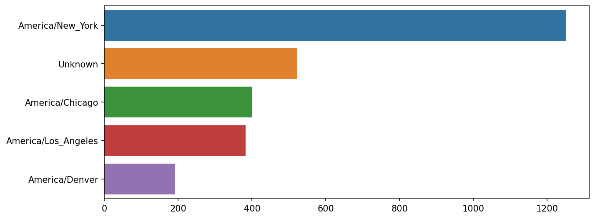

图 13.1: 1.usa.gov 示例数据中的顶部时区

`a` 字段包含有关用于执行 URL 缩短的浏览器、设备或应用程序的信息：
    
    
    In [41]: frame["a"][1]
    Out[41]: 'GoogleMaps/RochesterNY'
    
    In [42]: frame["a"][50]
    Out[42]: 'Mozilla/5.0 (Windows NT 5.1; rv:10.0.2) Gecko/20100101 Firefox/10.0.2'
    
    In [43]: frame["a"][51][:50]  # 长行
    Out[43]: 'Mozilla/5.0 (Linux; U; Android 2.2.2; en-us; LG-P9'

解析这些“代理”字符串中所有有趣的信息似乎是一项艰巨的任务。一种可能的策略是拆分字符串中的第一个标记（大致对应于浏览器功能），并制作另一个用户行为摘要：
    
    
    In [44]: results = pd.Series([x.split()[0] for x in frame["a"].dropna()])
    
    In [45]: results.head(5)
    Out[45]: 
    0               Mozilla/5.0
    1    GoogleMaps/RochesterNY
    2               Mozilla/4.0
    3               Mozilla/5.0
    4               Mozilla/5.0
    dtype: object
    
    In [46]: results.value_counts().head(8)
    Out[46]: 
    Mozilla/5.0                 2594
    Mozilla/4.0                  601
    GoogleMaps/RochesterNY       121
    Opera/9.80                    34
    TEST_INTERNET_AGENT           24
    GoogleProducer                21
    Mozilla/6.0                    5
    BlackBerry8520/5.0.0.681       4
    Name: count, dtype: int64

现在，假设你想将顶部时区分解为 Windows 和非 Windows 用户。作为一种简化，我们说如果代理字符串中包含 `"Windows"`，则用户使用的是 Windows。由于某些代理缺失，我们将从数据中排除这些：
    
    
    In [47]: cframe = frame[frame["a"].notna()].copy()

然后我们想计算每行是否是 Windows：
    
    
    In [48]: cframe["os"] = np.where(cframe["a"].str.contains("Windows"),
       ....:                         "Windows", "Not Windows")
    
    In [49]: cframe["os"].head(5)
    Out[49]: 
    0        Windows
    1    Not Windows
    2        Windows
    3    Not Windows
    4        Windows
    Name: os, dtype: object

然后，你可以按其时区列和这个新的操作系统列表对数据进行分组：
    
    
    In [50]: by_tz_os = cframe.groupby(["tz", "os"])

组计数，类似于 `value_counts` 函数，可以使用 `size` 计算。然后使用 `unstack` 将此结果重塑为一个表格：
    
    
    In [51]: agg_counts = by_tz_os.size().unstack().fillna(0)
    
    In [52]: agg_counts.head()
    Out[52]: 
    os                   Not Windows  Windows
    tz                                       
                               245.0    276.0
    Africa/Cairo                 0.0      3.0
    Africa/Casablanca            0.0      1.0
    Africa/Ceuta                 0.0      2.0
    Africa/Johannesburg          0.0      1.0

最后，让我们选择总体的顶部时区。为此，我从 `agg_counts` 中的行计数构造一个间接索引数组。在使用 `agg_counts.sum("columns")` 计算行计数之后，我可以调用 `argsort()` 来获取一个索引数组，该数组可用于按升序排序：
    
    
    In [53]: indexer = agg_counts.sum("columns").argsort()
    
    In [54]: indexer.values[:10]
    Out[54]: array([24, 20, 21, 92, 87, 53, 54, 57, 26, 55])

我使用 `take` 按该顺序选择行，然后切掉最后 10 行（最大值）：
    
    
    In [55]: count_subset = agg_counts.take(indexer[-10:])
    
    In [56]: count_subset
    Out[56]: 
    os                   Not Windows  Windows
    tz                                       
    America/Sao_Paulo           13.0     20.0
    Europe/Madrid               16.0     19.0
    Pacific/Honolulu             0.0     36.0
    Asia/Tokyo                   2.0     35.0
    Europe/London               43.0     31.0
    America/Denver             132.0     59.0
    America/Los_Angeles        130.0    252.0
    America/Chicago            115.0    285.0
                               245.0    276.0
    America/New_York           339.0    912.0

pandas 有一个名为 `nlargest` 的便捷方法，可以做同样的事情：
    
    
    In [57]: agg_counts.sum(axis="columns").nlargest(10)
    Out[57]: 
    tz
    America/New_York       1251.0
                            521.0
    America/Chicago         400.0
    America/Los_Angeles     382.0
    America/Denver          191.0
    Europe/London            74.0
    Asia/Tokyo               37.0
    Pacific/Honolulu         36.0
    Europe/Madrid            35.0
    America/Sao_Paulo        33.0
    dtype: float64

然后，这可以在分组条形图中绘制，比较 Windows 和非 Windows 用户的数量，使用 seaborn 的 `barplot` 函数（参见按 Windows 和非 Windows 用户划分的顶部时区）。我首先调用 `count_subset.stack()` 并重置索引以重新排列数据，以便更好地与 seaborn 兼容：
    
    
    In [59]: count_subset = count_subset.stack()
    
    In [60]: count_subset.name = "total"
    
    In [61]: count_subset = count_subset.reset_index()
    
    In [62]: count_subset.head(10)
    Out[62]: 
                      tz           os  total
    0  America/Sao_Paulo  Not Windows   13.0
    1  America/Sao_Paulo      Windows   20.0
    2      Europe/Madrid  Not Windows   16.0
    3      Europe/Madrid      Windows   19.0
    4   Pacific/Honolulu  Not Windows    0.0
    5   Pacific/Honolulu      Windows   36.0
    6         Asia/Tokyo  Not Windows    2.0
    7         Asia/Tokyo      Windows   35.0
    8      Europe/London  Not Windows   43.0
    9      Europe/London      Windows   31.0
    
    In [63]: sns.barplot(x="total", y="tz", hue="os",  data=count_subset)

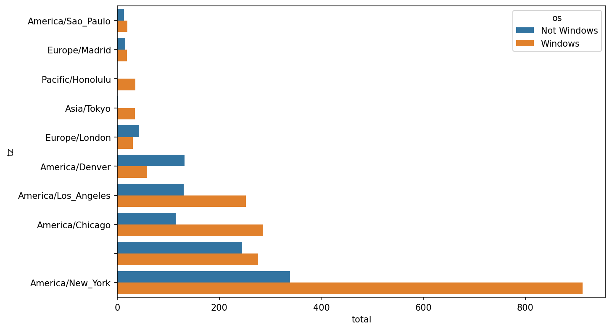

图 13.2: 按 Windows 和非 Windows 用户划分的顶部时区

在较小的组中很难看到 Windows 用户的相对百分比，因此让我们将组百分比归一化，使其总和为 1：
    
    
    def norm_total(group):
        group["normed_total"] = group["total"] / group["total"].sum()
        return group
    
    results = count_subset.groupby("tz").apply(norm_total)

然后在顶部出现时区中的 Windows 和非 Windows 用户百分比中绘制此图：
    
    
    In [66]: sns.barplot(x="normed_total", y="tz", hue="os",  data=results)

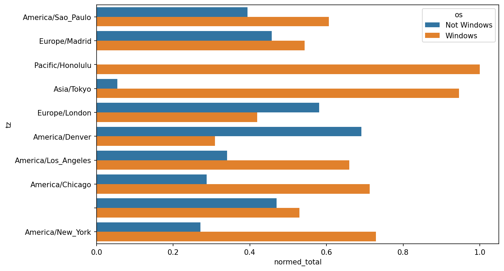

图 13.3: 顶部出现时区中的 Windows 和非 Windows 用户百分比

我们可以通过使用 `groupby` 的 `transform` 方法更有效地计算归一化总和：
    
    
    In [67]: g = count_subset.groupby("tz")
    
    In [68]: results2 = count_subset["total"] / g["total"].transform("sum")

## 13.2 MovieLens 1M 数据集

[GroupLens Research](https://grouplens.org/datasets/movielens) 提供了多个电影评分数据集合，这些数据收集自 20 世纪 90 年代末和 21 世纪初的 MovieLens 用户。数据包括电影评分、电影元数据（类型和年份）以及用户的人口统计信息（年龄、邮政编码、性别认同和职业）。这类数据在基于机器学习算法开发推荐系统时通常备受关注。虽然本书不会详细探讨机器学习技术，但我将向你展示如何将此类数据集切割整理成所需的确切形式。

MovieLens 1M 数据集包含来自六千名用户对四千部电影的一百万条评分。它分布在三个表中：评分、用户信息和电影信息。我们可以使用 `pandas.read_table` 将每个表加载到 pandas 的 DataFrame 对象中。在 Jupyter 单元中运行以下代码：

```python
unames = ["user_id", "gender", "age", "occupation", "zip"]
users = pd.read_table("datasets/movielens/users.dat", sep="::",
                      header=None, names=unames, engine="python")

rnames = ["user_id", "movie_id", "rating", "timestamp"]
ratings = pd.read_table("datasets/movielens/ratings.dat", sep="::",
                        header=None, names=rnames, engine="python")

mnames = ["movie_id", "title", "genres"]
movies = pd.read_table("datasets/movielens/movies.dat", sep="::",
                       header=None, names=mnames, engine="python")
```

通过查看每个 DataFrame 可以验证是否一切顺利：

```python
In [70]: users.head(5)
Out[70]: 
   user_id gender  age  occupation    zip
0        1      F    1          10  48067
1        2      M   56          16  70072
2        3      M   25          15  55117
3        4      M   45           7  02460
4        5      M   25          20  55455

In [71]: ratings.head(5)
Out[71]: 
   user_id  movie_id  rating  timestamp
0        1      1193       5  978300760
1        1       661       3  978302109
2        1       914       3  978301968
3        1      3408       4  978300275
4        1      2355       5  978824291

In [72]: movies.head(5)
Out[72]: 
   movie_id                               title                        genres
0         1                    Toy Story (1995)   Animation|Children's|Comedy
1         2                      Jumanji (1995)  Adventure|Children's|Fantasy
2         3             Grumpier Old Men (1995)                Comedy|Romance
3         4            Waiting to Exhale (1995)                  Comedy|Drama
4         5  Father of the Bride Part II (1995)                        Comedy

In [73]: ratings
Out[73]: 
         user_id  movie_id  rating  timestamp
0              1      1193       5  978300760
1              1       661       3  978302109
2              1       914       3  978301968
3              1      3408       4  978300275
4              1      2355       5  978824291
...          ...       ...     ...        ...
1000204     6040      1091       1  956716541
1000205     6040      1094       5  956704887
1000206     6040       562       5  956704746
1000207     6040      1096       4  956715648
1000208     6040      1097       4  956715569
[1000209 rows x 4 columns]
```

请注意，年龄和职业被编码为整数，表示数据集的 _README_ 文件中描述的组别。分析分布在三个表中的数据并非易事；例如，假设你想按性别认同和年龄计算特定电影的平均评分。正如你将看到的，将所有数据合并到单个表中进行操作会更加方便。使用 pandas 的 `merge` 函数，我们首先将 `ratings` 与 `users` 合并，然后将结果与 `movies` 数据合并。pandas 会根据重叠的列名推断使用哪些列作为合并（或 _连接_）键：

```python
In [74]: data = pd.merge(pd.merge(ratings, users), movies)

In [75]: data
Out[75]: 
         user_id  movie_id  rating  timestamp gender  age  occupation    zip   
0              1      1193       5  978300760      F    1          10  48067  \
1              2      1193       5  978298413      M   56          16  70072   
2             12      1193       4  978220179      M   25          12  32793   
3             15      1193       4  978199279      M   25           7  22903   
4             17      1193       5  978158471      M   50           1  95350   
...          ...       ...     ...        ...    ...  ...         ...    ...   
1000204     5949      2198       5  958846401      M   18          17  47901   
1000205     5675      2703       3  976029116      M   35          14  30030   
1000206     5780      2845       1  958153068      M   18          17  92886   
1000207     5851      3607       5  957756608      F   18          20  55410   
1000208     5938      2909       4  957273353      M   25           1  35401   
                                               title                genres  
0             One Flew Over the Cuckoo's Nest (1975)                 Drama  
1             One Flew Over the Cuckoo's Nest (1975)                 Drama  
2             One Flew Over the Cuckoo's Nest (1975)                 Drama  
3             One Flew Over the Cuckoo's Nest (1975)                 Drama  
4             One Flew Over the Cuckoo's Nest (1975)                 Drama  
...                                              ...                   ...  
1000204                           Modulations (1998)           Documentary  
1000205                        Broken Vessels (1998)                 Drama  
1000206                            White Boys (1999)                 Drama  
1000207                     One Little Indian (1973)  Comedy|Drama|Western  
1000208  Five Wives, Three Secretaries and Me (1998)           Documentary  
[1000209 rows x 10 columns]

In [76]: data.iloc[0]
Out[76]: 
user_id                                            1
movie_id                                        1193
rating                                             5
timestamp                                  978300760
gender                                             F
age                                                1
occupation                                        10
zip                                            48067
title         One Flew Over the Cuckoo's Nest (1975)
genres                                         Drama
Name: 0, dtype: object
```

要获取按性别分组的每部电影的平均评分，我们可以使用 `pivot_table` 方法：

```python
In [77]: mean_ratings = data.pivot_table("rating", index="title",
   ....:                                 columns="gender", aggfunc="mean")

In [78]: mean_ratings.head(5)
Out[78]: 
gender                                F         M
title                                            
$1,000,000 Duck (1971)         3.375000  2.761905
'Night Mother (1986)           3.388889  3.352941
'Til There Was You (1997)      2.675676  2.733333
'burbs, The (1989)             2.793478  2.962085
...And Justice for All (1979)  3.828571  3.689024
```

这生成了另一个包含平均评分的 DataFrame，其中电影标题作为行标签（“索引”），性别作为列标签。我首先筛选出至少获得 250 条评分（一个任意数字）的电影；为此，我按标题对数据进行分组，并使用 `size()` 获取每个标题的组大小 Series：

```python
In [79]: ratings_by_title = data.groupby("title").size()

In [80]: ratings_by_title.head()
Out[80]: 
title
$1,000,000 Duck (1971)            37
'Night Mother (1986)              70
'Til There Was You (1997)         52
'burbs, The (1989)               303
...And Justice for All (1979)    199
dtype: int64

In [81]: active_titles = ratings_by_title.index[ratings_by_title >= 250]

In [82]: active_titles
Out[82]: 
Index([''burbs, The (1989)', '10 Things I Hate About You (1999)',
       '101 Dalmatians (1961)', '101 Dalmatians (1996)', '12 Angry Men (1957)',
       '13th Warrior, The (1999)', '2 Days in the Valley (1996)',
       '20,000 Leagues Under the Sea (1954)', '2001: A Space Odyssey (1968)',
       '2010 (1984)',
       ...
       'X-Men (2000)', 'Year of Living Dangerously (1982)',
       'Yellow Submarine (1968)', 'You've Got Mail (1998)',
       'Young Frankenstein (1974)', 'Young Guns (1988)',
       'Young Guns II (1990)', 'Young Sherlock Holmes (1985)',
       'Zero Effect (1998)', 'eXistenZ (1999)'],
      dtype='object', name='title', length=1216)
```

然后，可以使用 `.loc` 从 `mean_ratings` 中选择至少获得 250 条评分的标题索引对应的行：

```python
In [83]: mean_ratings = mean_ratings.loc[active_titles]

In [84]: mean_ratings
Out[84]: 
gender                                    F         M
title                                                
'burbs, The (1989)                 2.793478  2.962085
10 Things I Hate About You (1999)  3.646552  3.311966
101 Dalmatians (1961)              3.791444  3.500000
101 Dalmatians (1996)              3.240000  2.911215
12 Angry Men (1957)                4.184397  4.328421
...                                     ...       ...
Young Guns (1988)                  3.371795  3.425620
Young Guns II (1990)               2.934783  2.904025
Young Sherlock Holmes (1985)       3.514706  3.363344
Zero Effect (1998)                 3.864407  3.723140
eXistenZ (1999)                    3.098592  3.289086
[1216 rows x 2 columns]
```

要查看女性观众中最受欢迎的电影，我们可以按 `F` 列降序排序：

```python
In [86]: top_female_ratings = mean_ratings.sort_values("F", ascending=False)

In [87]: top_female_ratings.head()
Out[87]: 
gender                                                         F         M
title                                                                     
Close Shave, A (1995)                                   4.644444  4.473795
Wrong Trousers, The (1993)                              4.588235  4.478261
Sunset Blvd. (a.k.a. Sunset Boulevard) (1950)           4.572650  4.464589
Wallace & Gromit: The Best of Aardman Animation (1996)  4.563107  4.385075
Schindler's List (1993)                                 4.562602  4.491415
```

### 测量评分分歧

假设你想找出男性和女性观众之间分歧最大的电影。一种方法是在 `mean_ratings` 中添加一列，包含均值差异，然后按该列排序：

```python
In [88]: mean_ratings["diff"] = mean_ratings["M"] - mean_ratings["F"]
```

按 `"diff"` 排序可以得到评分差异最大的电影，从而看出哪些电影更受女性喜爱：

```python
In [89]: sorted_by_diff = mean_ratings.sort_values("diff")

In [90]: sorted_by_diff.head()
Out[90]: 
gender                            F         M      diff
title                                                  
Dirty Dancing (1987)       3.790378  2.959596 -0.830782
Jumpin' Jack Flash (1986)  3.254717  2.578358 -0.676359
Grease (1978)              3.975265  3.367041 -0.608224
Little Women (1994)        3.870588  3.321739 -0.548849
Steel Magnolias (1989)     3.901734  3.365957 -0.535777
```

反转行顺序并再次取前 10 行，我们可以得到男性喜爱但女性评分不高的电影：

```python
In [91]: sorted_by_diff[::-1].head()
Out[91]: 
gender                                         F         M      diff
title                                                               
Good, The Bad and The Ugly, The (1966)  3.494949  4.221300  0.726351
Kentucky Fried Movie, The (1977)        2.878788  3.555147  0.676359
Dumb & Dumber (1994)                    2.697987  3.336595  0.638608
Longest Day, The (1962)                 3.411765  4.031447  0.619682
Cable Guy, The (1996)                   2.250000  2.863787  0.613787
```

假设你想找出观众中分歧最大的电影，而不考虑性别认同。分歧可以通过评分的方差或标准差来衡量。为此，我们首先按标题计算评分的标准差，然后筛选出活跃标题：

```python
In [92]: rating_std_by_title = data.groupby("title")["rating"].std()

In [93]: rating_std_by_title = rating_std_by_title.loc[active_titles]

In [94]: rating_std_by_title.head()
Out[94]: 
title
'burbs, The (1989)                   1.107760
10 Things I Hate About You (1999)    0.989815
101 Dalmatians (1961)                0.982103
101 Dalmatians (1996)                1.098717
12 Angry Men (1957)                  0.812731
Name: rating, dtype: float64
```

然后，我们按降序排序并选择前 10 行，这些大致是评分分歧最大的 10 部电影：

```python
In [95]: rating_std_by_title.sort_values(ascending=False)[:10]
Out[95]: 
title
Dumb & Dumber (1994)                     1.321333
Blair Witch Project, The (1999)          1.316368
Natural Born Killers (1994)              1.307198
Tank Girl (1995)                         1.277695
Rocky Horror Picture Show, The (1975)    1.260177
Eyes Wide Shut (1999)                    1.259624
Evita (1996)                             1.253631
Billy Madison (1995)                     1.249970
Fear and Loathing in Las Vegas (1998)    1.246408
Bicentennial Man (1999)                  1.245533
Name: rating, dtype: float64
```

你可能已经注意到，电影类型是以竖线分隔（`|`）的字符串给出的，因为一部电影可以属于多个类型。为了帮助我们按类型对评分数据进行分组，我们可以在 DataFrame 上使用 `explode` 方法。让我们看看这是如何工作的。首先，我们可以使用 Series 上的 `str.split` 方法将类型字符串拆分为类型列表：

```python
In [96]: movies["genres"].head()
Out[96]: 
0     Animation|Children's|Comedy
1    Adventure|Children's|Fantasy
2                  Comedy|Romance
3                    Comedy|Drama
4                          Comedy
Name: genres, dtype: object

In [97]: movies["genres"].head().str.split("|")
Out[97]: 
0     [Animation, Children's, Comedy]
1    [Adventure, Children's, Fantasy]
2                   [Comedy, Romance]
3                     [Comedy, Drama]
4                            [Comedy]
Name: genres, dtype: object

In [98]: movies["genre"] = movies.pop("genres").str.split("|")

In [99]: movies.head()
Out[99]: 
   movie_id                               title   
0         1                    Toy Story (1995)  \
1         2                      Jumanji (1995)   
2         3             Grumpier Old Men (1995)   
3         4            Waiting to Exhale (1995)   
4         5  Father of the Bride Part II (1995)   
                                  genre  
0   [Animation, Children's, Comedy]  
1  [Adventure, Children's, Fantasy]  
2                 [Comedy, Romance]  
3                   [Comedy, Drama]  
4                          [Comedy]  
```

现在，调用 `movies.explode("genre")` 会生成一个新的 DataFrame，其中每个电影类型列表中的每个“内部”元素都对应一行。例如，如果一部电影同时被分类为喜剧和爱情片，那么结果中会有两行，一行只有 `"Comedy"`，另一行只有 `"Romance"`：

```python
In [100]: movies_exploded = movies.explode("genre")

In [101]: movies_exploded[:10]
Out[101]: 
   movie_id                     title       genre
0         1          Toy Story (1995)   Animation
0         1          Toy Story (1995)  Children's
0         1          Toy Story (1995)      Comedy
1         2            Jumanji (1995)   Adventure
1         2            Jumanji (1995)  Children's
1         2            Jumanji (1995)     Fantasy
2         3   Grumpier Old Men (1995)      Comedy
2         3   Grumpier Old Men (1995)     Romance
3         4  Waiting to Exhale (1995)      Comedy
3         4  Waiting to Exhale (1995)       Drama
```

现在，我们可以将所有三个表合并在一起并按类型分组：

```python
In [102]: ratings_with_genre = pd.merge(pd.merge(movies_exploded, ratings), users
)

In [103]: ratings_with_genre.iloc[0]
Out[103]: 
movie_id                     1
title         Toy Story (1995)
genre                Animation
user_id                      1
rating                       5
timestamp            978824268
gender                       F
age                          1
occupation                  10
zip                      48067
Name: 0, dtype: object

In [104]: genre_ratings = (ratings_with_genre.groupby(["genre", "age"])
   .....:                  ["rating"].mean()
   .....:                  .unstack("age"))

In [105]: genre_ratings[:10]
Out[105]: 
age                1         18        25        35        45        50   
genre                                                                     
Action       3.506385  3.447097  3.453358  3.538107  3.528543  3.611333  \
Adventure    3.449975  3.408525  3.443163  3.515291  3.528963  3.628163   
Animation    3.476113  3.624014  3.701228  3.740545  3.734856  3.780020   
Children's   3.241642  3.294257  3.426873  3.518423  3.527593  3.556555   
Comedy       3.497491  3.460417  3.490385  3.561984  3.591789  3.646868   
Crime        3.710170  3.668054  3.680321  3.733736  3.750661  3.810688   
Documentary  3.730769  3.865865  3.946690  3.953747  3.966521  3.908108   
Drama        3.794735  3.721930  3.726428  3.782512  3.784356  3.878415   
Fantasy      3.317647  3.353778  3.452484  3.482301  3.532468  3.581570   
Film-Noir    4.145455  3.997368  4.058725  4.064910  4.105376  4.175401   
age                56  
genre                  
Action       3.610709  
Adventure    3.649064  
Animation    3.756233  
Children's   3.621822  
Comedy       3.650949  
Crime        3.832549  
Documentary  3.961538  
Drama        3.933465  
Fantasy      3.532700  
Film-Noir    4.125932  
```

## 13.3 美国婴儿名字 1880–2010

美国社会保障管理局（SSA）提供了自 1880 年至今的婴儿名字频率数据。多位流行 R 包作者 Hadley Wickham 曾用此数据集演示 R 语言中的数据操作技巧。

我们需要进行一些数据整理才能加载此数据集，但完成后将得到如下所示的 DataFrame：

```python
In [4]: names.head(10)
Out[4]:
        name sex  births  year
0       Mary   F    7065  1880
1       Anna   F    2604  1880
2       Emma   F    2003  1880
3  Elizabeth   F    1939  1880
4     Minnie   F    1746  1880
5   Margaret   F    1578  1880
6        Ida   F    1472  1880
7      Alice   F    1414  1880
8     Bertha   F    1320  1880
9      Sarah   F    1288  1880
```

利用该数据集可进行多种分析：

* 可视化特定名字（自己或他人的名字）随时间推移的命名比例
* 确定名字的相对排名
* 找出每年最流行的名字或流行度变化最大的名字
* 分析名字趋势：元音、辅音、长度、整体多样性、拼写变化、首尾字母
* 分析趋势的外部来源：圣经名字、名人效应、人口统计因素

借助本书介绍的工具，许多此类分析都能轻松实现。接下来我将引导您完成其中部分分析。

截至撰写时，美国社会保障管理局按年份提供数据文件，每个文件包含不同性别/名字组合的出生总数。您可以下载这些文件的[原始归档](http://www.ssa.gov/oact/babynames/limits.html)。

若页面已迁移，通过互联网搜索很可能重新定位。下载"National data"文件 _names.zip_ 并解压后，将获得包含一系列类似 _yob1880.txt_ 文件的目录。使用 Unix `head` 命令查看某文件前 10 行（Windows 系统可使用 `more` 命令或在文本编辑器中打开）：

```bash
In [106]: !head -n 10 datasets/babynames/yob1880.txt
Mary,F,7065
Anna,F,2604
Emma,F,2003
Elizabeth,F,1939
Minnie,F,1746
Margaret,F,1578
Ida,F,1472
Alice,F,1414
Bertha,F,1320
Sarah,F,1288
```

由于已是逗号分隔格式，可使用 `pandas.read_csv` 加载到 DataFrame：

```python
In [107]: names1880 = pd.read_csv("datasets/babynames/yob1880.txt",
       .....:                         names=["name", "sex", "births"])

In [108]: names1880
Out[108]: 
           name sex  births
0          Mary   F    7065
1          Anna   F    2604
2          Emma   F    2003
3     Elizabeth   F    1939
4        Minnie   F    1746
...         ...  ..     ...
1995     Woodie   M       5
1996     Worthy   M       5
1997     Wright   M       5
1998       York   M       5
1999  Zachariah   M       5
[2000 rows x 3 columns]
```

这些文件仅包含每年至少出现五次的姓名，为简化处理，可直接使用按性别分组的出生数总和作为当年总出生数：

```python
In [109]: names1880.groupby("sex")["births"].sum()
Out[109]: 
sex
F     90993
M    110493
Name: births, dtype: int64
```

由于数据集按年份分割成多个文件，首要任务是将所有数据整合到单个 DataFrame 中并添加 `year` 字段。可使用 `pandas.concat` 实现。在 Jupyter 单元中运行以下代码：

```python
pieces = []
for year in range(1880, 2011):
    path = f"datasets/babynames/yob{year}.txt"
    frame = pd.read_csv(path, names=["name", "sex", "births"])

    # 添加年份列
    frame["year"] = year
    pieces.append(frame)

# 合并所有数据到单个 DataFrame
names = pd.concat(pieces, ignore_index=True)
```

需注意两点：首先，默认情况下 `concat` 按行合并 DataFrame 对象；其次，必须传递 `ignore_index=True` 因为不需要保留 `pandas.read_csv` 返回的原始行号。现在我们就得到了包含所有年份名字数据的单一 DataFrame：

```python
In [111]: names
Out[111]: 
              name sex  births  year
0             Mary   F    7065  1880
1             Anna   F    2604  1880
2             Emma   F    2003  1880
3        Elizabeth   F    1939  1880
4           Minnie   F    1746  1880
...            ...  ..     ...   ...
1690779    Zymaire   M       5  2010
1690780     Zyonne   M       5  2010
1690781  Zyquarius   M       5  2010
1690782      Zyran   M       5  2010
1690783      Zzyzx   M       5  2010
[1690784 rows x 4 columns]
```

有了这些数据，我们已可以使用 `groupby` 或 `pivot_table` 按年份和性别进行聚合（参见按性别和年份统计的总出生数）：

```python
In [112]: total_births = names.pivot_table("births", index="year",
       .....:                                  columns="sex", aggfunc=sum)

In [113]: total_births.tail()
Out[113]: 
sex         F        M
year                  
2006  1896468  2050234
2007  1916888  2069242
2008  1883645  2032310
2009  1827643  1973359
2010  1759010  1898382

In [114]: total_births.plot(title="Total births by sex and year")
```


图 13.4：按性别和年份统计的总出生数

接下来插入新列 `prop`，表示每个名字的出生数相对于总出生数的比例。`prop` 值为 `0.02` 表示每 100 个婴儿中有 2 个取了这个名字。因此，我们先按年份和性别分组，然后为每组添加新列：

```python
def add_prop(group):
    group["prop"] = group["births"] / group["births"].sum()
    return group
names = names.groupby(["year", "sex"], group_keys=False).apply(add_prop)
```

最终完整数据集包含以下列：

```python
In [116]: names
Out[116]: 
              name sex  births  year      prop
0             Mary   F    7065  1880  0.077643
1             Anna   F    2604  1880  0.028618
2             Emma   F    2003  1880  0.022013
3        Elizabeth   F    1939  1880  0.021309
4           Minnie   F    1746  1880  0.019188
...            ...  ..     ...   ...       ...
1690779    Zymaire   M       5  2010  0.000003
1690780     Zyonne   M       5  2010  0.000003
1690781  Zyquarius   M       5  2010  0.000003
1690782      Zyran   M       5  2010  0.000003
1690783      Zzyzx   M       5  2010  0.000003
[1690784 rows x 5 columns]
```

进行此类分组操作时，最好进行合理性检查，例如验证所有组中 `prop` 列的总和是否为 1：

```python
In [117]: names.groupby(["year", "sex"])["prop"].sum()
Out[117]: 
year  sex
1880  F      1.0
      M      1.0
1881  F      1.0
      M      1.0
1882  F      1.0
            ... 
2008  M      1.0
2009  F      1.0
      M      1.0
2010  F      1.0
      M      1.0
Name: prop, Length: 262, dtype: float64
```

完成此步骤后，我将提取数据子集以便进一步分析：每个性别/年份组合的前 1000 个名字。这又是一次分组操作：

```python
In [118]: def get_top1000(group):
   .....:     return group.sort_values("births", ascending=False)[:1000]

In [119]: grouped = names.groupby(["year", "sex"])

In [120]: top1000 = grouped.apply(get_top1000)

In [121]: top1000.head()
Out[121]: 
                 name sex  births  year      prop
year sex                                         
1880 F   0       Mary   F    7065  1880  0.077643
          1       Anna   F    2604  1880  0.028618
          2       Emma   F    2003  1880  0.022013
          3  Elizabeth   F    1939  1880  0.021309
          4     Minnie   F    1746  1880  0.019188
```

由于分析不需要分组索引，可以将其删除：

```python
In [122]: top1000 = top1000.reset_index(drop=True)
```

最终数据集规模显著缩小：

```python
In [123]: top1000.head()
Out[123]: 
        name sex  births  year      prop
0       Mary   F    7065  1880  0.077643
1       Anna   F    2604  1880  0.028618
2       Emma   F    2003  1880  0.022013
3  Elizabeth   F    1939  1880  0.021309
4     Minnie   F    1746  1880  0.019188
```

我们将在后续调查中使用这个前一千名数据集。

### 分析命名趋势

有了完整数据集和前一千名数据集，我们可以开始分析各种感兴趣的命名趋势。首先，将前一千名数据分割为男孩和女孩部分：

```python
In [124]: boys = top1000[top1000["sex"] == "M"]

In [125]: girls = top1000[top1000["sex"] == "F"]
```

简单的时间序列（如每年取名 John 或 Mary 的数量）可以绘制，但需要一些处理才能更有用。我们构建一个按年份和名字统计的总出生数透视表：

```python
In [126]: total_births = top1000.pivot_table("births", index="year",
       .....:                                    columns="name",
       .....:                                    aggfunc=sum)
```

现在，可以使用 DataFrame 的 `plot` 方法绘制几个名字的曲线（随时间变化的几个男孩和女孩名字展示了结果）：

```python
In [127]: total_births.info()
<class 'pandas.core.frame.DataFrame'>
Index: 131 entries, 1880 to 2010
Columns: 6868 entries, Aaden to Zuri
dtypes: float64(6868)
memory usage: 6.9 MB

In [128]: subset = total_births[["John", "Harry", "Mary", "Marilyn"]]

In [129]: subset.plot(subplots=True, figsize=(12, 10),
       .....:             title="Number of births per year")
```

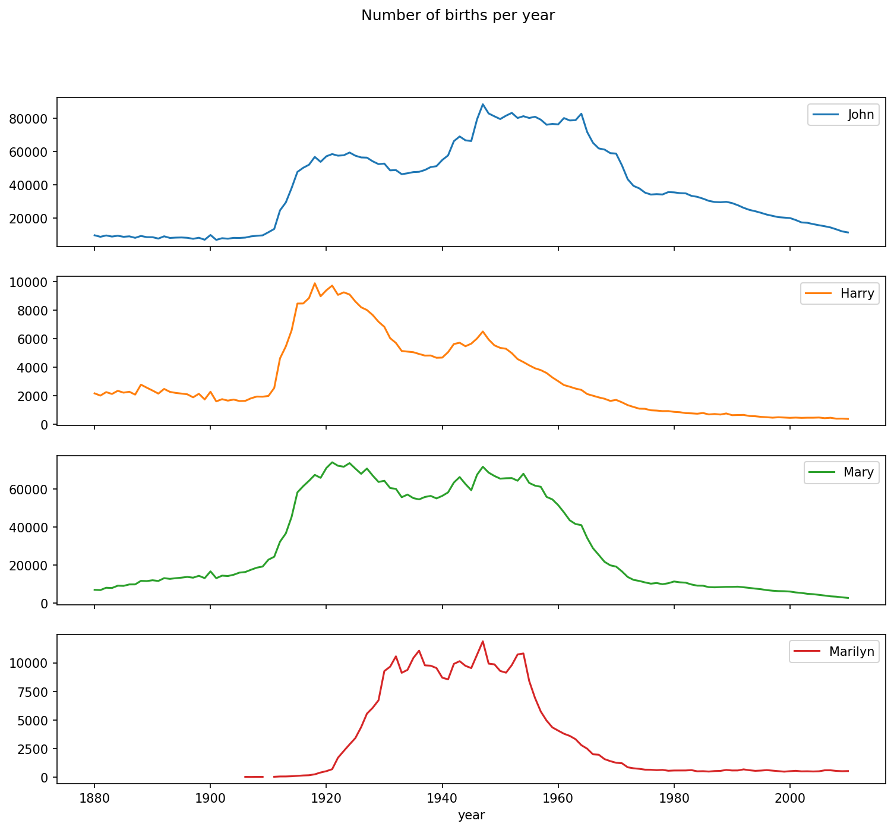

图 13.5：随时间变化的几个男孩和女孩名字

观察此图，您可能会认为这些名字已不再受美国人青睐。但实际情况更为复杂，下一节将深入探讨。

#### 测量命名多样性的增加

图表中下降趋势的一种解释是，越来越少父母为孩子选择常见名字。这一假设可以通过数据探索和验证。一种衡量指标是前 1000 个最流行名字所代表的出生比例，我按年份和性别聚合并绘制图表（按性别分列的前一千名名字出生比例展示了结果图）：

```python
In [131]: table = top1000.pivot_table("prop", index="year",
       .....:                             columns="sex", aggfunc=sum)

In [132]: table.plot(title="Sum of table1000.prop by year and sex",
       .....:            yticks=np.linspace(0, 1.2, 13))
```

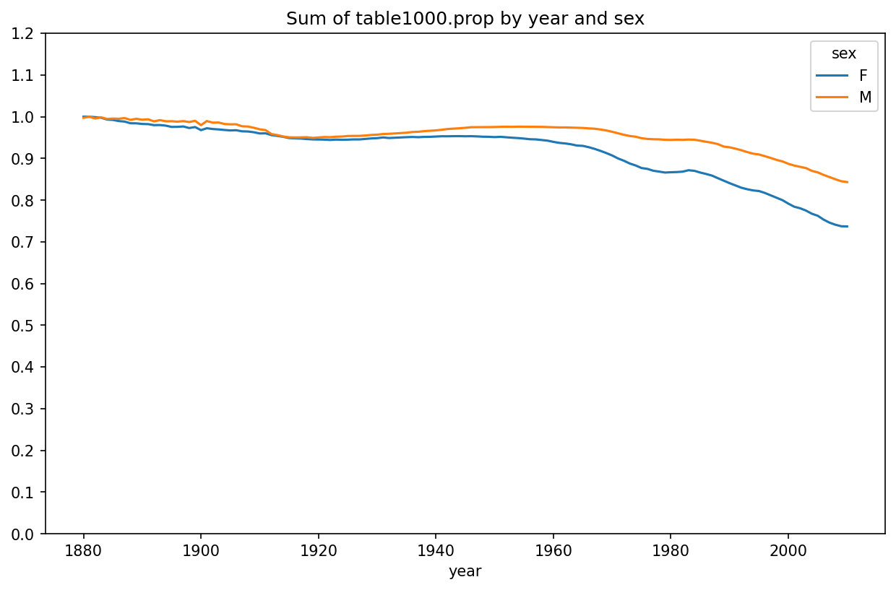

图 13.6：按性别分列的前一千名名字出生比例

可以看出，名字多样性确实在增加（前一千名的总比例在下降）。另一个有趣的指标是占出生总数 50% 的不同名字数量（按流行度从高到低排列）。这个数字计算起来较为复杂。我们仅以 2010 年男孩名为例：

```python
In [133]: df = boys[boys["year"] == 2010]

In [134]: df
Out[134]: 
           name sex  births  year      prop
260877    Jacob   M   21875  2010  0.011523
260878    Ethan   M   17866  2010  0.009411
260879  Michael   M   17133  2010  0.009025
260880   Jayden   M   17030  2010  0.008971
260881  William   M   16870  2010  0.008887
...         ...  ..     ...   ...       ...
261872   Camilo   M     194  2010  0.000102
261873   Destin   M     194  2010  0.000102
261874   Jaquan   M     194  2010  0.000102
261875   Jaydan   M     194  2010  0.000102
261876   Maxton   M     193  2010  0.000102
[1000 rows x 5 columns]
```

将 `prop` 降序排序后，我们想知道需要多少最流行的名字才能达到 50%。虽然可以用 `for` 循环实现，但向量化的 NumPy 方法计算效率更高。取 `prop` 的累积和 `cumsum`，然后调用 `searchsorted` 方法返回需插入 `0.5` 以保持排序顺序的位置：

```python
In [135]: prop_cumsum = df["prop"].sort_values(ascending=False).cumsum()

In [136]: prop_cumsum[:10]
Out[136]: 
260877    0.011523
260878    0.020934
260879    0.029959
260880    0.038930
260881    0.047817
260882    0.056579
260883    0.065155
260884    0.073414
260885    0.081528
260886    0.089621
Name: prop, dtype: float64

In [137]: prop_cumsum.searchsorted(0.5)
Out[137]: 116
```

由于数组从零开始索引，将此结果加 1 得到 117。相比之下，1900 年这个数字要小得多：

```python
In [138]: df = boys[boys.year == 1900]

In [139]: in1900 = df.sort_values("prop", ascending=False).prop.cumsum()

In [140]: in1900.searchsorted(0.5) + 1
Out[140]: 25
```

现在可以将此操作应用于每个年份/性别组合，按这些字段分组，并应用返回每组计数的函数：

```python
def get_quantile_count(group, q=0.5):
    group = group.sort_values("prop", ascending=False)
    return group.prop.cumsum().searchsorted(q) + 1

diversity = top1000.groupby(["year", "sex"]).apply(get_quantile_count)
diversity = diversity.unstack()
```

现在得到的 DataFrame `diversity` 包含两个时间序列（每个性别一个），按年份索引。可以如前所述进行检查和绘图（参见按年份划分的多样性指标图）：

```python
In [143]: diversity.head()
Out[143]: 
sex    F   M
year        
1880  38  14
1881  38  14
1882  38  15
1883  39  15
1884  39  16

In [144]: diversity.plot(title="Number of popular names in top 50%")
```

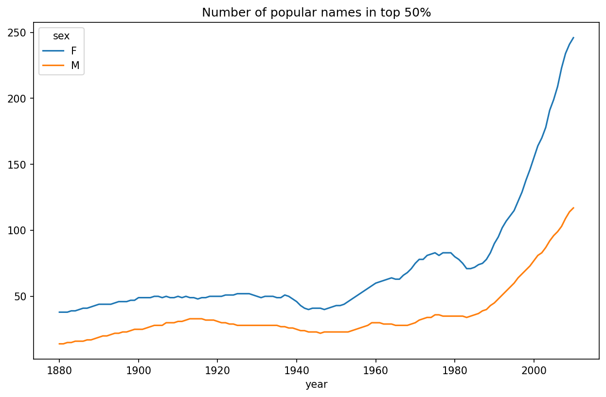

图 13.7：按年份划分的多样性指标图

如您所见，女孩名字一直比男孩名字更多样化，而且随着时间的推移越来越多样化。关于驱动多样性的具体因素（如替代拼写的增加）的进一步分析，留给读者自行探索。

#### “尾字母”革命

2007 年，婴儿名字研究员 Laura Wattenberg 指出，过去 100 年中男孩名字按最后字母的分布发生了显著变化。为验证这一点，我们首先按年份、性别和最后字母聚合完整数据集中的所有出生数：

```python
def get_last_letter(x):
    return x[-1]

last_letters = names["name"].map(get_last_letter)
last_letters.name = "last_letter"

table = names.pivot_table("births", index=last_letters,
                          columns=["sex", "year"], aggfunc=sum)
```

然后选择三个具有代表性的历史年份并打印前几行：

```python
In [146]: subtable = table.reindex(columns=[1910, 1960, 2010], level="year")

In [147]: subtable.head()
Out[147]: 
sex                 F                            M                    
year             1910      1960      2010     1910      1960      2010
last_letter                                                           
a            108376.0  691247.0  670605.0    977.0    5204.0   28438.0
b                 NaN     694.0     450.0    411.0    3912.0   38859.0
c                 5.0      49.0     946.0    482.0   15476.0   23125.0
d              6750.0    3729.0    2607.0  22111.0  262112.0   44398.0
e            133569.0  435013.0  313833.0  28655.0  178823.0  129012.0
```

接下来，通过总出生数标准化该表，计算一个新表，其中包含每个性别以每个字母结尾的名字在总出生数中的比例：

```python
In [148]: subtable.sum()
Out[148]: 
sex  year
F    1910     396416.0
     1960    2022062.0
     2010    1759010.0
M    1910     194198.0
     1960    2132588.0
     2010    1898382.0
dtype: float64

In [149]: letter_prop = subtable / subtable.sum()

In [150]: letter_prop
Out[150]: 
sex                 F                             M                    
year             1910      1960      2010      1910      1960      2010
last_letter                                                            
a            0.273390  0.341853  0.381240  0.005031  0.002440  0.014980
b                 NaN  0.000343  0.000256  0.002116  0.001834  0.020470
c            0.000013  0.000024  0.000538  0.002482  0.007257  0.012181
d            0.017028  0.001844  0.001482  0.113858  0.122908  0.023387
e            0.336941  0.215133  0.178415  0.147556  0.083853  0.067959
...               ...       ...       ...       ...       ...       ...
v                 NaN  0.000060  0.000117  0.000113  0.000037  0.001434
w            0.000020  0.000031  0.001182  0.006329  0.007711  0.016148
x            0.000015  0.000037  0.000727  0.003965  0.001851  0.008614
y            0.110972  0.152569  0.116828  0.077349  0.160987  0.058168
z            0.002439  0.000659  0.000704  0.000170  0.000184  0.001831
[26 rows x 6 columns]
```

有了字母比例数据，现在可以为每个性别制作条形图，按年份细分（参见以各字母结尾的男孩和女孩名字比例）：

```python
import matplotlib.pyplot as plt

fig, axes = plt.subplots(2, 1, figsize=(10, 8))
letter_prop["M"].plot(kind="bar", rot=0, ax=axes[0], title="Male")
letter_prop["F"].plot(kind="bar", rot=0, ax=axes[1], title="Female",
                      legend=False)
```

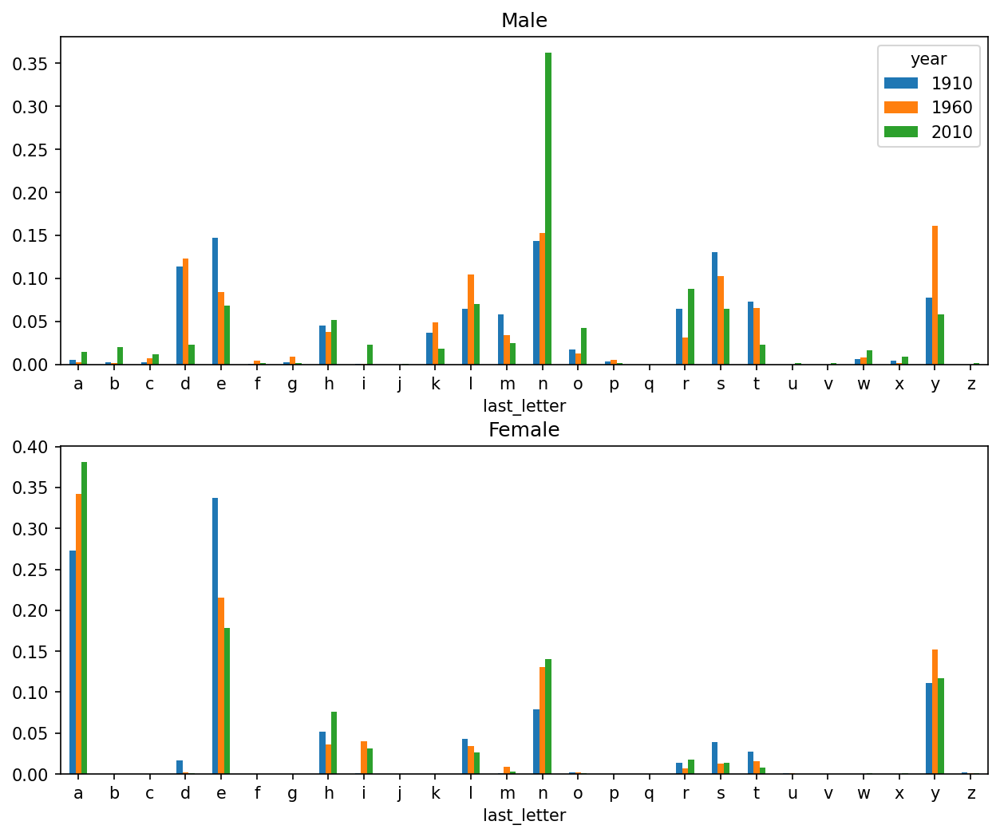

图 13.8：以各字母结尾的男孩和女孩名字比例

如您所见，以 _n_ 结尾的男孩名字自 1960 年代以来显著增长。回到之前创建的完整表格，我再次按年份和性别标准化，并选择男孩名字的几个字母子集，最后转置使每列成为一个时间序列：

```python
In [153]: letter_prop = table / table.sum()

In [154]: dny_ts = letter_prop.loc[["d", "n", "y"], "M"].T

In [155]: dny_ts.head()
Out[155]: 
last_letter         d         n         y
year                                     
1880         0.083055  0.153213  0.075760
1881         0.083247  0.153214  0.077451
1882         0.085340  0.149560  0.077537
1883         0.084066  0.151646  0.079144
1884         0.086120  0.149915  0.080405
```

有了这个时间序列 DataFrame，我可以再次用其 `plot` 方法绘制随时间变化的趋势图（参见以 d/n/y 结尾的男孩出生比例随时间变化）：

```python
In [158]: dny_ts.plot()
```

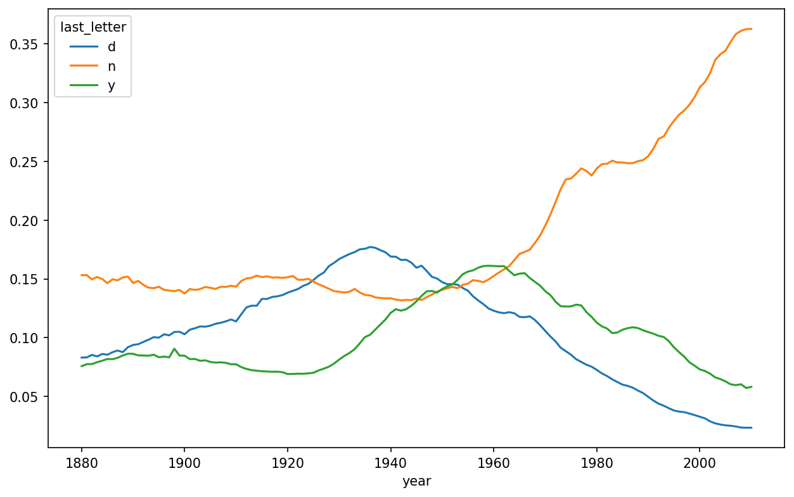

图 13.9：以 d/n/y 结尾的男孩出生比例随时间变化

#### 男孩名变女孩名（反之亦然）

另一个有趣趋势是考察那些在样本早期更受某一性别青睐，但随着时间的推移逐渐成为另一性别首选的名字。例如 Lesley 或 Leslie 这个名字。回到 `top1000` DataFrame，我计算数据集中以"Lesl"开头的名字列表：

```python
In [159]: all_names = pd.Series(top1000["name"].unique())

In [160]: lesley_like = all_names[all_names.str.contains("Lesl")]

In [161]: lesley_like
Out[161]: 
632     Leslie
2294    Lesley
4262    Leslee
4728     Lesli
6103     Lesly
dtype: object
```

由此，我们可以筛选出这些名字，并按名字分组求和出生数以查看相对频率：

```python
In [162]: filtered = top1000[top1000["name"].isin(lesley_like)]

In [163]: filtered.groupby("name")["births"].sum()
Out[163]: 
name
Leslee      1082
Lesley     35022
Lesli        929
Leslie    370429
Lesly      10067
Name: births, dtype: int64
```

接下来，按性别和年份聚合，并在年份内标准化：

```python
In [164]: table = filtered.pivot_table("births", index="year",
       .....:                              columns="sex", aggfunc="sum")

In [165]: table = table.div(table.sum(axis="columns"), axis="index")

In [166]: table.tail()
Out[166]: 
sex     F   M
year         
2006  1.0 NaN
2007  1.0 NaN
2008  1.0 NaN
2009  1.0 NaN
2010  1.0 NaN
```

最后，现在可以绘制随时间变化的性别细分图（参见随时间变化的 Lesley 类名字男女比例）：

```python
In [168]: table.plot(style={"M": "k-", "F": "k--"})
```

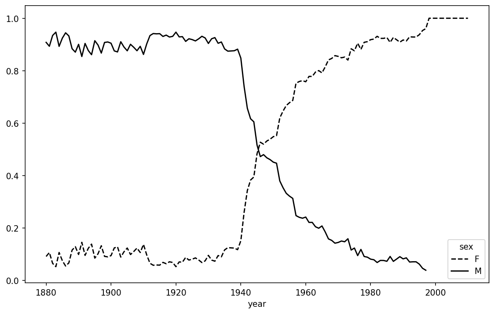

图 13.10：随时间变化的 Lesley 类名字男女比例

## 13.4 USDA 食品数据库

美国农业部（USDA）提供了一个食品营养成分信息的数据库。程序员 Ashley Williams 将其制作成了 JSON 格式的版本。记录示例如下：

```json
{
  "id": 21441,
  "description": "KENTUCKY FRIED CHICKEN, Fried Chicken, EXTRA CRISPY, Wing, meat and skin with breading",
  "tags": ["KFC"],
  "manufacturer": "Kentucky Fried Chicken",
  "group": "Fast Foods",
  "portions": [
    {
      "amount": 1,
      "unit": "wing, with skin",
      "grams": 68.0
    },
    
    ...
  ],
  "nutrients": [
    {
      "value": 20.8,
      "units": "g",
      "description": "Protein",
      "group": "Composition"
    },
    
    ...
  ]
}
```

每种食品都有若干标识属性，以及两个分别关于营养成分和分量大小的列表。这种形式的数据不太适合分析，因此我们需要做一些工作来将数据整理成更好的形式。

你可以使用任何你选择的 JSON 库将此文件加载到 Python 中。我将使用 Python 内置的 `json` 模块：

```python
In [169]: import json

In [170]: db = json.load(open("datasets/usda_food/database.json"))

In [171]: len(db)
Out[171]: 6636
```

`db` 中的每个条目都是一个字典，包含单个食品的所有数据。`"nutrients"` 字段是一个字典列表，每个字典对应一种营养成分：

```python
In [172]: db[0].keys()
Out[172]: dict_keys(['id', 'description', 'tags', 'manufacturer', 'group', 'portions', 'nutrients'])

In [173]: db[0]["nutrients"][0]
Out[173]: 
{'value': 25.18,
 'units': 'g',
 'description': 'Protein',
 'group': 'Composition'}

In [174]: nutrients = pd.DataFrame(db[0]["nutrients"])

In [175]: nutrients.head(7)
Out[175]: 
         value units                  description        group
0    25.18     g                      Protein  Composition
1    29.20     g            Total lipid (fat)  Composition
2     3.06     g  Carbohydrate, by difference  Composition
3     3.28     g                          Ash        Other
4   376.00  kcal                       Energy       Energy
5    39.28     g                        Water  Composition
6  1573.00    kJ                       Energy       Energy
```

将字典列表转换为 DataFrame 时，我们可以指定要提取的字段列表。我们将提取食品名称、组别、ID 和制造商：

```python
In [176]: info_keys = ["description", "group", "id", "manufacturer"]

In [177]: info = pd.DataFrame(db, columns=info_keys)

In [178]: info.head()
Out[178]: 
                              description                   group    id   
0                     Cheese, caraway  Dairy and Egg Products  1008  \
1                     Cheese, cheddar  Dairy and Egg Products  1009   
2                        Cheese, edam  Dairy and Egg Products  1018   
3                        Cheese, feta  Dairy and Egg Products  1019   
4  Cheese, mozzarella, part skim milk  Dairy and Egg Products  1028   
      manufacturer  
0               
1               
2               
3               
4               

In [179]: info.info()
<class 'pandas.core.frame.DataFrame'>
RangeIndex: 6636 entries, 0 to 6635
Data columns (total 4 columns):
 #   Column        Non-Null Count  Dtype 
---  ------        --------------  ----- 
 0   description   6636 non-null   object
 1   group         6636 non-null   object
 2   id            6636 non-null   int64 
 3   manufacturer  5195 non-null   object
dtypes: int64(1), object(3)
memory usage: 207.5+ KB
```

从 `info.info()` 的输出中，我们可以看到 `manufacturer` 列中存在缺失数据。

你可以使用 `value_counts` 查看食品组别的分布：

```python
In [180]: pd.value_counts(info["group"])[:10]
Out[180]: 
group
Vegetables and Vegetable Products    812
Beef Products                        618
Baked Products                       496
Breakfast Cereals                    403
Legumes and Legume Products          365
Fast Foods                           365
Lamb, Veal, and Game Products        345
Sweets                               341
Fruits and Fruit Juices              328
Pork Products                        328
Name: count, dtype: int64
```

现在，要对所有营养成分数据进行分析，最简单的方法是将每种食品的营养成分整合到一个大的表中。为此，我们需要几个步骤。首先，我将每种食品的营养成分列表转换为 DataFrame，添加一个食品 `id` 列，并将 DataFrame 追加到一个列表中。然后，可以使用 `concat` 进行连接。在 Jupyter 单元格中运行以下代码：

```python
nutrients = []

for rec in db:
    fnuts = pd.DataFrame(rec["nutrients"])
    fnuts["id"] = rec["id"]
    nutrients.append(fnuts)

nutrients = pd.concat(nutrients, ignore_index=True)
```

如果一切顺利，`nutrients` 应该如下所示：

```python
In [182]: nutrients
Out[182]: 
              value units                         description        group     id
0        25.180     g                             Protein  Composition   1008
1        29.200     g                   Total lipid (fat)  Composition   1008
2         3.060     g         Carbohydrate, by difference  Composition   1008
3         3.280     g                                 Ash        Other   1008
4       376.000  kcal                              Energy       Energy   1008
...         ...   ...                                 ...          ...    ...
389350    0.000   mcg                 Vitamin B-12, added     Vitamins  43546
389351    0.000    mg                         Cholesterol        Other  43546
389352    0.072     g        Fatty acids, total saturated        Other  43546
389353    0.028     g  Fatty acids, total monounsaturated        Other  43546
389354    0.041     g  Fatty acids, total polyunsaturated        Other  43546
[389355 rows x 5 columns]
```

我注意到这个 DataFrame 中存在重复项，因此删除它们会使处理更简便：

```python
In [183]: nutrients.duplicated().sum()  # 重复项的数量
Out[183]: 14179

In [184]: nutrients = nutrients.drop_duplicates()
```

由于 `"group"` 和 `"description"` 在两个 DataFrame 对象中都存在，我们可以重命名以使其更清晰：

```python
In [185]: col_mapping = {"description" : "food",
       .....:                "group"       : "fgroup"}

In [186]: info = info.rename(columns=col_mapping, copy=False)

In [187]: info.info()
<class 'pandas.core.frame.DataFrame'>
RangeIndex: 6636 entries, 0 to 6635
Data columns (total 4 columns):
 #   Column        Non-Null Count  Dtype 
---  ------        --------------  ----- 
 0   food          6636 non-null   object
 1   fgroup        6636 non-null   object
 2   id            6636 non-null   int64 
 3   manufacturer  5195 non-null   object
dtypes: int64(1), object(3)
memory usage: 207.5+ KB

In [188]: col_mapping = {"description" : "nutrient",
       .....:                "group" : "nutgroup"}

In [189]: nutrients = nutrients.rename(columns=col_mapping, copy=False)

In [190]: nutrients
Out[190]: 
              value units                            nutrient     nutgroup     id
0        25.180     g                             Protein  Composition   1008
1        29.200     g                   Total lipid (fat)  Composition   1008
2         3.060     g         Carbohydrate, by difference  Composition   1008
3         3.280     g                                 Ash        Other   1008
4       376.000  kcal                              Energy       Energy   1008
...         ...   ...                                 ...          ...    ...
389350    0.000   mcg                 Vitamin B-12, added     Vitamins  43546
389351    0.000    mg                         Cholesterol        Other  43546
389352    0.072     g        Fatty acids, total saturated        Other  43546
389353    0.028     g  Fatty acids, total monounsaturated        Other  43546
389354    0.041     g  Fatty acids, total polyunsaturated        Other  43546
[375176 rows x 5 columns]
```

完成所有这些后，我们就可以将 `info` 与 `nutrients` 合并了：

```python
In [191]: ndata = pd.merge(nutrients, info, on="id")

In [192]: ndata.info()
<class 'pandas.core.frame.DataFrame'>
RangeIndex: 375176 entries, 0 to 375175
Data columns (total 8 columns):
 #   Column        Non-Null Count   Dtype  
---  ------        --------------   -----  
 0   value         375176 non-null  float64
 1   units         375176 non-null  object 
 2   nutrient      375176 non-null  object 
 3   nutgroup      375176 non-null  object 
 4   id            375176 non-null  int64  
 5   food          375176 non-null  object 
 6   fgroup        375176 non-null  object 
 7   manufacturer  293054 non-null  object 
dtypes: float64(1), int64(1), object(6)
memory usage: 22.9+ MB

In [193]: ndata.iloc[30000]
Out[193]: 
value                                             0.04
units                                                g
nutrient                                       Glycine
nutgroup                                   Amino Acids
id                                                6158
food            Soup, tomato bisque, canned, condensed
fgroup                      Soups, Sauces, and Gravies
manufacturer                                          
Name: 30000, dtype: object
```

现在，我们可以按食品组和营养成分类型绘制中位数值图（参见按食品组划分的锌中位数值）：

```python
In [195]: result = ndata.groupby(["nutrient", "fgroup"])["value"].quantile(0.5)

In [196]: result["Zinc, Zn"].sort_values().plot(kind="barh")
```

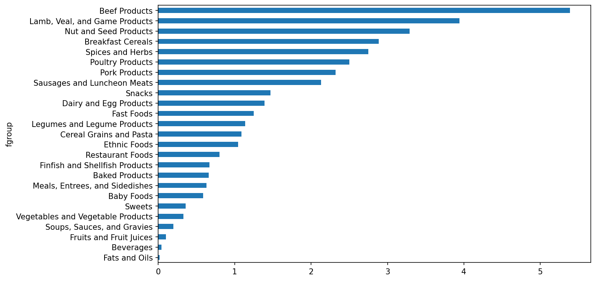

图 13.11：按食品组划分的锌中位数值

使用 `idxmax` 或 `argmax` Series 方法，你可以找到哪种食品在每种营养成分中含量最高。在 Jupyter 单元格中运行以下代码：

```python
by_nutrient = ndata.groupby(["nutgroup", "nutrient"])

def get_maximum(x):
    return x.loc[x.value.idxmax()]

max_foods = by_nutrient.apply(get_maximum)[["value", "food"]]

# 让食品名称显示短一些
max_foods["food"] = max_foods["food"].str[:50]
```

生成的 DataFrame 有点大，无法在书中全部显示；这里只展示 `"Amino Acids"`（氨基酸）营养组：

```python
In [198]: max_foods.loc["Amino Acids"]["food"]
Out[198]: 
nutrient
Alanine                            Gelatins, dry powder, unsweetened
Arginine                                Seeds, sesame flour, low-fat
Aspartic acid                                    Soy protein isolate
Cystine                 Seeds, cottonseed flour, low fat (glandless)
Glutamic acid                                    Soy protein isolate
Glycine                            Gelatins, dry powder, unsweetened
Histidine                 Whale, beluga, meat, dried (Alaska Native)
Hydroxyproline    KENTUCKY FRIED CHICKEN, Fried Chicken, ORIGINAL RE
Isoleucine        Soy protein isolate, PROTEIN TECHNOLOGIES INTERNAT
Leucine           Soy protein isolate, PROTEIN TECHNOLOGIES INTERNAT
Lysine            Seal, bearded (Oogruk), meat, dried (Alaska Native
Methionine                     Fish, cod, Atlantic, dried and salted
Phenylalanine     Soy protein isolate, PROTEIN TECHNOLOGIES INTERNAT
Proline                            Gelatins, dry powder, unsweetened
Serine            Soy protein isolate, PROTEIN TECHNOLOGIES INTERNAT
Threonine         Soy protein isolate, PROTEIN TECHNOLOGIES INTERNAT
Tryptophan          Sea lion, Steller, meat with fat (Alaska Native)
Tyrosine          Soy protein isolate, PROTEIN TECHNOLOGIES INTERNAT
Valine            Soy protein isolate, PROTEIN TECHNOLOGIES INTERNAT
Name: food, dtype: object
```

## 13.5 2012年联邦选举委员会数据库

美国联邦选举委员会（FEC）发布了关于政治竞选捐款的数据。这些数据包括捐款人姓名、职业和雇主、地址以及捐款金额。2012年美国总统选举的捐款数据以一个150兆字节的CSV文件 _P00000001-ALL.csv_ 形式提供（参见本书的数据仓库），可以使用 `pandas.read_csv` 加载：
    
    
    In [199]: fec = pd.read_csv("datasets/fec/P00000001-ALL.csv", low_memory=False)
    
    In [200]: fec.info()
    <class 'pandas.core.frame.DataFrame'>
    RangeIndex: 1001731 entries, 0 to 1001730
    Data columns (total 16 columns):
     #   Column             Non-Null Count    Dtype  
    ---  ------             --------------    -----  
     0   cmte_id            1001731 non-null  object 
     1   cand_id            1001731 non-null  object 
     2   cand_nm            1001731 non-null  object 
     3   contbr_nm          1001731 non-null  object 
     4   contbr_city        1001712 non-null  object 
     5   contbr_st          1001727 non-null  object 
     6   contbr_zip         1001620 non-null  object 
     7   contbr_employer    988002 non-null   object 
     8   contbr_occupation  993301 non-null   object 
     9   contb_receipt_amt  1001731 non-null  float64
     10  contb_receipt_dt   1001731 non-null  object 
     11  receipt_desc       14166 non-null    object 
     12  memo_cd            92482 non-null    object 
     13  memo_text          97770 non-null    object 
     14  form_tp            1001731 non-null  object 
     15  file_num           1001731 non-null  int64  
    dtypes: float64(1), int64(1), object(14)
    memory usage: 122.3+ MB __

__

注意 

有几个人要求我将数据集从2012年选举更新到2016年或2020年选举。不幸的是，FEC提供的较新数据集变得更大、更复杂，我认为在这里使用它们会偏离我想要说明的分析技术。

DataFrame 中的一条示例记录如下所示：
    
    
    In [201]: fec.iloc[123456]
    Out[201]: 
    cmte_id                             C00431445
    cand_id                             P80003338
    cand_nm                         Obama, Barack
    contbr_nm                         ELLMAN, IRA
    contbr_city                             TEMPE
    contbr_st                                  AZ
    contbr_zip                          852816719
    contbr_employer      ARIZONA STATE UNIVERSITY
    contbr_occupation                   PROFESSOR
    contb_receipt_amt                        50.0
    contb_receipt_dt                    01-DEC-11
    receipt_desc                              NaN
    memo_cd                                   NaN
    memo_text                                 NaN
    form_tp                                 SA17A
    file_num                               772372
    Name: 123456, dtype: object __

你可能会想到一些方法来开始切片和切块这些数据，以提取关于捐赠者和竞选捐款模式的信息性统计数据。我将向你展示许多不同的分析，这些分析应用了本书中的技术。

你可以看到数据中没有政党 affiliation（党派 affiliation），所以添加这一点会很有用。你可以使用 `unique` 获取所有唯一政治候选人的列表：
    
    
    In [202]: unique_cands = fec["cand_nm"].unique()
    
    In [203]: unique_cands
    Out[203]: 
    array(['Bachmann, Michelle', 'Romney, Mitt', 'Obama, Barack',
           "Roemer, Charles E. 'Buddy' III", 'Pawlenty, Timothy',
           'Johnson, Gary Earl', 'Paul, Ron', 'Santorum, Rick',
           'Cain, Herman', 'Gingrich, Newt', 'McCotter, Thaddeus G',
           'Huntsman, Jon', 'Perry, Rick'], dtype=object)
    
    In [204]: unique_cands[2]
    Out[204]: 'Obama, Barack'__

指示政党 affiliation 的一种方法是使用字典：1
    
    
    parties = {"Bachmann, Michelle": "Republican",
               "Cain, Herman": "Republican",
               "Gingrich, Newt": "Republican",
               "Huntsman, Jon": "Republican",
               "Johnson, Gary Earl": "Republican",
               "McCotter, Thaddeus G": "Republican",
               "Obama, Barack": "Democrat",
               "Paul, Ron": "Republican",
               "Pawlenty, Timothy": "Republican",
               "Perry, Rick": "Republican",
               "Roemer, Charles E. 'Buddy' III": "Republican",
               "Romney, Mitt": "Republican",
               "Santorum, Rick": "Republican"}__

现在，使用这个映射和 Series 对象上的 `map` 方法，你可以从候选人姓名计算出一个政党数组：
    
    
    In [206]: fec["cand_nm"][123456:123461]
    Out[206]: 
    123456    Obama, Barack
    123457    Obama, Barack
    123458    Obama, Barack
    123459    Obama, Barack
    123460    Obama, Barack
    Name: cand_nm, dtype: object
    
    In [207]: fec["cand_nm"][123456:123461].map(parties)
    Out[207]: 
    123456    Democrat
    123457    Democrat
    123458    Democrat
    123459    Democrat
    123460    Democrat
    Name: cand_nm, dtype: object
    
    # 将其添加为一列
    In [208]: fec["party"] = fec["cand_nm"].map(parties)
    
    In [209]: fec["party"].value_counts()
    Out[209]: 
    party
    Democrat      593746
    Republican    407985
    Name: count, dtype: int64 __

有几个数据准备点。首先，这些数据包括捐款和退款（负的捐款金额）：
    
    
    In [210]: (fec["contb_receipt_amt"] > 0).value_counts()
    Out[210]: 
    contb_receipt_amt
    True     991475
    False     10256
    Name: count, dtype: int64 __

为了简化分析，我将数据集限制为正的捐款：
    
    
    In [211]: fec = fec[fec["contb_receipt_amt"] > 0]__

由于巴拉克·奥巴马（Barack Obama）和米特·罗姆尼（Mitt Romney）是两位主要候选人，我还将准备一个只包含他们竞选捐款的子集：
    
    
    In [212]: fec_mrbo = fec[fec["cand_nm"].isin(["Obama, Barack", "Romney, Mitt"])]__

### 按职业和雇主划分的捐款统计

按职业划分的捐款是另一个经常研究的统计数据。例如，律师倾向于向民主党捐赠更多钱，而企业高管倾向于向共和党捐赠更多。你没有理由相信我；你可以在数据中亲眼看到。首先，可以使用 `value_counts` 计算按职业划分的捐款总数：
    
    
    In [213]: fec["contbr_occupation"].value_counts()[:10]
    Out[213]: 
    contbr_occupation
    RETIRED                                   233990
    INFORMATION REQUESTED                      35107
    ATTORNEY                                   34286
    HOMEMAKER                                  29931
    PHYSICIAN                                  23432
    INFORMATION REQUESTED PER BEST EFFORTS     21138
    ENGINEER                                   14334
    TEACHER                                    13990
    CONSULTANT                                 13273
    PROFESSOR                                  12555
    Name: count, dtype: int64 __

通过查看职业，你会注意到许多职业指的是相同的基本工作类型，或者有几种变体。以下代码片段说明了一种通过将一个职业映射到另一个职业来清理其中一些职业的技术；注意使用 `dict.get` 的技巧，允许没有映射的职业“通过”：
    
    
    occ_mapping = {
       "INFORMATION REQUESTED PER BEST EFFORTS" : "NOT PROVIDED",
       "INFORMATION REQUESTED" : "NOT PROVIDED",
       "INFORMATION REQUESTED (BEST EFFORTS)" : "NOT PROVIDED",
       "C.E.O.": "CEO"
    }
    
    def get_occ(x):
        # 如果没有提供映射，则返回 x
        return occ_mapping.get(x, x)
    
    fec["contbr_occupation"] = fec["contbr_occupation"].map(get_occ)__

我还将对雇主做同样的事情：
    
    
    emp_mapping = {
       "INFORMATION REQUESTED PER BEST EFFORTS" : "NOT PROVIDED",
       "INFORMATION REQUESTED" : "NOT PROVIDED",
       "SELF" : "SELF-EMPLOYED",
       "SELF EMPLOYED" : "SELF-EMPLOYED",
    }
    
    def get_emp(x):
        # 如果没有提供映射，则返回 x
        return emp_mapping.get(x, x)
    
    fec["contbr_employer"] = fec["contbr_employer"].map(get_emp)__

现在，你可以使用 `pivot_table` 按党派和职业聚合数据，然后过滤到总捐款至少200万美元的子集：
    
    
    In [216]: by_occupation = fec.pivot_table("contb_receipt_amt",
       .....:                                 index="contbr_occupation",
       .....:                                 columns="party", aggfunc="sum")
    
    In [217]: over_2mm = by_occupation[by_occupation.sum(axis="columns") > 2000000]
    
    In [218]: over_2mm
    Out[218]: 
    party                 Democrat   Republican
    contbr_occupation                          
    ATTORNEY           11141982.97   7477194.43
    CEO                 2074974.79   4211040.52
    CONSULTANT          2459912.71   2544725.45
    ENGINEER             951525.55   1818373.70
    EXECUTIVE           1355161.05   4138850.09
    HOMEMAKER           4248875.80  13634275.78
    INVESTOR             884133.00   2431768.92
    LAWYER              3160478.87    391224.32
    MANAGER              762883.22   1444532.37
    NOT PROVIDED        4866973.96  20565473.01
    OWNER               1001567.36   2408286.92
    PHYSICIAN           3735124.94   3594320.24
    PRESIDENT           1878509.95   4720923.76
    PROFESSOR           2165071.08    296702.73
    REAL ESTATE          528902.09   1625902.25
    RETIRED            25305116.38  23561244.49
    SELF-EMPLOYED        672393.40   1640252.54 __

以条形图的形式查看这些数据可能更容易（`"barh"` 表示水平条形图；参见按顶级职业划分的党派总捐款）：
    
    
    In [220]: over_2mm.plot(kind="barh")__

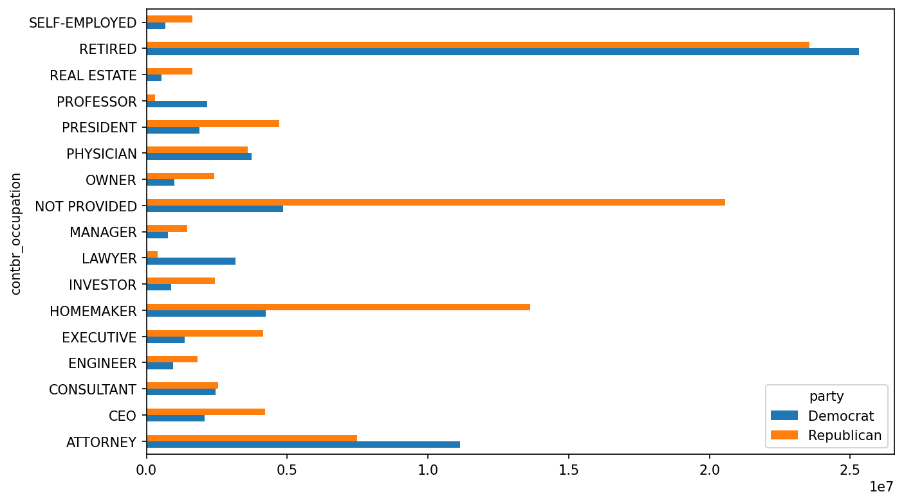

图13.12：按顶级职业划分的党派总捐款

你可能对向奥巴马和罗姆尼捐款最多的捐赠者职业或公司感兴趣。要做到这一点，你可以按候选人姓名分组，并使用本章早些时候的 `top` 方法的一个变体：
    
    
    def get_top_amounts(group, key, n=5):
        totals = group.groupby(key)["contb_receipt_amt"].sum()
        return totals.nlargest(n)__

然后按职业和雇主聚合：
    
    
    In [222]: grouped = fec_mrbo.groupby("cand_nm")
    
    In [223]: grouped.apply(get_top_amounts, "contbr_occupation", n=7)
    Out[223]: 
    cand_nm        contbr_occupation                     
    Obama, Barack  RETIRED                                   25305116.38
                   ATTORNEY                                  11141982.97
                   INFORMATION REQUESTED                      4866973.96
                   HOMEMAKER                                  4248875.80
                   PHYSICIAN                                  3735124.94
                   LAWYER                                     3160478.87
                   CONSULTANT                                 2459912.71
    Romney, Mitt   RETIRED                                   11508473.59
                   INFORMATION REQUESTED PER BEST EFFORTS    11396894.84
                   HOMEMAKER                                  8147446.22
                   ATTORNEY                                   5364718.82
                   PRESIDENT                                  2491244.89
                   EXECUTIVE                                  2300947.03
                   C.E.O.                                     1968386.11
    Name: contb_receipt_amt, dtype: float64
    
    In [224]: grouped.apply(get_top_amounts, "contbr_employer", n=10)
    Out[224]: 
    cand_nm        contbr_employer                       
    Obama, Barack  RETIRED                                   22694358.85
                   SELF-EMPLOYED                             17080985.96
                   NOT EMPLOYED                               8586308.70
                   INFORMATION REQUESTED                      5053480.37
                   HOMEMAKER                                  2605408.54
                   SELF                                       1076531.20
                   SELF EMPLOYED                               469290.00
                   STUDENT                                     318831.45
                   VOLUNTEER                                   257104.00
                   MICROSOFT                                   215585.36
    Romney, Mitt   INFORMATION REQUESTED PER BEST EFFORTS    12059527.24
                   RETIRED                                   11506225.71
                   HOMEMAKER                                  8147196.22
                   SELF-EMPLOYED                              7409860.98
                   STUDENT                                     496490.94
                   CREDIT SUISSE                               281150.00
                   MORGAN STANLEY                              267266.00
                   GOLDMAN SACH & CO.                          238250.00
                   BARCLAYS CAPITAL                            162750.00
                   H.I.G. CAPITAL                              139500.00
    Name: contb_receipt_amt, dtype: float64 __

### 分桶捐款金额

分析这些数据的一个有用方法是使用 `cut` 函数将捐款金额按捐款大小离散化到桶中：
    
    
    In [225]: bins = np.array([0, 1, 10, 100, 1000, 10000,
       .....:                  100_000, 1_000_000, 10_000_000])
    
    In [226]: labels = pd.cut(fec_mrbo["contb_receipt_amt"], bins)
    
    In [227]: labels
    Out[227]: 
    411         (10, 100]
    412       (100, 1000]
    413       (100, 1000]
    414         (10, 100]
    415         (10, 100]
                 ...     
    701381      (10, 100]
    701382    (100, 1000]
    701383        (1, 10]
    701384      (10, 100]
    701385    (100, 1000]
    Name: contb_receipt_amt, Length: 694282, dtype: category
    Categories (8, interval[int64, right]): [(0, 1] < (1, 10] < (10, 100] < (100, 100
    0] <
                                             (1000, 10000] < (10000, 100000] < (10000
    0, 1000000] <
                                             (1000000, 10000000]]__

然后，我们可以按姓名和桶标签对奥巴马和罗姆尼的数据进行分组，以获得按捐款大小的直方图：
    
    
    In [228]: grouped = fec_mrbo.groupby(["cand_nm", labels])
    
    In [229]: grouped.size().unstack(level=0)
    Out[229]: 
    cand_nm              Obama, Barack  Romney, Mitt
    contb_receipt_amt                               
    (0, 1]                         493            77
    (1, 10]                      40070          3681
    (10, 100]                   372280         31853
    (100, 1000]                 153991         43357
    (1000, 10000]                22284         26186
    (10000, 100000]                  2             1
    (100000, 1000000]                3             0
    (1000000, 10000000]              4             0 __

这些数据表明，奥巴马收到的小额捐款数量明显多于罗姆尼。你还可以对捐款金额求和，并在桶内归一化，以可视化每个候选人每种捐款大小占总捐款的百分比（候选人收到的每种捐款大小的总捐款百分比显示了结果图）：
    
    
    In [231]: bucket_sums = grouped["contb_receipt_amt"].sum().unstack(level=0)
    
    In [232]: normed_sums = bucket_sums.div(bucket_sums.sum(axis="columns"),
       .....:                               axis="index")
    
    In [233]: normed_sums
    Out[233]: 
    cand_nm              Obama, Barack  Romney, Mitt
    contb_receipt_amt                               
    (0, 1]                    0.805182      0.194818
    (1, 10]                   0.918767      0.081233
    (10, 100]                 0.910769      0.089231
    (100, 1000]               0.710176      0.289824
    (1000, 10000]             0.447326      0.552674
    (10000, 100000]           0.823120      0.176880
    (100000, 1000000]         1.000000      0.000000
    (1000000, 10000000]       1.000000      0.000000
    
    In [234]: normed_sums[:-2].plot(kind="barh")__

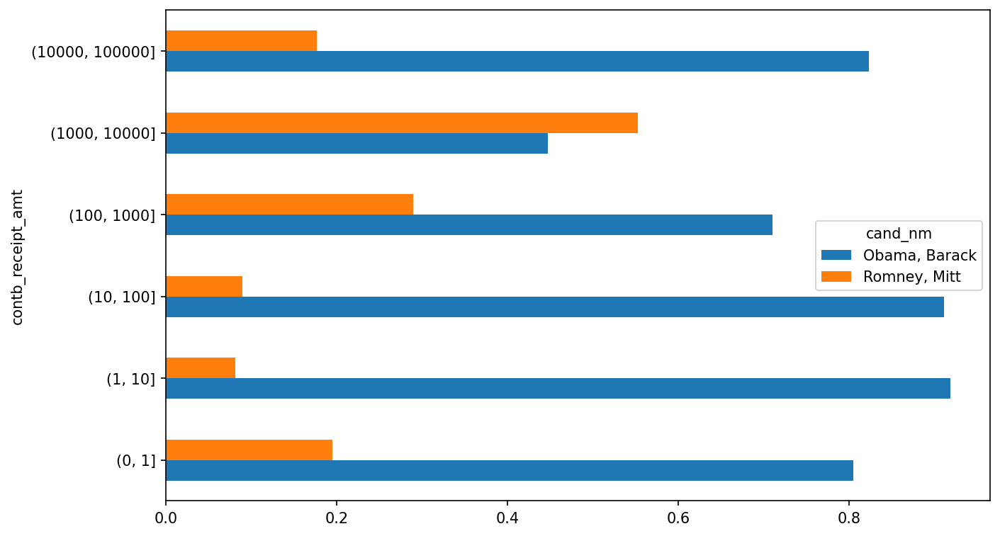

图13.13：候选人收到的每种捐款大小的总捐款百分比

我排除了两个最大的桶，因为这些不是个人的捐款。

这种分析可以通过许多方式改进和完善。例如，你可以按捐赠者姓名和邮政编码聚合捐款，以调整那些捐赠了许多小额捐款 versus 一次或多次大额捐款的捐赠者。我鼓励你自己探索数据集。

### 按州划分的捐款统计

我们可以首先按候选人和州聚合数据：
    
    
    In [235]: grouped = fec_mrbo.groupby(["cand_nm", "contbr_st"])
    
    In [236]: totals = grouped["contb_receipt_amt"].sum().unstack(level=0).fillna(0)
    
    In [237]: totals = totals[totals.sum(axis="columns") > 100000]
    
    In [238]: totals.head(10)
    Out[238]: 
    cand_nm    Obama, Barack  Romney, Mitt
    contbr_st                             
    AK             281840.15      86204.24
    AL             543123.48     527303.51
    AR             359247.28     105556.00
    AZ            1506476.98    1888436.23
    CA           23824984.24   11237636.60
    CO            2132429.49    1506714.12
    CT            2068291.26    3499475.45
    DC            4373538.80    1025137.50
    DE             336669.14      82712.00
    FL            7318178.58    8338458.81 __

如果将每一行除以总捐款金额，你会得到每个候选人在各州的总捐款的相对百分比：
    
    
    In [239]: percent = totals.div(totals.sum(axis="columns"), axis="index")
    
    In [240]: percent.head(10)
    Out[240]: 
    cand_nm    Obama, Barack  Romney, Mitt
    contbr_st                             
    AK              0.765778      0.234222
    AL              0.507390      0.492610
    AR              0.772902      0.227098
    AZ              0.443745      0.556255
    CA              0.679498      0.320502
    CO              0.585970      0.414030
    CT              0.371476      0.628524
    DC              0.810113      0.189887
    DE              0.802776      0.197224
    FL              0.467417      0.532583 __

## 13.6 结论

我们已经抵达本书的终点。附录部分包含了一些您可能会觉得有用的补充内容。

自本书第一版出版以来的10年间，Python已成为数据分析领域流行且广泛使用的语言。您在此培养的编程技能将在未来很长一段时间内保持其价值。希望我们探讨的这些编程工具和库能为您提供长久助力。

* * *

  1. 此处作了简化假设：尽管加里·约翰逊后来成为自由党（Libertarian party）候选人，仍将其视为共和党成员。↩︎